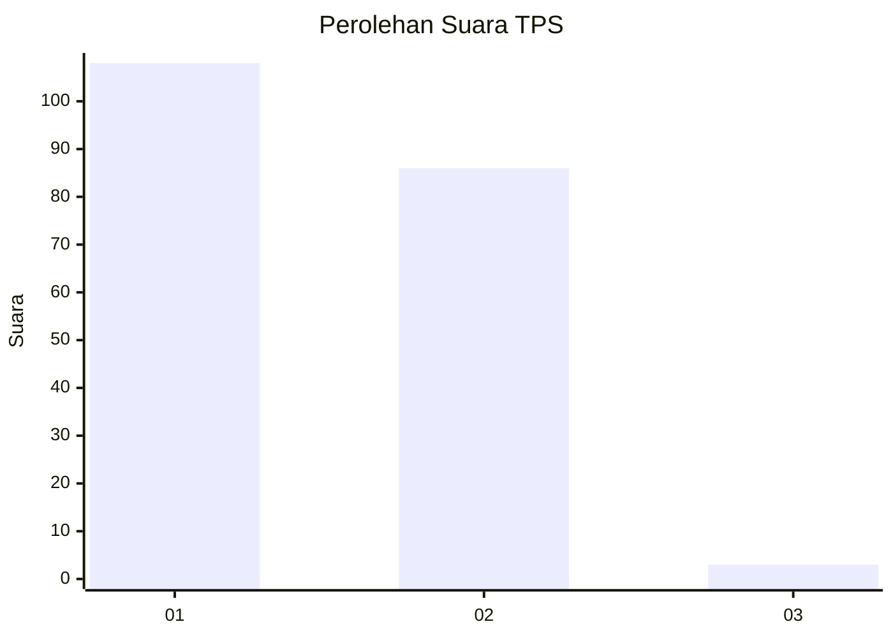
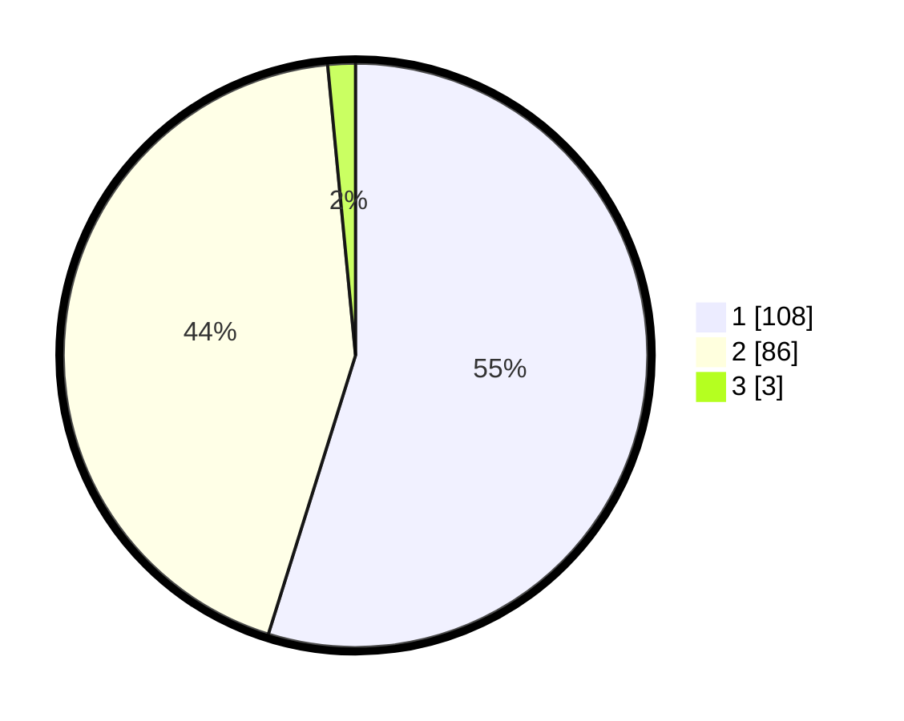

# Hasil

## Grafik

## Tabel

| No. | Nama Paslon    | Suara | Suara (raw) | Persentase |
|:--- |:-------------- | -----:| -----------:| ----------:|
| 1   | ANIES MUHAIMIN | 108   | [108][p-1]  | 54,82      |
| 2   | PRABOWO GIBRAN | 86    | [86][p-2]   | 43,65      |
| 3   | GANJAR MAHFUD  | 3     | [3][p-3]    | 1,52       |

[p-1]: https://github.com/gigit-pemilu/pemilu-2024/blob/main/pilpres/hitung-suara/sub/35-jawa-timur/sub/29-sumenep/sub/27-kangayan/sub/2001-saobi/sub/015-tps/sub/paslon-1.txt
[p-2]: https://github.com/gigit-pemilu/pemilu-2024/blob/main/pilpres/hitung-suara/sub/35-jawa-timur/sub/29-sumenep/sub/27-kangayan/sub/2001-saobi/sub/015-tps/sub/paslon-2.txt
[p-3]: https://github.com/gigit-pemilu/pemilu-2024/blob/main/pilpres/hitung-suara/sub/35-jawa-timur/sub/29-sumenep/sub/27-kangayan/sub/2001-saobi/sub/015-tps/sub/paslon-3.txt

## Foto C Plano

https://sirekap-obj-formc.kpu.go.id/2388/pemilu/ppwp/35/29/27/20/01/3529272001015-20240226-165913--be25b1fe-f8e3-486d-89a8-29f885b2c756.jpg

https://sirekap-obj-formc.kpu.go.id/2388/pemilu/ppwp/35/29/27/20/01/3529272001015-20240226-165939--b540ac85-8d0a-4aa0-96c1-2820799ffb81.jpg

https://sirekap-obj-formc.kpu.go.id/2388/pemilu/ppwp/35/29/27/20/01/3529272001015-20240226-165958--3a65c54e-84f1-419a-8be2-0f104714748f.jpg

## Metadata

| Key        | Value               |
| ---------- | ------------------- |
| Time Stamp | 2024-02-28 19:00:00 |

