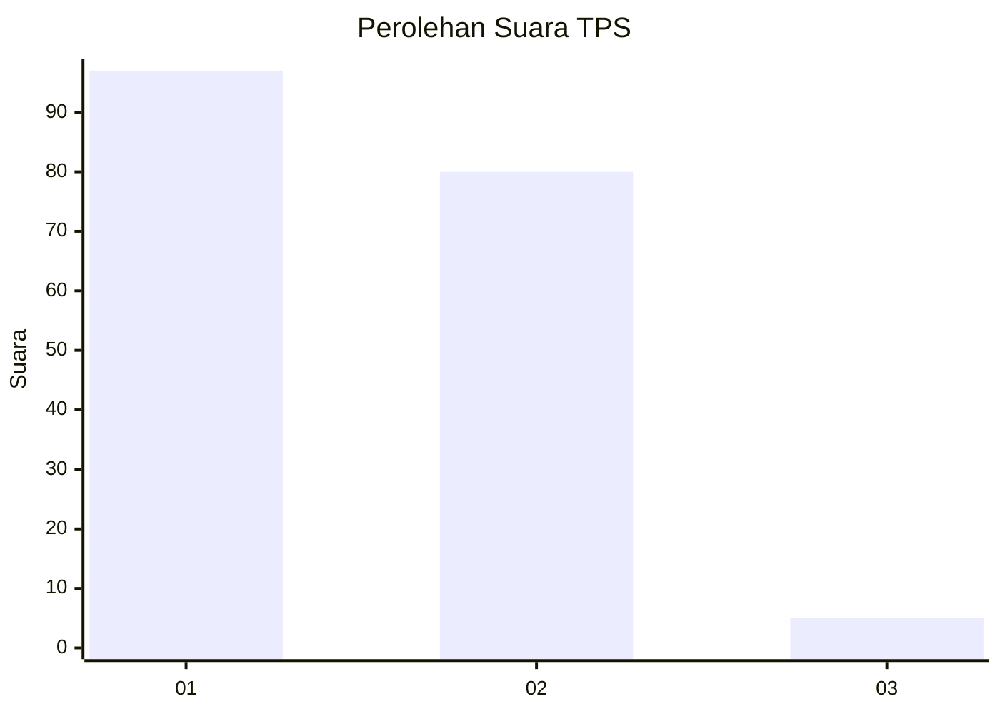
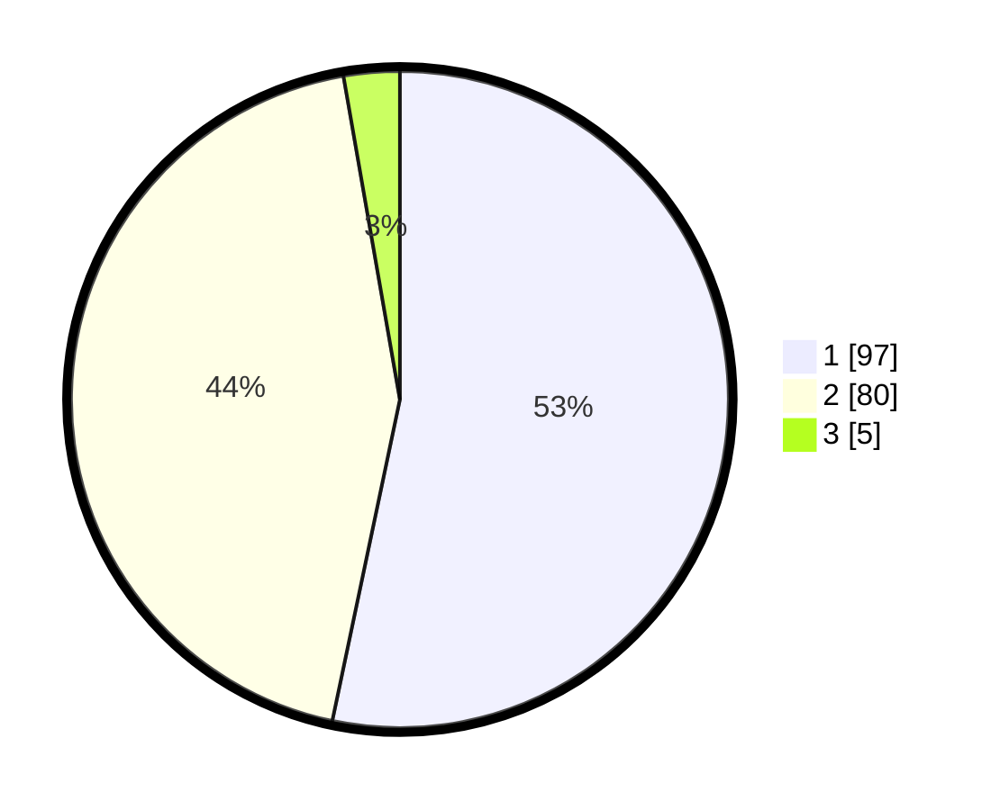

# Hasil

## Grafik

## Tabel

| No. | Nama Paslon    | Suara | Suara (raw) | Persentase |
|:--- |:-------------- | -----:| -----------:| ----------:|
| 1   | ANIES MUHAIMIN | 97    | [97][p-1]   | 53,30      |
| 2   | PRABOWO GIBRAN | 80    | [80][p-2]   | 43,96      |
| 3   | GANJAR MAHFUD  | 5     | [5][p-3]    | 2,75       |

[p-1]: https://github.com/gigit-pemilu/pemilu-2024-35-jawa-timur/blob/main/pilpres/hitung-suara/sub/35-jawa-timur/sub/29-sumenep/sub/27-kangayan/sub/2002-kangayan/sub/003-tps/sub/paslon-1.txt
[p-2]: https://github.com/gigit-pemilu/pemilu-2024-35-jawa-timur/blob/main/pilpres/hitung-suara/sub/35-jawa-timur/sub/29-sumenep/sub/27-kangayan/sub/2002-kangayan/sub/003-tps/sub/paslon-2.txt
[p-3]: https://github.com/gigit-pemilu/pemilu-2024-35-jawa-timur/blob/main/pilpres/hitung-suara/sub/35-jawa-timur/sub/29-sumenep/sub/27-kangayan/sub/2002-kangayan/sub/003-tps/sub/paslon-3.txt

## Foto C Plano

https://sirekap-obj-formc.kpu.go.id/1866/pemilu/ppwp/35/29/27/20/02/3529272002003-20240223-140306--22b25c5a-4dc1-4610-a8f0-2f0703ec630f.jpg

https://sirekap-obj-formc.kpu.go.id/1866/pemilu/ppwp/35/29/27/20/02/3529272002003-20240223-140330--1acf57c6-5053-4ad5-a81b-10ae2f83b6dd.jpg

https://sirekap-obj-formc.kpu.go.id/1866/pemilu/ppwp/35/29/27/20/02/3529272002003-20240223-140358--343affbd-f8d7-469f-ae4c-49d7c84e9608.jpg

## Metadata

| Key        | Value               |
| ---------- | ------------------- |
| Time Stamp | 2024-02-25 21:00:00 |

