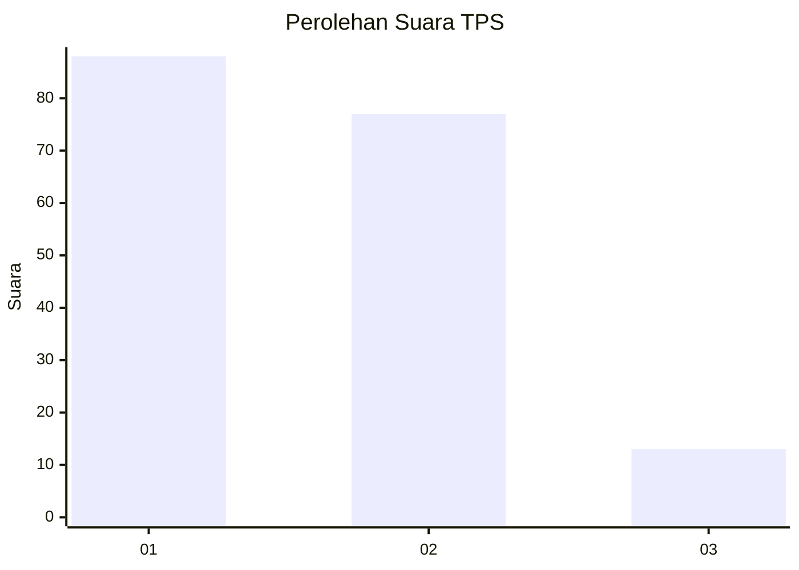
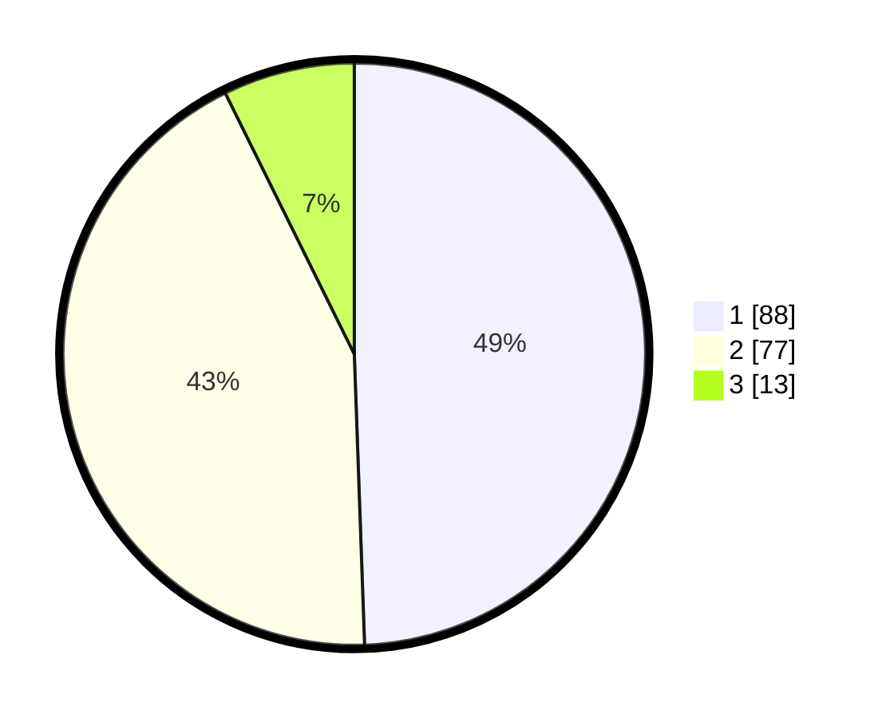

# Hasil

## Grafik

## Tabel

| No. | Nama Paslon    | Suara | Suara (raw) | Persentase |
|:--- |:-------------- | -----:| -----------:| ----------:|
| 1   | ANIES MUHAIMIN | 88    | [88][p-1]   | 49,44      |
| 2   | PRABOWO GIBRAN | 77    | [77][p-2]   | 43,26      |
| 3   | GANJAR MAHFUD  | 13    | [13][p-3]   | 7,30       |

[p-1]: https://github.com/gigit-pemilu/pemilu-2024/blob/main/pilpres/hitung-suara/sub/35-jawa-timur/sub/29-sumenep/sub/27-kangayan/sub/2002-kangayan/sub/004-tps/sub/paslon-1.txt
[p-2]: https://github.com/gigit-pemilu/pemilu-2024/blob/main/pilpres/hitung-suara/sub/35-jawa-timur/sub/29-sumenep/sub/27-kangayan/sub/2002-kangayan/sub/004-tps/sub/paslon-2.txt
[p-3]: https://github.com/gigit-pemilu/pemilu-2024/blob/main/pilpres/hitung-suara/sub/35-jawa-timur/sub/29-sumenep/sub/27-kangayan/sub/2002-kangayan/sub/004-tps/sub/paslon-3.txt

## Foto C Plano

https://sirekap-obj-formc.kpu.go.id/66ed/pemilu/ppwp/35/29/27/20/02/3529272002004-20240223-140910--12f79457-cf6f-4095-b97f-94cfce720bd3.jpg

https://sirekap-obj-formc.kpu.go.id/66ed/pemilu/ppwp/35/29/27/20/02/3529272002004-20240223-140941--30255114-b478-451c-9e3d-bead7e8eaa08.jpg

https://sirekap-obj-formc.kpu.go.id/66ed/pemilu/ppwp/35/29/27/20/02/3529272002004-20240223-141005--71c1a810-0787-4506-b3d9-ae11ea5dc753.jpg

## Metadata

| Key        | Value               |
| ---------- | ------------------- |
| Time Stamp | 2024-02-24 22:31:28 |

