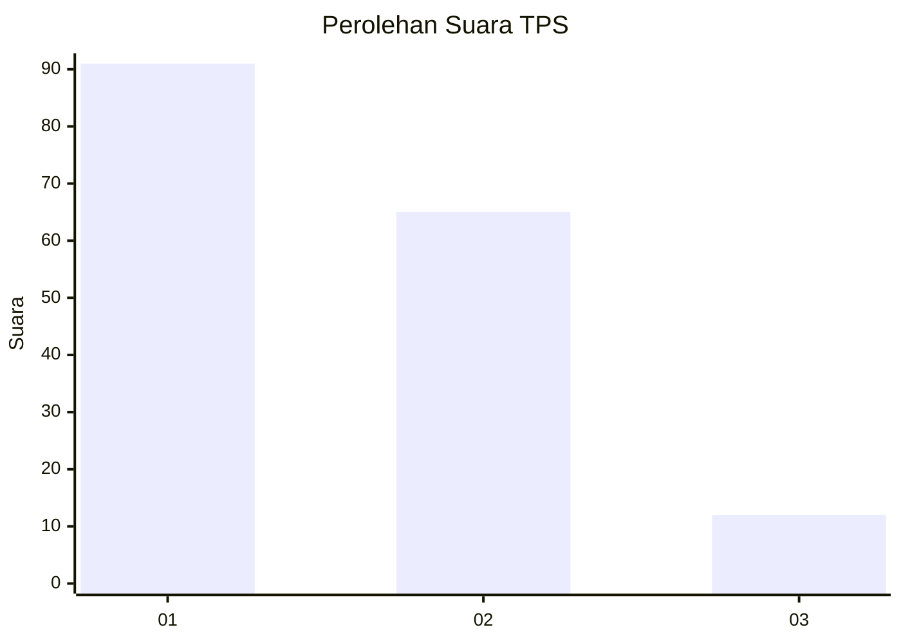
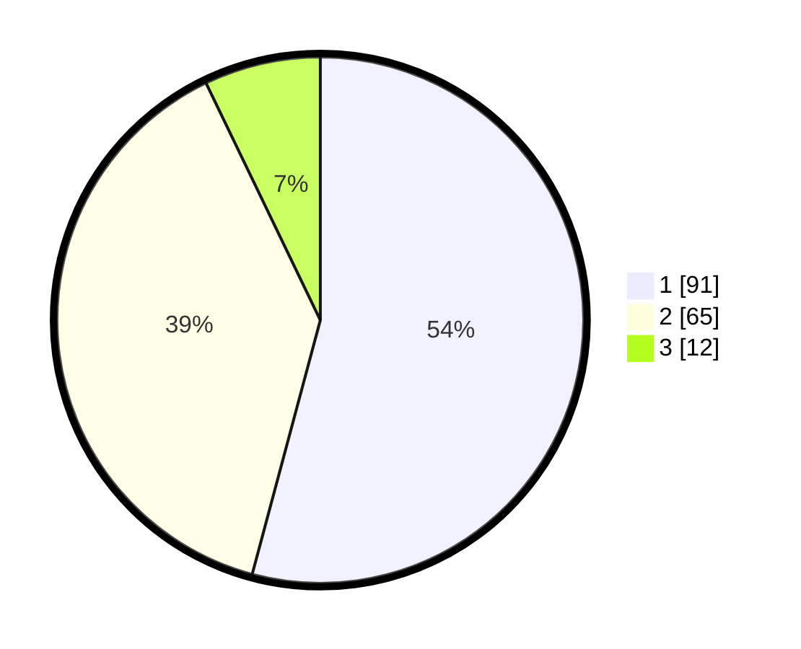

# Hasil

## Grafik

## Tabel

| No. | Nama Paslon    | Suara | Suara (raw) | Persentase |
|:--- |:-------------- | -----:| -----------:| ----------:|
| 1   | ANIES MUHAIMIN | 91    | [91][p-1]   | 54,17      |
| 2   | PRABOWO GIBRAN | 65    | [65][p-2]   | 38,69      |
| 3   | GANJAR MAHFUD  | 12    | [12][p-3]   | 7,14       |

[p-1]: https://github.com/gigit-pemilu/pemilu-2024-35-jawa-timur/blob/main/pilpres/hitung-suara/sub/35-jawa-timur/sub/29-sumenep/sub/27-kangayan/sub/2002-kangayan/sub/005-tps/sub/paslon-1.txt
[p-2]: https://github.com/gigit-pemilu/pemilu-2024-35-jawa-timur/blob/main/pilpres/hitung-suara/sub/35-jawa-timur/sub/29-sumenep/sub/27-kangayan/sub/2002-kangayan/sub/005-tps/sub/paslon-2.txt
[p-3]: https://github.com/gigit-pemilu/pemilu-2024-35-jawa-timur/blob/main/pilpres/hitung-suara/sub/35-jawa-timur/sub/29-sumenep/sub/27-kangayan/sub/2002-kangayan/sub/005-tps/sub/paslon-3.txt

## Foto C Plano

https://sirekap-obj-formc.kpu.go.id/f42b/pemilu/ppwp/35/29/27/20/02/3529272002005-20240223-141722--4e9041d7-799e-4e19-8e8d-272565344686.jpg

https://sirekap-obj-formc.kpu.go.id/f42b/pemilu/ppwp/35/29/27/20/02/3529272002005-20240223-141754--d5cfac3f-a317-4eb7-8b80-05bdf105eb1a.jpg

https://sirekap-obj-formc.kpu.go.id/f42b/pemilu/ppwp/35/29/27/20/02/3529272002005-20240223-141826--543968e2-09ed-4c62-ae47-2c59b39e806c.jpg

## Metadata

| Key        | Value               |
| ---------- | ------------------- |
| Time Stamp | 2024-02-25 22:00:00 |

