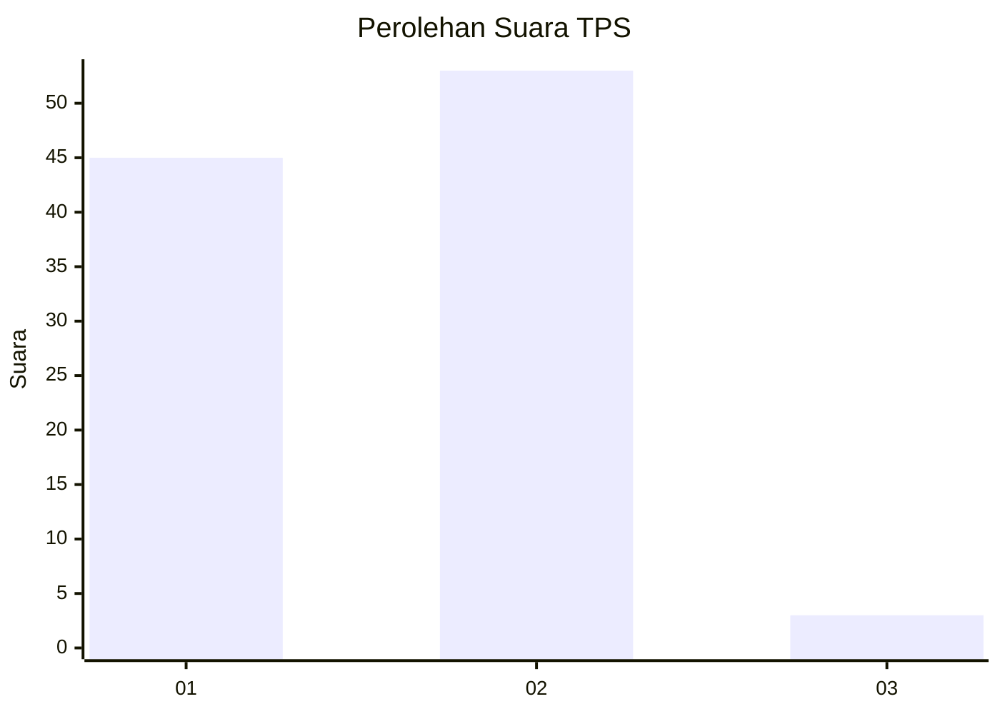
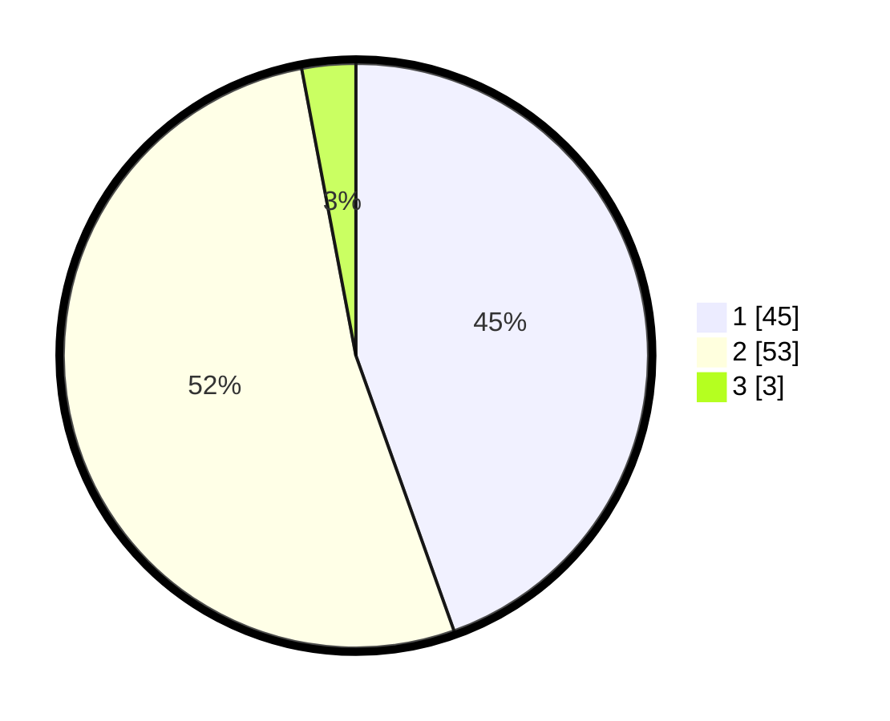

# Hasil

## Grafik

## Tabel

| No. | Nama Paslon    | Suara | Suara (raw) | Persentase |
|:--- |:-------------- | -----:| -----------:| ----------:|
| 1   | ANIES MUHAIMIN | 45    | [45][p-1]   | 44,55      |
| 2   | PRABOWO GIBRAN | 53    | [53][p-2]   | 52,48      |
| 3   | GANJAR MAHFUD  | 3     | [3][p-3]    | 2,97       |

[p-1]: https://github.com/gigit-pemilu/pemilu-2024/blob/main/pilpres/hitung-suara/sub/35-jawa-timur/sub/29-sumenep/sub/27-kangayan/sub/2002-kangayan/sub/006-tps/sub/paslon-1.txt
[p-2]: https://github.com/gigit-pemilu/pemilu-2024/blob/main/pilpres/hitung-suara/sub/35-jawa-timur/sub/29-sumenep/sub/27-kangayan/sub/2002-kangayan/sub/006-tps/sub/paslon-2.txt
[p-3]: https://github.com/gigit-pemilu/pemilu-2024/blob/main/pilpres/hitung-suara/sub/35-jawa-timur/sub/29-sumenep/sub/27-kangayan/sub/2002-kangayan/sub/006-tps/sub/paslon-3.txt

## Foto C Plano

https://sirekap-obj-formc.kpu.go.id/24e2/pemilu/ppwp/35/29/27/20/02/3529272002006-20240223-142406--38cd487f-c6a9-4a40-860b-1fd248c295e2.jpg

https://sirekap-obj-formc.kpu.go.id/24e2/pemilu/ppwp/35/29/27/20/02/3529272002006-20240223-142434--cbed97b1-64e8-4a39-b90d-a3ddcf36aa93.jpg

https://sirekap-obj-formc.kpu.go.id/24e2/pemilu/ppwp/35/29/27/20/02/3529272002006-20240223-142509--fc2f7467-402f-41e2-93e8-50a5bfc95b9e.jpg

## Metadata

| Key        | Value               |
| ---------- | ------------------- |
| Time Stamp | 2024-02-24 22:31:28 |

