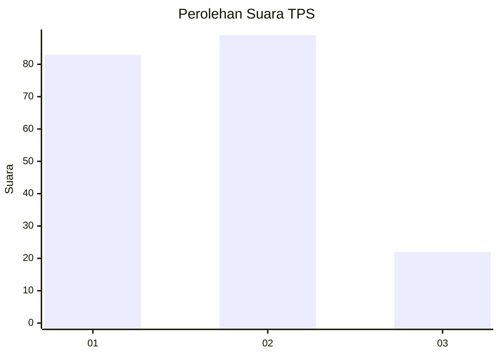
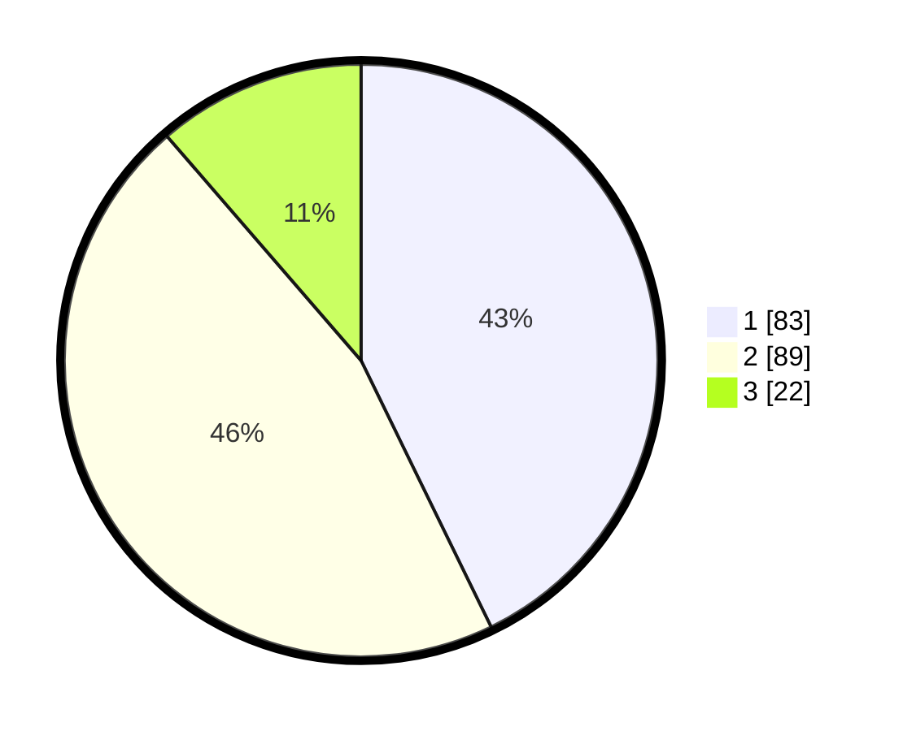

# Hasil

## Grafik

## Tabel

| No. | Nama Paslon    | Suara | Suara (raw) | Persentase |
|:--- |:-------------- | -----:| -----------:| ----------:|
| 1   | ANIES MUHAIMIN | 83    | [83][p-1]   | 42,78      |
| 2   | PRABOWO GIBRAN | 89    | [89][p-2]   | 45,88      |
| 3   | GANJAR MAHFUD  | 22    | [22][p-3]   | 11,34      |

[p-1]: https://github.com/gigit-pemilu/pemilu-2024/blob/main/pilpres/hitung-suara/sub/35-jawa-timur/sub/29-sumenep/sub/27-kangayan/sub/2002-kangayan/sub/007-tps/sub/paslon-1.txt
[p-2]: https://github.com/gigit-pemilu/pemilu-2024/blob/main/pilpres/hitung-suara/sub/35-jawa-timur/sub/29-sumenep/sub/27-kangayan/sub/2002-kangayan/sub/007-tps/sub/paslon-2.txt
[p-3]: https://github.com/gigit-pemilu/pemilu-2024/blob/main/pilpres/hitung-suara/sub/35-jawa-timur/sub/29-sumenep/sub/27-kangayan/sub/2002-kangayan/sub/007-tps/sub/paslon-3.txt

## Foto C Plano

https://sirekap-obj-formc.kpu.go.id/1afe/pemilu/ppwp/35/29/27/20/02/3529272002007-20240223-143147--a6dc6bb7-d2a7-4396-b490-c41530dca9c8.jpg

https://sirekap-obj-formc.kpu.go.id/1afe/pemilu/ppwp/35/29/27/20/02/3529272002007-20240223-143215--9696bd86-2c16-4cd0-b6d4-a0d3d9e00115.jpg

https://sirekap-obj-formc.kpu.go.id/1afe/pemilu/ppwp/35/29/27/20/02/3529272002007-20240223-143245--4d61b671-bb22-4469-98e7-2a96837fd0c6.jpg

## Metadata

| Key        | Value               |
| ---------- | ------------------- |
| Time Stamp | 2024-02-24 22:31:28 |

