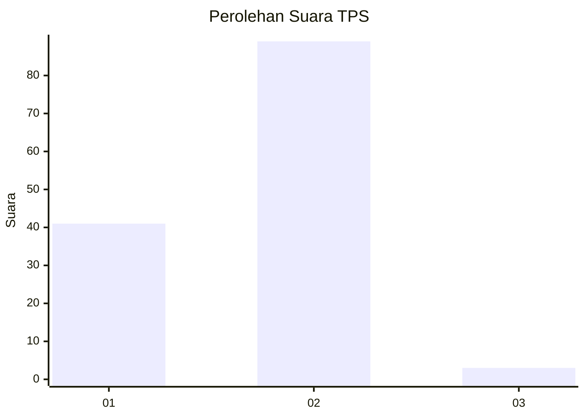
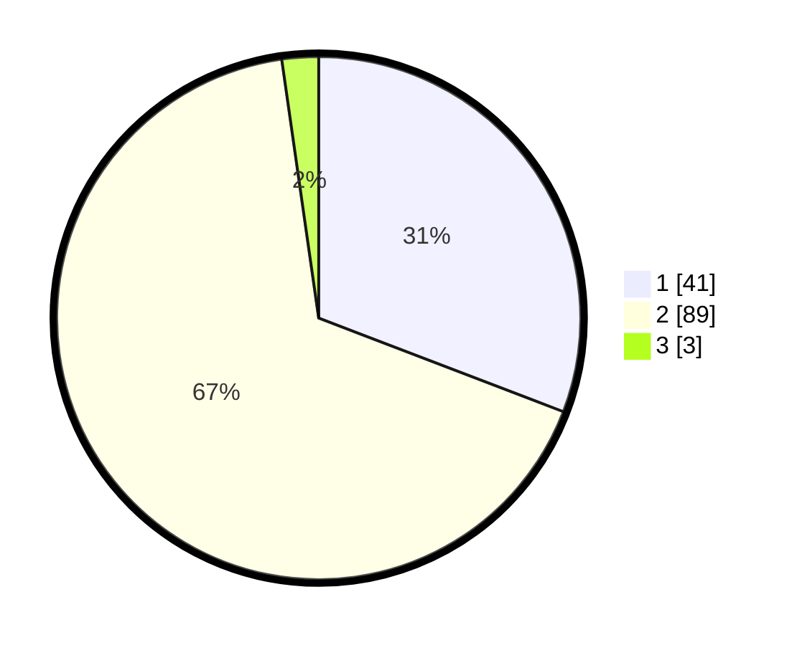

# Hasil

## Grafik

## Tabel

| No. | Nama Paslon    | Suara | Suara (raw) | Persentase |
|:--- |:-------------- | -----:| -----------:| ----------:|
| 1   | ANIES MUHAIMIN | 41    | [41][p-1]   | 30,83      |
| 2   | PRABOWO GIBRAN | 89    | [89][p-2]   | 66,92      |
| 3   | GANJAR MAHFUD  | 3     | [3][p-3]    | 2,26       |

[p-1]: https://github.com/gigit-pemilu/pemilu-2024-35-jawa-timur/blob/main/pilpres/hitung-suara/sub/35-jawa-timur/sub/29-sumenep/sub/27-kangayan/sub/2002-kangayan/sub/008-tps/sub/paslon-1.txt
[p-2]: https://github.com/gigit-pemilu/pemilu-2024-35-jawa-timur/blob/main/pilpres/hitung-suara/sub/35-jawa-timur/sub/29-sumenep/sub/27-kangayan/sub/2002-kangayan/sub/008-tps/sub/paslon-2.txt
[p-3]: https://github.com/gigit-pemilu/pemilu-2024-35-jawa-timur/blob/main/pilpres/hitung-suara/sub/35-jawa-timur/sub/29-sumenep/sub/27-kangayan/sub/2002-kangayan/sub/008-tps/sub/paslon-3.txt

## Foto C Plano

https://sirekap-obj-formc.kpu.go.id/ba49/pemilu/ppwp/35/29/27/20/02/3529272002008-20240223-143445--5450b623-09b5-4dea-8c91-9ac62c93e816.jpg

https://sirekap-obj-formc.kpu.go.id/ba49/pemilu/ppwp/35/29/27/20/02/3529272002008-20240223-143544--f9be0f00-be59-4d8e-983c-5dcf1f7171d4.jpg

https://sirekap-obj-formc.kpu.go.id/ba49/pemilu/ppwp/35/29/27/20/02/3529272002008-20240223-143636--7cb63301-74a3-4033-82a1-d6ecaa4f4467.jpg

## Metadata

| Key        | Value               |
| ---------- | ------------------- |
| Time Stamp | 2024-02-24 22:31:28 |

