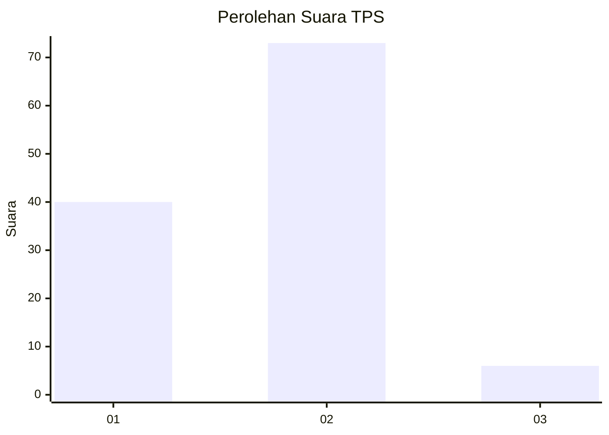
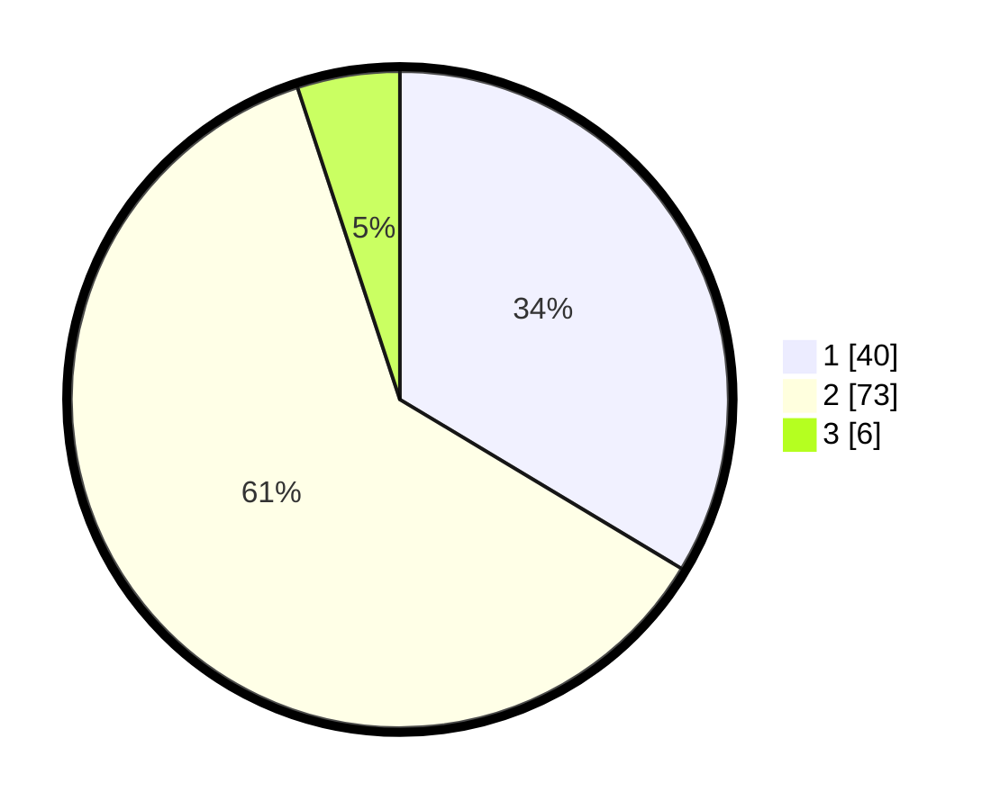

# Hasil

## Grafik

## Tabel

| No. | Nama Paslon    | Suara | Suara (raw) | Persentase |
|:--- |:-------------- | -----:| -----------:| ----------:|
| 1   | ANIES MUHAIMIN | 40    | [40][p-1]   | 33,61      |
| 2   | PRABOWO GIBRAN | 73    | [73][p-2]   | 61,34      |
| 3   | GANJAR MAHFUD  | 6     | [6][p-3]    | 5,04       |

[p-1]: https://github.com/gigit-pemilu/pemilu-2024/blob/main/pilpres/hitung-suara/sub/35-jawa-timur/sub/29-sumenep/sub/27-kangayan/sub/2002-kangayan/sub/009-tps/sub/paslon-1.txt
[p-2]: https://github.com/gigit-pemilu/pemilu-2024/blob/main/pilpres/hitung-suara/sub/35-jawa-timur/sub/29-sumenep/sub/27-kangayan/sub/2002-kangayan/sub/009-tps/sub/paslon-2.txt
[p-3]: https://github.com/gigit-pemilu/pemilu-2024/blob/main/pilpres/hitung-suara/sub/35-jawa-timur/sub/29-sumenep/sub/27-kangayan/sub/2002-kangayan/sub/009-tps/sub/paslon-3.txt

## Foto C Plano

https://sirekap-obj-formc.kpu.go.id/412f/pemilu/ppwp/35/29/27/20/02/3529272002009-20240223-143957--f8f587d0-7c8a-4251-8c87-a79b4d3d08c6.jpg

https://sirekap-obj-formc.kpu.go.id/412f/pemilu/ppwp/35/29/27/20/02/3529272002009-20240223-144023--7bdf4e3f-b18f-4ee8-941b-032b771454f3.jpg

https://sirekap-obj-formc.kpu.go.id/412f/pemilu/ppwp/35/29/27/20/02/3529272002009-20240223-144055--d3e5f27e-9853-4531-8c22-e85dc8e3537e.jpg

## Metadata

| Key        | Value               |
| ---------- | ------------------- |
| Time Stamp | 2024-02-24 22:31:28 |

