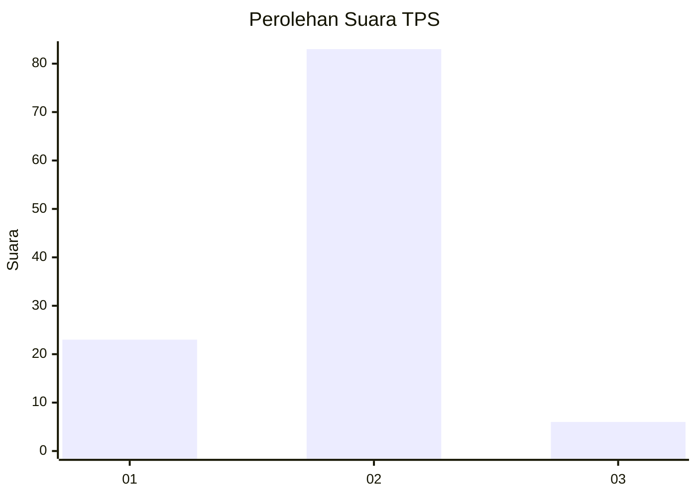
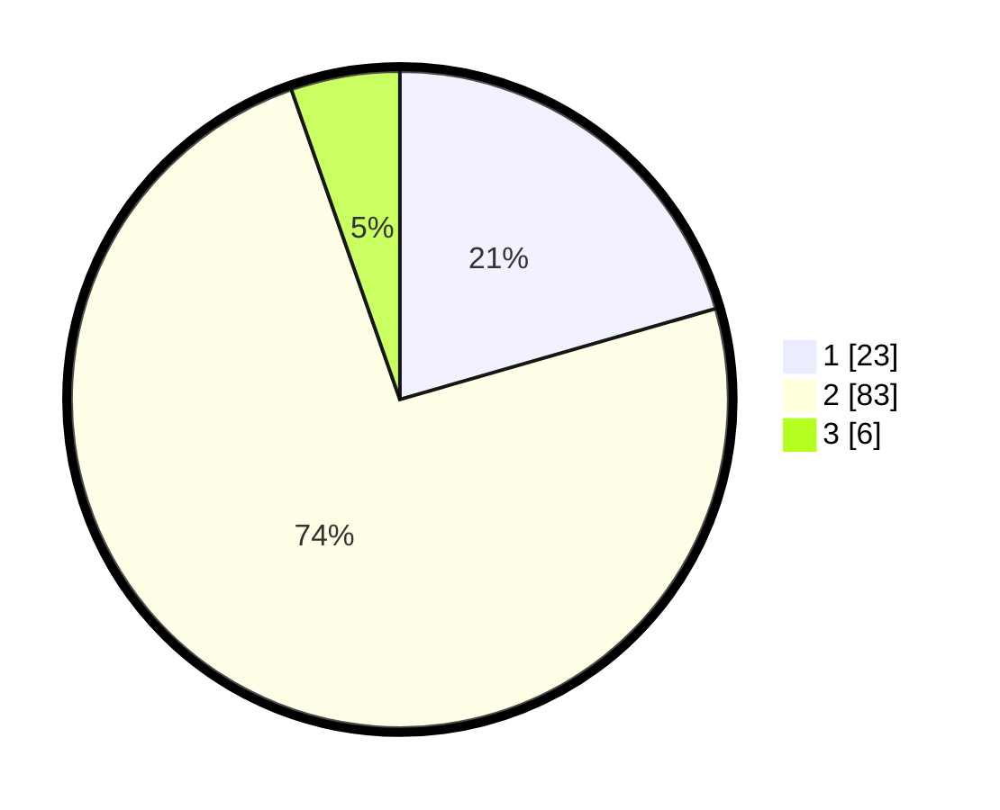

# Hasil

## Grafik

## Tabel

| No. | Nama Paslon    | Suara | Suara (raw) | Persentase |
|:--- |:-------------- | -----:| -----------:| ----------:|
| 1   | ANIES MUHAIMIN | 23    | [23][p-1]   | 20,54      |
| 2   | PRABOWO GIBRAN | 83    | [83][p-2]   | 74,11      |
| 3   | GANJAR MAHFUD  | 6     | [6][p-3]    | 5,36       |

[p-1]: https://github.com/gigit-pemilu/pemilu-2024-35-jawa-timur/blob/main/pilpres/hitung-suara/sub/35-jawa-timur/sub/29-sumenep/sub/27-kangayan/sub/2002-kangayan/sub/010-tps/sub/paslon-1.txt
[p-2]: https://github.com/gigit-pemilu/pemilu-2024-35-jawa-timur/blob/main/pilpres/hitung-suara/sub/35-jawa-timur/sub/29-sumenep/sub/27-kangayan/sub/2002-kangayan/sub/010-tps/sub/paslon-2.txt
[p-3]: https://github.com/gigit-pemilu/pemilu-2024-35-jawa-timur/blob/main/pilpres/hitung-suara/sub/35-jawa-timur/sub/29-sumenep/sub/27-kangayan/sub/2002-kangayan/sub/010-tps/sub/paslon-3.txt

## Foto C Plano

https://sirekap-obj-formc.kpu.go.id/1143/pemilu/ppwp/35/29/27/20/02/3529272002010-20240223-144354--3b7ebb4b-5370-4b2e-b95c-9533a3c251c3.jpg

https://sirekap-obj-formc.kpu.go.id/1143/pemilu/ppwp/35/29/27/20/02/3529272002010-20240223-144422--8ad148dd-0d59-4f4d-9383-3f3df81cae11.jpg

https://sirekap-obj-formc.kpu.go.id/1143/pemilu/ppwp/35/29/27/20/02/3529272002010-20240223-144449--42d35ac3-5fa1-49b3-9378-10401a306893.jpg

## Metadata

| Key        | Value               |
| ---------- | ------------------- |
| Time Stamp | 2024-02-24 22:31:28 |

