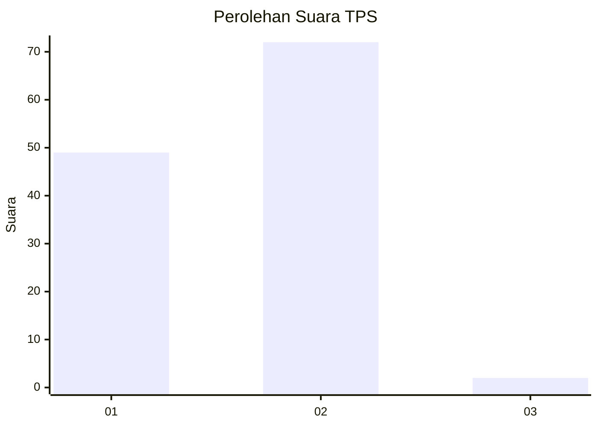
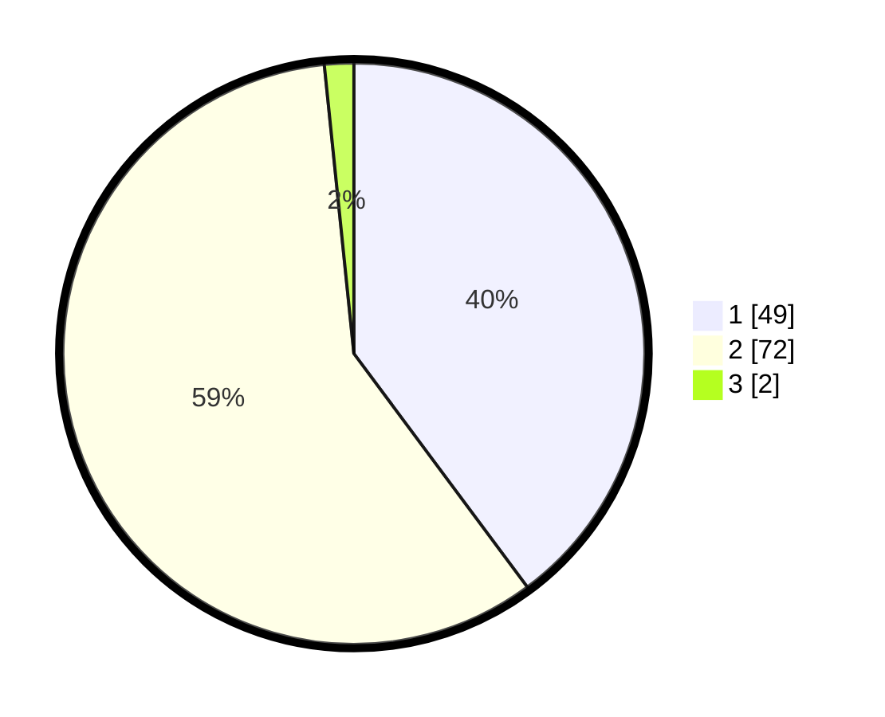

# Hasil

## Grafik

## Tabel

| No. | Nama Paslon    | Suara | Suara (raw) | Persentase |
|:--- |:-------------- | -----:| -----------:| ----------:|
| 1   | ANIES MUHAIMIN | 49    | [49][p-1]   | 39,84      |
| 2   | PRABOWO GIBRAN | 72    | [72][p-2]   | 58,54      |
| 3   | GANJAR MAHFUD  | 2     | [2][p-3]    | 1,63       |

[p-1]: https://github.com/gigit-pemilu/pemilu-2024-35-jawa-timur/blob/main/pilpres/hitung-suara/sub/35-jawa-timur/sub/29-sumenep/sub/27-kangayan/sub/2002-kangayan/sub/011-tps/sub/paslon-1.txt
[p-2]: https://github.com/gigit-pemilu/pemilu-2024-35-jawa-timur/blob/main/pilpres/hitung-suara/sub/35-jawa-timur/sub/29-sumenep/sub/27-kangayan/sub/2002-kangayan/sub/011-tps/sub/paslon-2.txt
[p-3]: https://github.com/gigit-pemilu/pemilu-2024-35-jawa-timur/blob/main/pilpres/hitung-suara/sub/35-jawa-timur/sub/29-sumenep/sub/27-kangayan/sub/2002-kangayan/sub/011-tps/sub/paslon-3.txt

## Foto C Plano

https://sirekap-obj-formc.kpu.go.id/5365/pemilu/ppwp/35/29/27/20/02/3529272002011-20240223-145102--06727d73-7693-4f1a-aa91-ea64d3b4c1de.jpg

https://sirekap-obj-formc.kpu.go.id/5365/pemilu/ppwp/35/29/27/20/02/3529272002011-20240223-145143--0a6c3e6c-7a16-42f6-a928-03cb411b9f98.jpg

https://sirekap-obj-formc.kpu.go.id/5365/pemilu/ppwp/35/29/27/20/02/3529272002011-20240223-145230--99d0b4d1-b631-412e-8ead-72ae82af9955.jpg

## Metadata

| Key        | Value               |
| ---------- | ------------------- |
| Time Stamp | 2024-02-24 22:31:28 |

