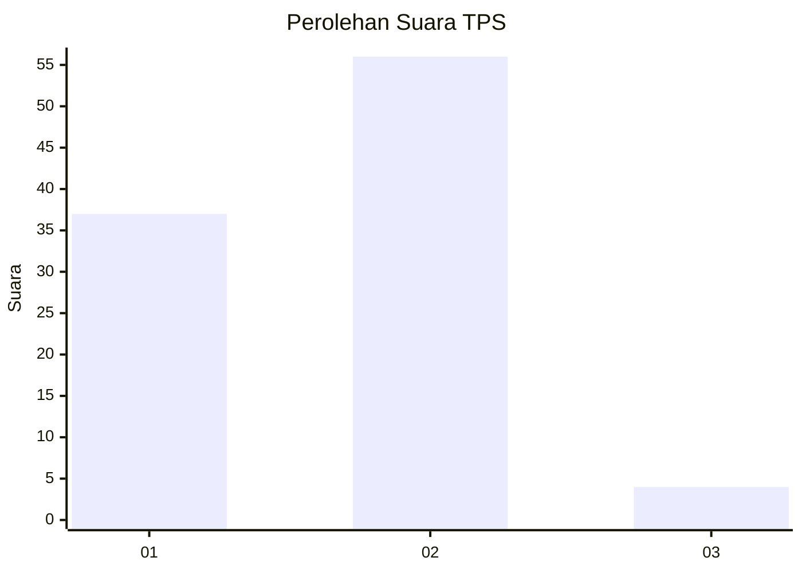
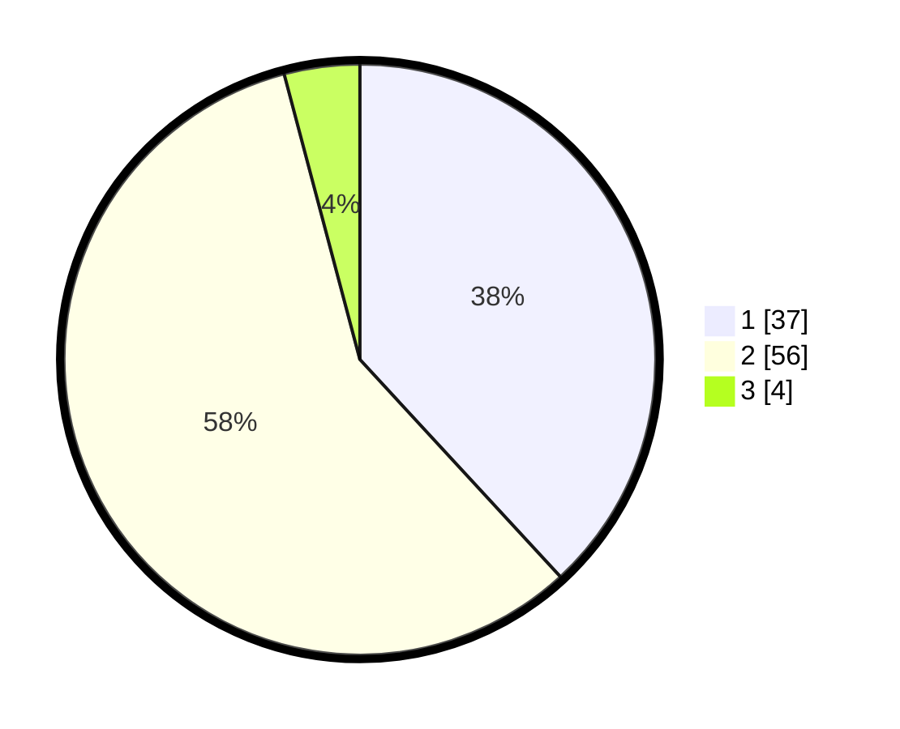

# Hasil

## Grafik

## Tabel

| No. | Nama Paslon    | Suara | Suara (raw) | Persentase |
|:--- |:-------------- | -----:| -----------:| ----------:|
| 1   | ANIES MUHAIMIN | 37    | [37][p-1]   | 38,14      |
| 2   | PRABOWO GIBRAN | 56    | [56][p-2]   | 57,73      |
| 3   | GANJAR MAHFUD  | 4     | [4][p-3]    | 4,12       |

[p-1]: https://github.com/gigit-pemilu/pemilu-2024-35-jawa-timur/blob/main/pilpres/hitung-suara/sub/35-jawa-timur/sub/29-sumenep/sub/27-kangayan/sub/2002-kangayan/sub/012-tps/sub/paslon-1.txt
[p-2]: https://github.com/gigit-pemilu/pemilu-2024-35-jawa-timur/blob/main/pilpres/hitung-suara/sub/35-jawa-timur/sub/29-sumenep/sub/27-kangayan/sub/2002-kangayan/sub/012-tps/sub/paslon-2.txt
[p-3]: https://github.com/gigit-pemilu/pemilu-2024-35-jawa-timur/blob/main/pilpres/hitung-suara/sub/35-jawa-timur/sub/29-sumenep/sub/27-kangayan/sub/2002-kangayan/sub/012-tps/sub/paslon-3.txt

## Foto C Plano

https://sirekap-obj-formc.kpu.go.id/fe7b/pemilu/ppwp/35/29/27/20/02/3529272002012-20240223-145748--37039ebc-369a-47f8-8853-094be943e725.jpg

https://sirekap-obj-formc.kpu.go.id/fe7b/pemilu/ppwp/35/29/27/20/02/3529272002012-20240223-145824--25b6c523-f6cd-493c-8f97-948d3e9950bc.jpg

https://sirekap-obj-formc.kpu.go.id/fe7b/pemilu/ppwp/35/29/27/20/02/3529272002012-20240223-145917--1f4c148b-f374-476e-b2f7-7c14c3f74fc4.jpg

## Metadata

| Key        | Value               |
| ---------- | ------------------- |
| Time Stamp | 2024-02-24 22:31:28 |

