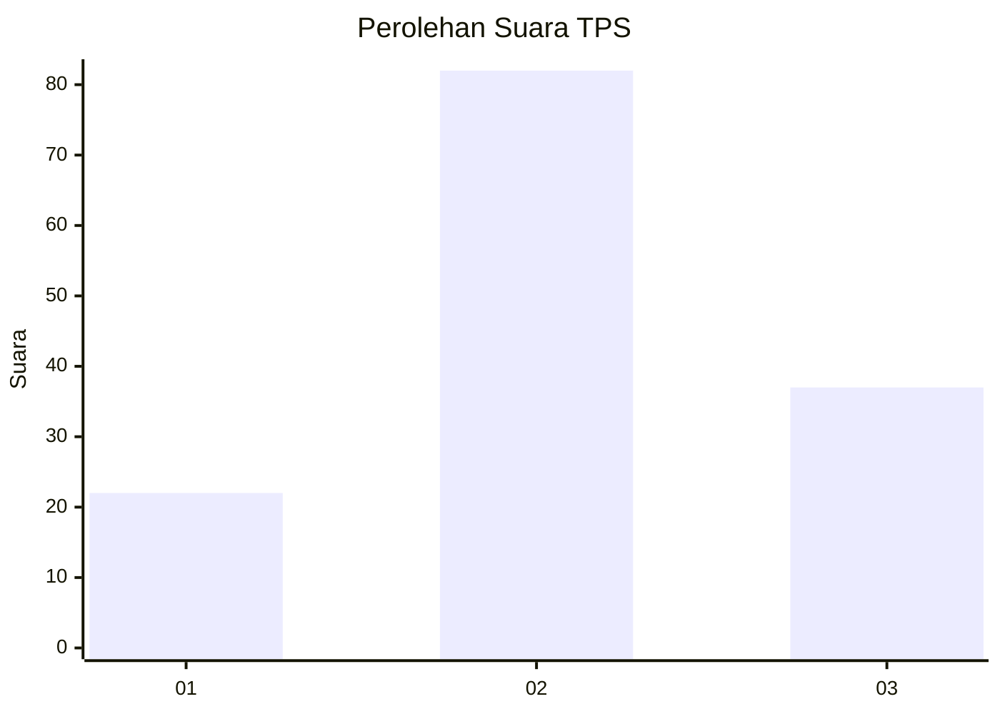
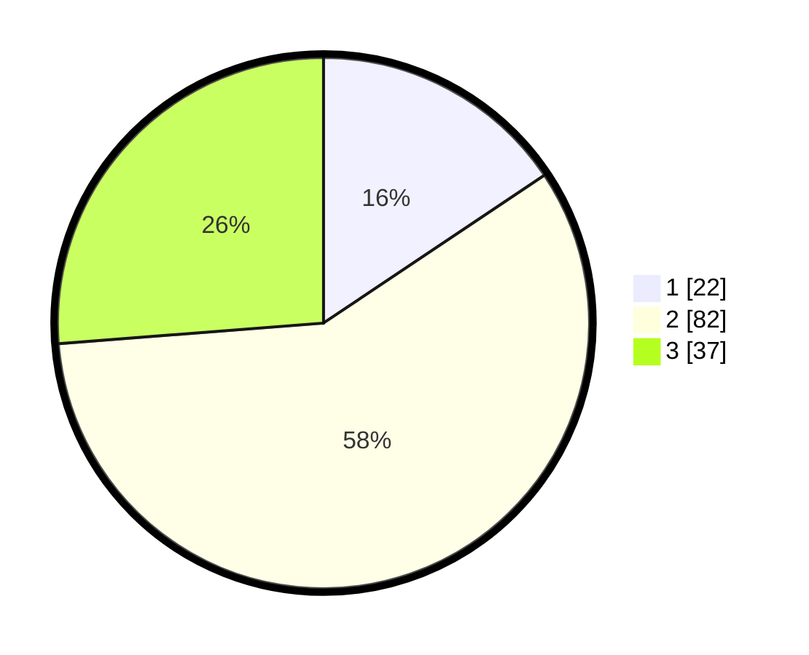

# Hasil

## Grafik

## Tabel

| No. | Nama Paslon    | Suara | Suara (raw) | Persentase |
|:--- |:-------------- | -----:| -----------:| ----------:|
| 1   | ANIES MUHAIMIN | 22    | [22][p-1]   | 15,60      |
| 2   | PRABOWO GIBRAN | 82    | [82][p-2]   | 58,16      |
| 3   | GANJAR MAHFUD  | 37    | [37][p-3]   | 26,24      |

[p-1]: https://github.com/gigit-pemilu/pemilu-2024-35-jawa-timur/blob/main/pilpres/hitung-suara/sub/35-jawa-timur/sub/29-sumenep/sub/27-kangayan/sub/2002-kangayan/sub/013-tps/sub/paslon-1.txt
[p-2]: https://github.com/gigit-pemilu/pemilu-2024-35-jawa-timur/blob/main/pilpres/hitung-suara/sub/35-jawa-timur/sub/29-sumenep/sub/27-kangayan/sub/2002-kangayan/sub/013-tps/sub/paslon-2.txt
[p-3]: https://github.com/gigit-pemilu/pemilu-2024-35-jawa-timur/blob/main/pilpres/hitung-suara/sub/35-jawa-timur/sub/29-sumenep/sub/27-kangayan/sub/2002-kangayan/sub/013-tps/sub/paslon-3.txt

## Foto C Plano

https://sirekap-obj-formc.kpu.go.id/de92/pemilu/ppwp/35/29/27/20/02/3529272002013-20240223-150126--1a3e5d4d-05fb-4785-9a2c-580e5ad717ea.jpg

https://sirekap-obj-formc.kpu.go.id/de92/pemilu/ppwp/35/29/27/20/02/3529272002013-20240223-150212--bc0be550-d670-4a84-a605-e24651ae3885.jpg

https://sirekap-obj-formc.kpu.go.id/de92/pemilu/ppwp/35/29/27/20/02/3529272002013-20240223-150252--c419d746-18a6-41ba-ae9d-7407bf87076a.jpg

## Metadata

| Key        | Value               |
| ---------- | ------------------- |
| Time Stamp | 2024-02-25 11:00:00 |

