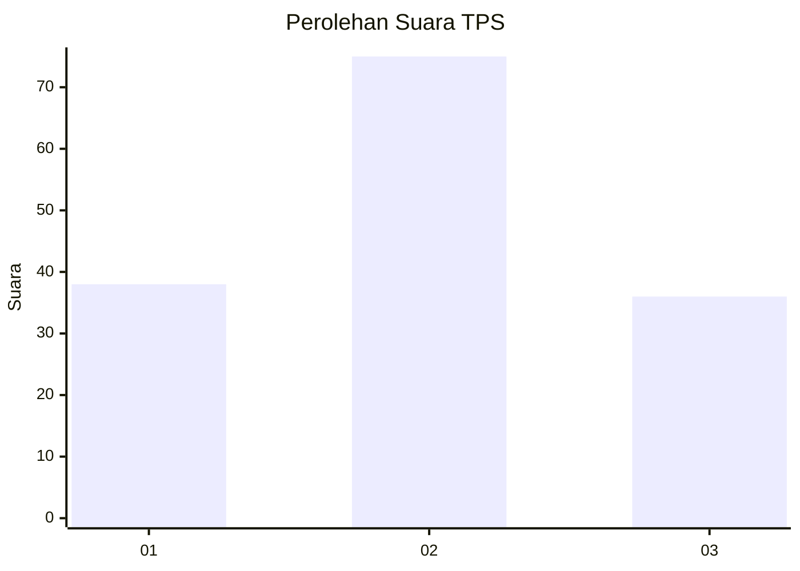
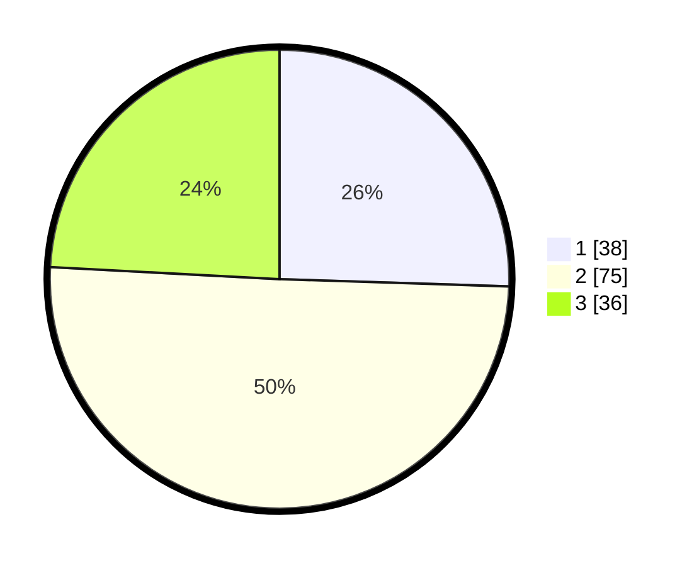

# Hasil

## Grafik

## Tabel

| No. | Nama Paslon    | Suara | Suara (raw) | Persentase |
|:--- |:-------------- | -----:| -----------:| ----------:|
| 1   | ANIES MUHAIMIN | 38    | [38][p-1]   | 25,50      |
| 2   | PRABOWO GIBRAN | 75    | [75][p-2]   | 50,34      |
| 3   | GANJAR MAHFUD  | 36    | [36][p-3]   | 24,16      |

[p-1]: https://github.com/gigit-pemilu/pemilu-2024-35-jawa-timur/blob/main/pilpres/hitung-suara/sub/35-jawa-timur/sub/29-sumenep/sub/27-kangayan/sub/2002-kangayan/sub/015-tps/sub/paslon-1.txt
[p-2]: https://github.com/gigit-pemilu/pemilu-2024-35-jawa-timur/blob/main/pilpres/hitung-suara/sub/35-jawa-timur/sub/29-sumenep/sub/27-kangayan/sub/2002-kangayan/sub/015-tps/sub/paslon-2.txt
[p-3]: https://github.com/gigit-pemilu/pemilu-2024-35-jawa-timur/blob/main/pilpres/hitung-suara/sub/35-jawa-timur/sub/29-sumenep/sub/27-kangayan/sub/2002-kangayan/sub/015-tps/sub/paslon-3.txt

## Foto C Plano

https://sirekap-obj-formc.kpu.go.id/53b5/pemilu/ppwp/35/29/27/20/02/3529272002015-20240223-150801--3b52fac9-b48d-4695-8044-daa3a5b541d6.jpg

https://sirekap-obj-formc.kpu.go.id/53b5/pemilu/ppwp/35/29/27/20/02/3529272002015-20240223-150848--b09c29be-fb7c-4136-b36b-456ffc73bc3b.jpg

https://sirekap-obj-formc.kpu.go.id/53b5/pemilu/ppwp/35/29/27/20/02/3529272002015-20240223-150940--671ce297-c195-4332-a07d-cd2f455bde92.jpg

## Metadata

| Key        | Value               |
| ---------- | ------------------- |
| Time Stamp | 2024-02-25 18:00:00 |

