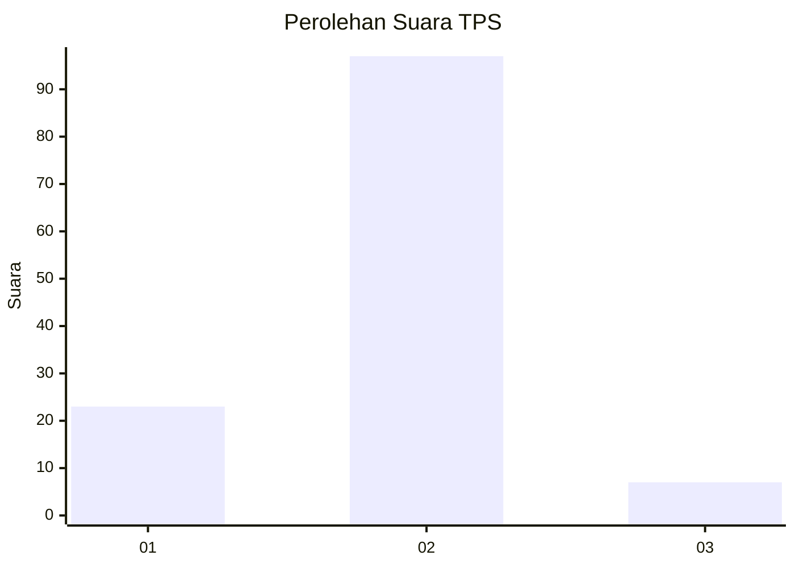
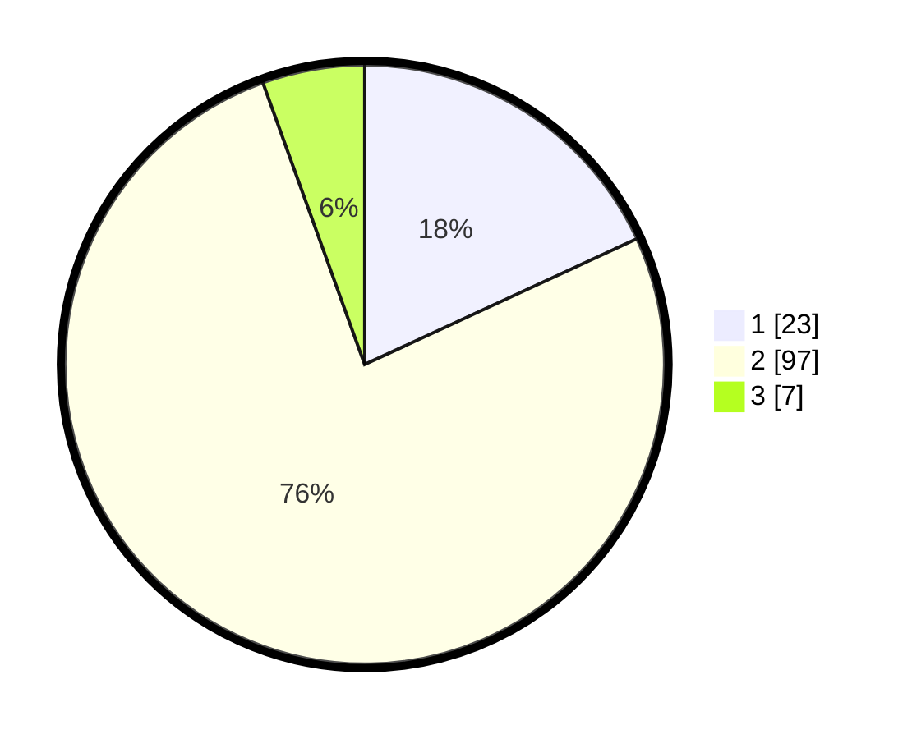

# Hasil

## Grafik

## Tabel

| No. | Nama Paslon    | Suara | Suara (raw) | Persentase |
|:--- |:-------------- | -----:| -----------:| ----------:|
| 1   | ANIES MUHAIMIN | 23    | [23][p-1]   | 18,11      |
| 2   | PRABOWO GIBRAN | 97    | [97][p-2]   | 76,38      |
| 3   | GANJAR MAHFUD  | 7     | [7][p-3]    | 5,51       |

[p-1]: https://github.com/gigit-pemilu/pemilu-2024-35-jawa-timur/blob/main/pilpres/hitung-suara/sub/35-jawa-timur/sub/29-sumenep/sub/27-kangayan/sub/2002-kangayan/sub/016-tps/sub/paslon-1.txt
[p-2]: https://github.com/gigit-pemilu/pemilu-2024-35-jawa-timur/blob/main/pilpres/hitung-suara/sub/35-jawa-timur/sub/29-sumenep/sub/27-kangayan/sub/2002-kangayan/sub/016-tps/sub/paslon-2.txt
[p-3]: https://github.com/gigit-pemilu/pemilu-2024-35-jawa-timur/blob/main/pilpres/hitung-suara/sub/35-jawa-timur/sub/29-sumenep/sub/27-kangayan/sub/2002-kangayan/sub/016-tps/sub/paslon-3.txt

## Foto C Plano

https://sirekap-obj-formc.kpu.go.id/a135/pemilu/ppwp/35/29/27/20/02/3529272002016-20240223-151120--338e7fcf-5047-4ce8-b1c3-ced1e573a263.jpg

https://sirekap-obj-formc.kpu.go.id/a135/pemilu/ppwp/35/29/27/20/02/3529272002016-20240223-151200--934d52a4-29d0-4335-bfc4-5b8d134cc8aa.jpg

https://sirekap-obj-formc.kpu.go.id/a135/pemilu/ppwp/35/29/27/20/02/3529272002016-20240223-151243--16d5c99f-7437-469b-8aec-9541ff844d70.jpg

## Metadata

| Key        | Value               |
| ---------- | ------------------- |
| Time Stamp | 2024-02-24 22:31:28 |

