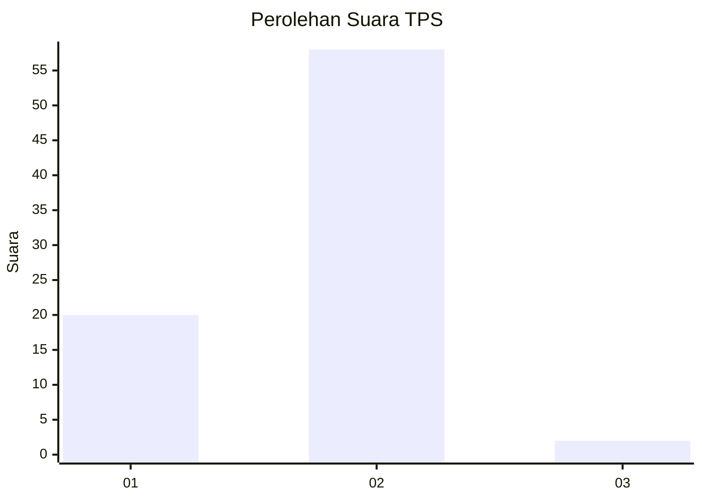
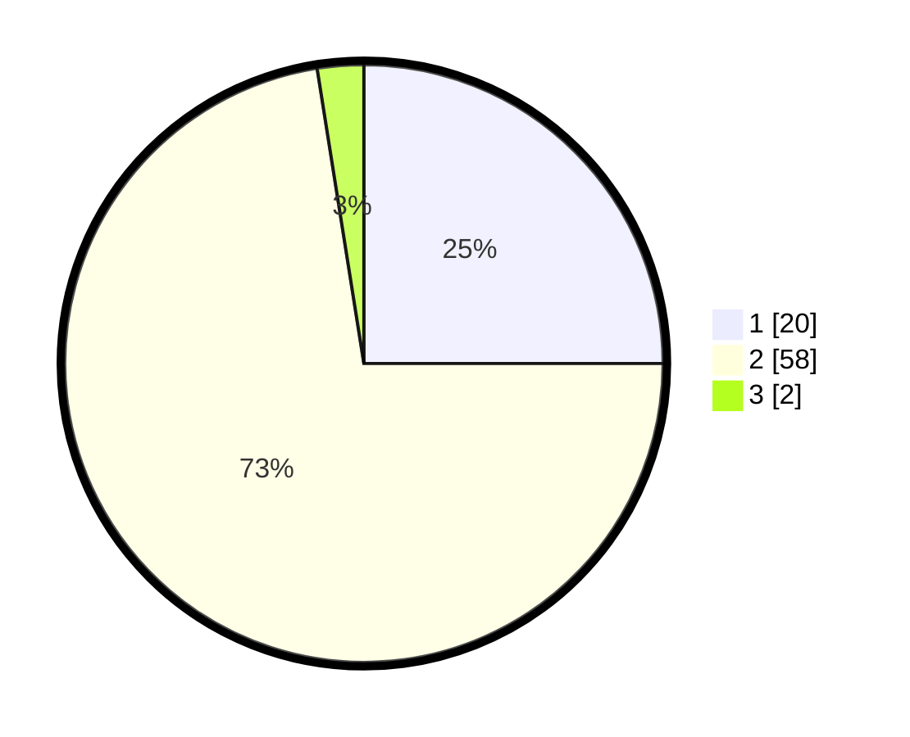

# Hasil

## Grafik

## Tabel

| No. | Nama Paslon    | Suara | Suara (raw) | Persentase |
|:--- |:-------------- | -----:| -----------:| ----------:|
| 1   | ANIES MUHAIMIN | 20    | [20][p-1]   | 25,00      |
| 2   | PRABOWO GIBRAN | 58    | [58][p-2]   | 72,50      |
| 3   | GANJAR MAHFUD  | 2     | [2][p-3]    | 2,50       |

[p-1]: https://github.com/gigit-pemilu/pemilu-2024/blob/main/pilpres/hitung-suara/sub/35-jawa-timur/sub/29-sumenep/sub/27-kangayan/sub/2002-kangayan/sub/018-tps/sub/paslon-1.txt
[p-2]: https://github.com/gigit-pemilu/pemilu-2024/blob/main/pilpres/hitung-suara/sub/35-jawa-timur/sub/29-sumenep/sub/27-kangayan/sub/2002-kangayan/sub/018-tps/sub/paslon-2.txt
[p-3]: https://github.com/gigit-pemilu/pemilu-2024/blob/main/pilpres/hitung-suara/sub/35-jawa-timur/sub/29-sumenep/sub/27-kangayan/sub/2002-kangayan/sub/018-tps/sub/paslon-3.txt

## Foto C Plano

https://sirekap-obj-formc.kpu.go.id/4233/pemilu/ppwp/35/29/27/20/02/3529272002018-20240223-151654--74b2da54-059c-4e33-bf07-18c78e3a3f11.jpg

https://sirekap-obj-formc.kpu.go.id/4233/pemilu/ppwp/35/29/27/20/02/3529272002018-20240223-151741--8c9df302-69dc-4955-957b-8e76a96ca4ff.jpg

https://sirekap-obj-formc.kpu.go.id/4233/pemilu/ppwp/35/29/27/20/02/3529272002018-20240223-151836--4400b920-c71c-4f4a-b5b6-5ddff72fbbc6.jpg

## Metadata

| Key        | Value               |
| ---------- | ------------------- |
| Time Stamp | 2024-02-24 22:31:28 |

