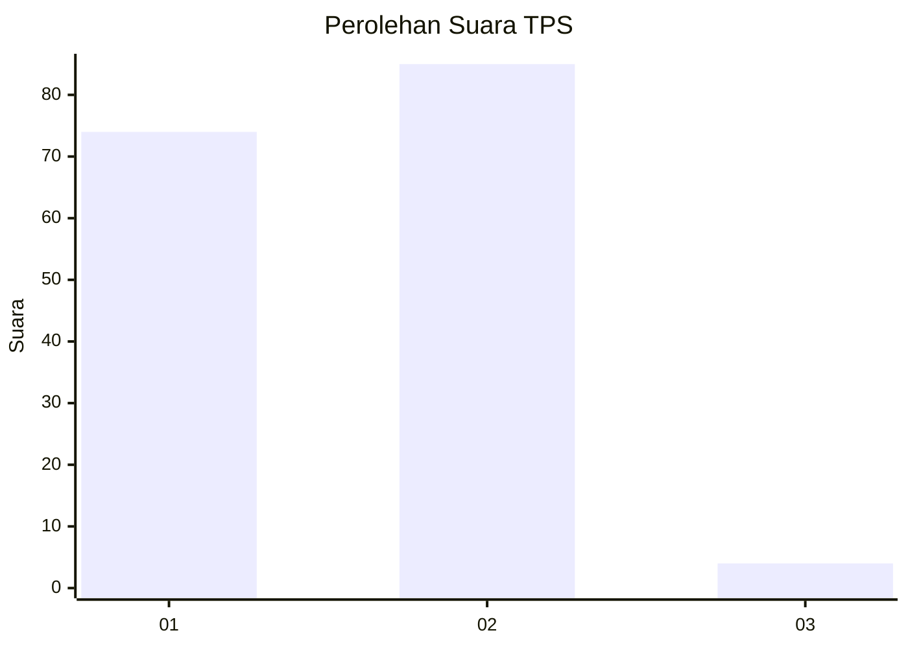
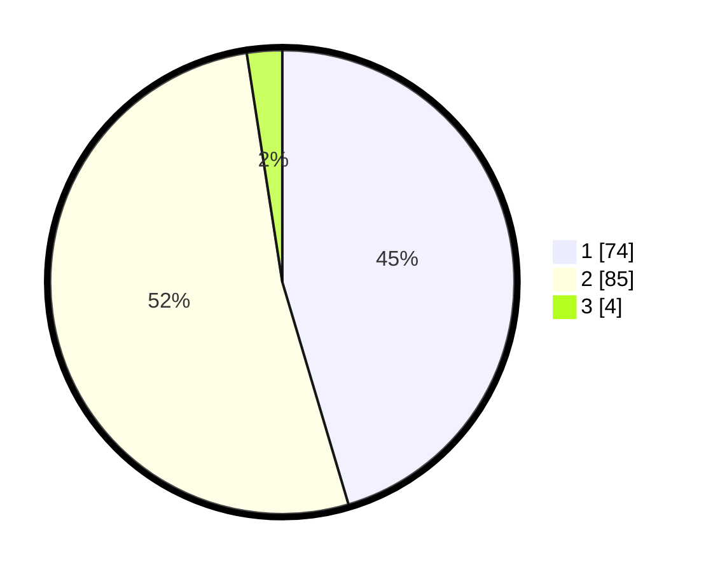

# Hasil

## Grafik

## Tabel

| No. | Nama Paslon    | Suara | Suara (raw) | Persentase |
|:--- |:-------------- | -----:| -----------:| ----------:|
| 1   | ANIES MUHAIMIN | 74    | [74][p-1]   | 45,40      |
| 2   | PRABOWO GIBRAN | 85    | [85][p-2]   | 52,15      |
| 3   | GANJAR MAHFUD  | 4     | [4][p-3]    | 2,45       |

[p-1]: https://github.com/gigit-pemilu/pemilu-2024-35-jawa-timur/blob/main/pilpres/hitung-suara/sub/35-jawa-timur/sub/29-sumenep/sub/27-kangayan/sub/2002-kangayan/sub/022-tps/sub/paslon-1.txt
[p-2]: https://github.com/gigit-pemilu/pemilu-2024-35-jawa-timur/blob/main/pilpres/hitung-suara/sub/35-jawa-timur/sub/29-sumenep/sub/27-kangayan/sub/2002-kangayan/sub/022-tps/sub/paslon-2.txt
[p-3]: https://github.com/gigit-pemilu/pemilu-2024-35-jawa-timur/blob/main/pilpres/hitung-suara/sub/35-jawa-timur/sub/29-sumenep/sub/27-kangayan/sub/2002-kangayan/sub/022-tps/sub/paslon-3.txt

## Foto C Plano

https://sirekap-obj-formc.kpu.go.id/2f1a/pemilu/ppwp/35/29/27/20/02/3529272002022-20240223-160425--e6905d82-9008-4a46-976c-c4b3ade5606d.jpg

https://sirekap-obj-formc.kpu.go.id/2f1a/pemilu/ppwp/35/29/27/20/02/3529272002022-20240223-160512--6391fdc4-0e94-4b92-bd0d-b150a23b23ed.jpg

https://sirekap-obj-formc.kpu.go.id/2f1a/pemilu/ppwp/35/29/27/20/02/3529272002022-20240223-160606--34502985-6486-48e5-bcef-62b5d2894c1d.jpg

## Metadata

| Key        | Value               |
| ---------- | ------------------- |
| Time Stamp | 2024-02-25 15:00:00 |

