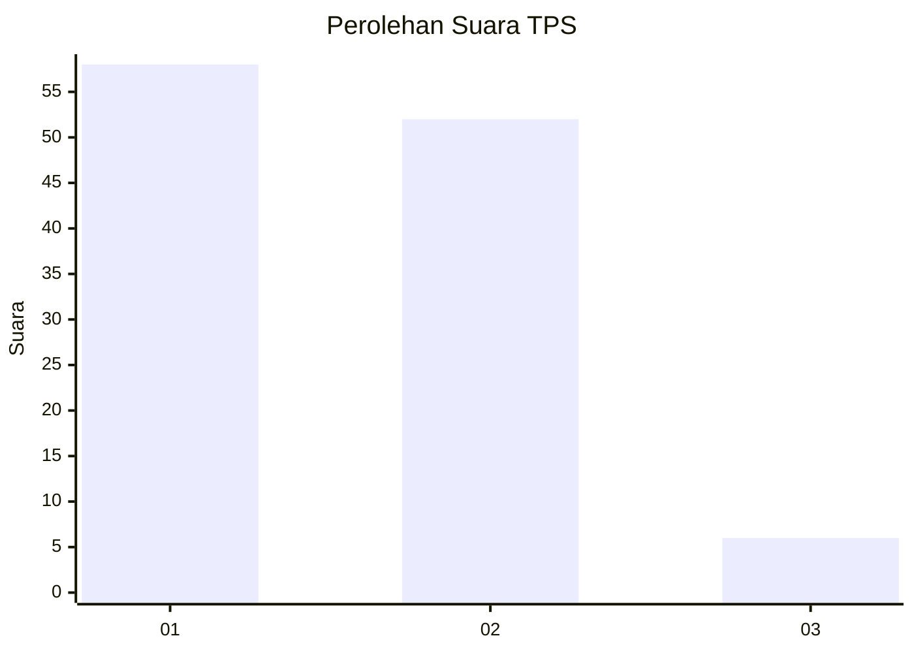
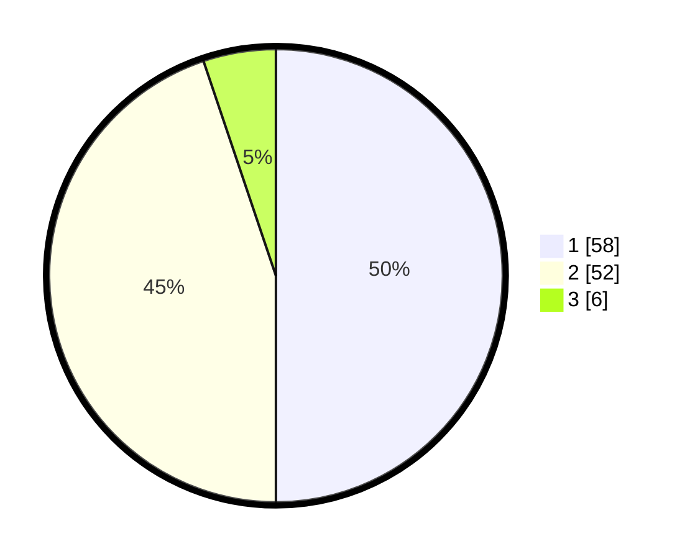

# Hasil

## Grafik

## Tabel

| No. | Nama Paslon    | Suara | Suara (raw) | Persentase |
|:--- |:-------------- | -----:| -----------:| ----------:|
| 1   | ANIES MUHAIMIN | 58    | [58][p-1]   | 50,00      |
| 2   | PRABOWO GIBRAN | 52    | [52][p-2]   | 44,83      |
| 3   | GANJAR MAHFUD  | 6     | [6][p-3]    | 5,17       |

[p-1]: https://github.com/gigit-pemilu/pemilu-2024-35-jawa-timur/blob/main/pilpres/hitung-suara/sub/35-jawa-timur/sub/29-sumenep/sub/27-kangayan/sub/2002-kangayan/sub/024-tps/sub/paslon-1.txt
[p-2]: https://github.com/gigit-pemilu/pemilu-2024-35-jawa-timur/blob/main/pilpres/hitung-suara/sub/35-jawa-timur/sub/29-sumenep/sub/27-kangayan/sub/2002-kangayan/sub/024-tps/sub/paslon-2.txt
[p-3]: https://github.com/gigit-pemilu/pemilu-2024-35-jawa-timur/blob/main/pilpres/hitung-suara/sub/35-jawa-timur/sub/29-sumenep/sub/27-kangayan/sub/2002-kangayan/sub/024-tps/sub/paslon-3.txt

## Foto C Plano

https://sirekap-obj-formc.kpu.go.id/2df9/pemilu/ppwp/35/29/27/20/02/3529272002024-20240223-161141--6317a543-e5ac-4819-8ddf-c9d3d9d7fd5c.jpg

https://sirekap-obj-formc.kpu.go.id/2df9/pemilu/ppwp/35/29/27/20/02/3529272002024-20240223-161223--0ce5d89a-f2db-41d5-9d58-ccf75cdf04ce.jpg

https://sirekap-obj-formc.kpu.go.id/2df9/pemilu/ppwp/35/29/27/20/02/3529272002024-20240223-161311--49429f8b-2ce9-4699-97b6-785873ffafc7.jpg

## Metadata

| Key        | Value               |
| ---------- | ------------------- |
| Time Stamp | 2024-02-25 22:00:00 |

