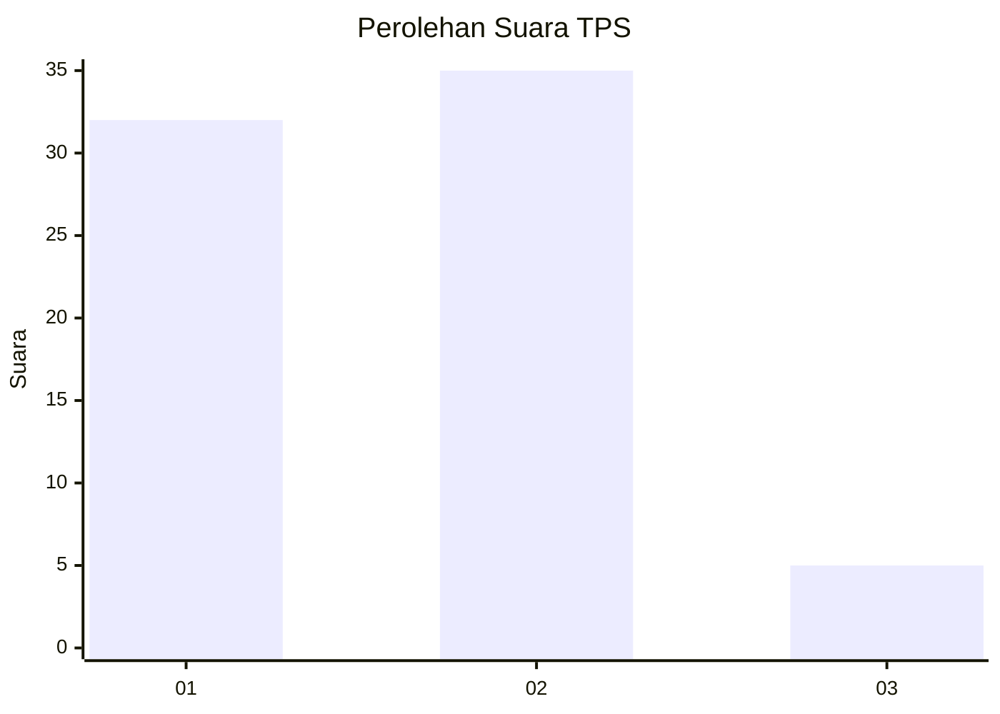
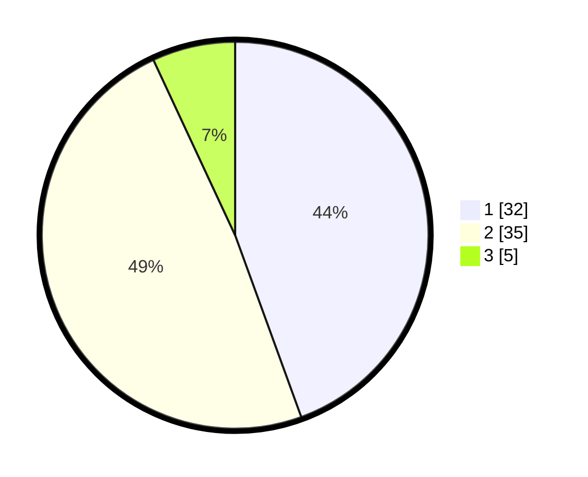

# Hasil

## Grafik

## Tabel

| No. | Nama Paslon    | Suara | Suara (raw) | Persentase |
|:--- |:-------------- | -----:| -----------:| ----------:|
| 1   | ANIES MUHAIMIN | 32    | [32][p-1]   | 44,44      |
| 2   | PRABOWO GIBRAN | 35    | [35][p-2]   | 48,61      |
| 3   | GANJAR MAHFUD  | 5     | [5][p-3]    | 6,94       |

[p-1]: https://github.com/gigit-pemilu/pemilu-2024-35-jawa-timur/blob/main/pilpres/hitung-suara/sub/35-jawa-timur/sub/29-sumenep/sub/27-kangayan/sub/2002-kangayan/sub/026-tps/sub/paslon-1.txt
[p-2]: https://github.com/gigit-pemilu/pemilu-2024-35-jawa-timur/blob/main/pilpres/hitung-suara/sub/35-jawa-timur/sub/29-sumenep/sub/27-kangayan/sub/2002-kangayan/sub/026-tps/sub/paslon-2.txt
[p-3]: https://github.com/gigit-pemilu/pemilu-2024-35-jawa-timur/blob/main/pilpres/hitung-suara/sub/35-jawa-timur/sub/29-sumenep/sub/27-kangayan/sub/2002-kangayan/sub/026-tps/sub/paslon-3.txt

## Foto C Plano

https://sirekap-obj-formc.kpu.go.id/d06d/pemilu/ppwp/35/29/27/20/02/3529272002026-20240223-161858--69b9b99d-fbc6-4bd3-8e72-2400f208af86.jpg

https://sirekap-obj-formc.kpu.go.id/d06d/pemilu/ppwp/35/29/27/20/02/3529272002026-20240223-161945--9c8fc475-9808-4da2-a8db-9b68c7593d76.jpg

https://sirekap-obj-formc.kpu.go.id/d06d/pemilu/ppwp/35/29/27/20/02/3529272002026-20240223-162029--8f27a550-c5b3-4f63-b48f-e6b13a681244.jpg

## Metadata

| Key        | Value               |
| ---------- | ------------------- |
| Time Stamp | 2024-02-24 22:31:28 |

