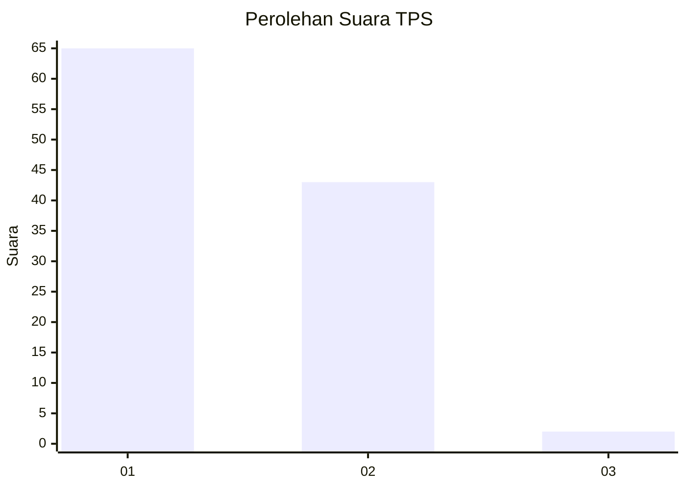
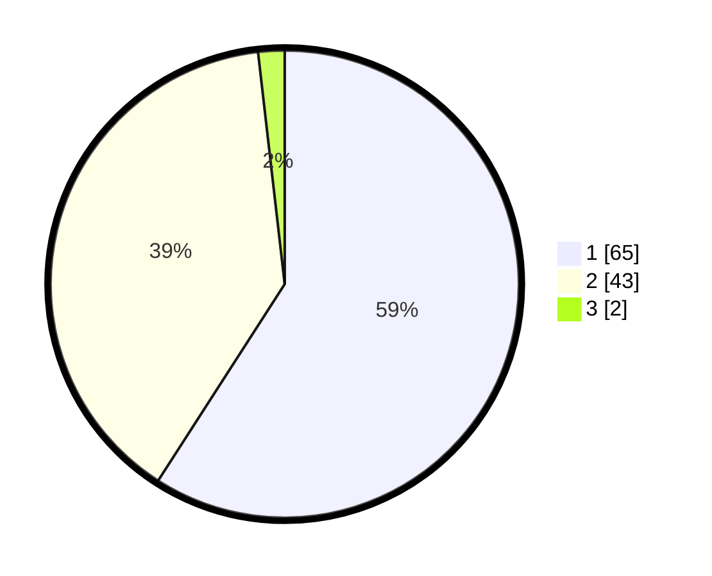

# Hasil

## Grafik

## Tabel

| No. | Nama Paslon    | Suara | Suara (raw) | Persentase |
|:--- |:-------------- | -----:| -----------:| ----------:|
| 1   | ANIES MUHAIMIN | 65    | [65][p-1]   | 59,09      |
| 2   | PRABOWO GIBRAN | 43    | [43][p-2]   | 39,09      |
| 3   | GANJAR MAHFUD  | 2     | [2][p-3]    | 1,82       |

[p-1]: https://github.com/gigit-pemilu/pemilu-2024-35-jawa-timur/blob/main/pilpres/hitung-suara/sub/35-jawa-timur/sub/29-sumenep/sub/27-kangayan/sub/2002-kangayan/sub/027-tps/sub/paslon-1.txt
[p-2]: https://github.com/gigit-pemilu/pemilu-2024-35-jawa-timur/blob/main/pilpres/hitung-suara/sub/35-jawa-timur/sub/29-sumenep/sub/27-kangayan/sub/2002-kangayan/sub/027-tps/sub/paslon-2.txt
[p-3]: https://github.com/gigit-pemilu/pemilu-2024-35-jawa-timur/blob/main/pilpres/hitung-suara/sub/35-jawa-timur/sub/29-sumenep/sub/27-kangayan/sub/2002-kangayan/sub/027-tps/sub/paslon-3.txt

## Foto C Plano

https://sirekap-obj-formc.kpu.go.id/9c84/pemilu/ppwp/35/29/27/20/02/3529272002027-20240223-162158--4f774178-0f82-4bad-96a2-256325476495.jpg

https://sirekap-obj-formc.kpu.go.id/9c84/pemilu/ppwp/35/29/27/20/02/3529272002027-20240223-162241--155f215e-0cae-4e18-b45e-f4361324a74f.jpg

https://sirekap-obj-formc.kpu.go.id/9c84/pemilu/ppwp/35/29/27/20/02/3529272002027-20240223-162348--b857c9a6-d4eb-40a0-a7c5-340c009c4d60.jpg

## Metadata

| Key        | Value               |
| ---------- | ------------------- |
| Time Stamp | 2024-02-25 13:00:00 |

