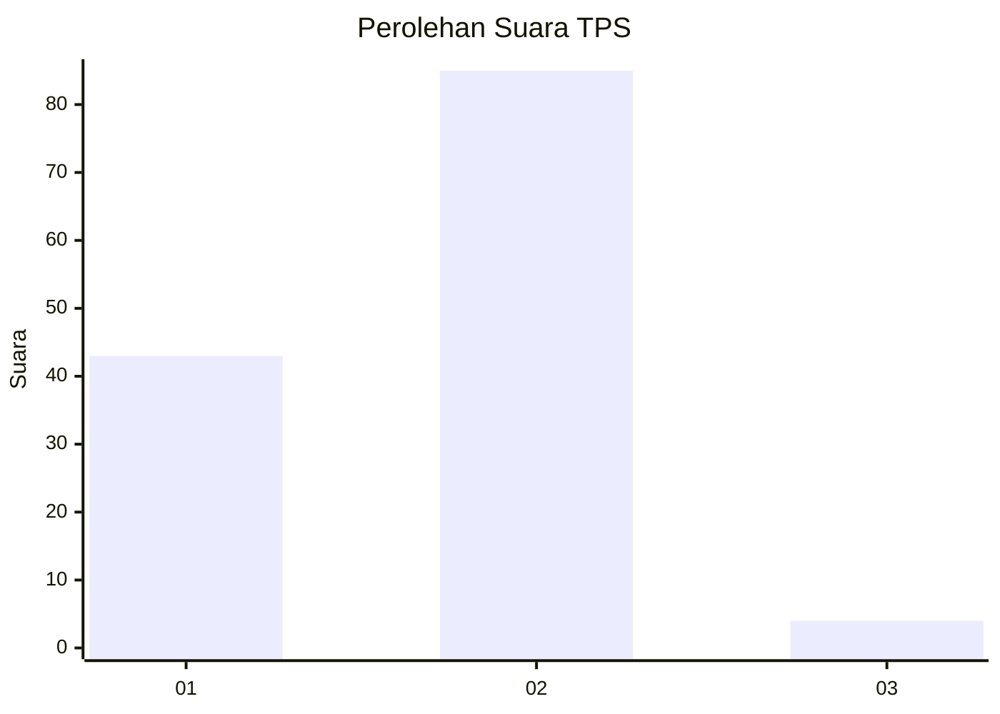
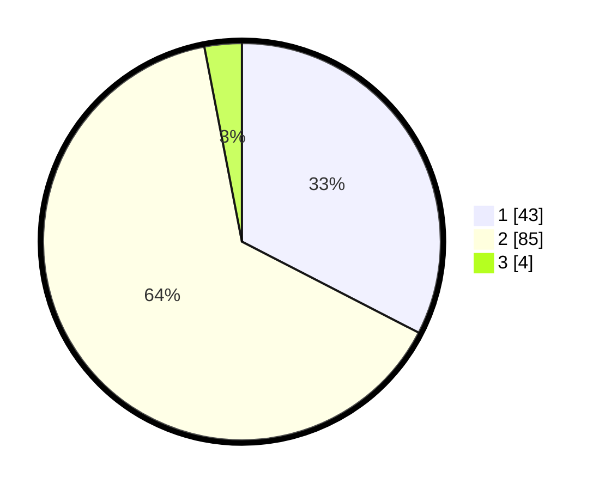

# Hasil

## Grafik

## Tabel

| No. | Nama Paslon    | Suara | Suara (raw) | Persentase |
|:--- |:-------------- | -----:| -----------:| ----------:|
| 1   | ANIES MUHAIMIN | 43    | [43][p-1]   | 32,58      |
| 2   | PRABOWO GIBRAN | 85    | [85][p-2]   | 64,39      |
| 3   | GANJAR MAHFUD  | 4     | [4][p-3]    | 3,03       |

[p-1]: https://github.com/gigit-pemilu/pemilu-2024-35-jawa-timur/blob/main/pilpres/hitung-suara/sub/35-jawa-timur/sub/29-sumenep/sub/27-kangayan/sub/2002-kangayan/sub/028-tps/sub/paslon-1.txt
[p-2]: https://github.com/gigit-pemilu/pemilu-2024-35-jawa-timur/blob/main/pilpres/hitung-suara/sub/35-jawa-timur/sub/29-sumenep/sub/27-kangayan/sub/2002-kangayan/sub/028-tps/sub/paslon-2.txt
[p-3]: https://github.com/gigit-pemilu/pemilu-2024-35-jawa-timur/blob/main/pilpres/hitung-suara/sub/35-jawa-timur/sub/29-sumenep/sub/27-kangayan/sub/2002-kangayan/sub/028-tps/sub/paslon-3.txt

## Foto C Plano

https://sirekap-obj-formc.kpu.go.id/2f1e/pemilu/ppwp/35/29/27/20/02/3529272002028-20240223-162448--5c5a0f63-6456-4157-923e-b8281202eb47.jpg

https://sirekap-obj-formc.kpu.go.id/2f1e/pemilu/ppwp/35/29/27/20/02/3529272002028-20240223-162629--50b1ef1f-b8af-4664-92ec-b52cab331434.jpg

https://sirekap-obj-formc.kpu.go.id/2f1e/pemilu/ppwp/35/29/27/20/02/3529272002028-20240223-162709--f003e783-309c-4f16-94ee-2b5fc2fabb45.jpg

## Metadata

| Key        | Value               |
| ---------- | ------------------- |
| Time Stamp | 2024-02-24 22:31:28 |

