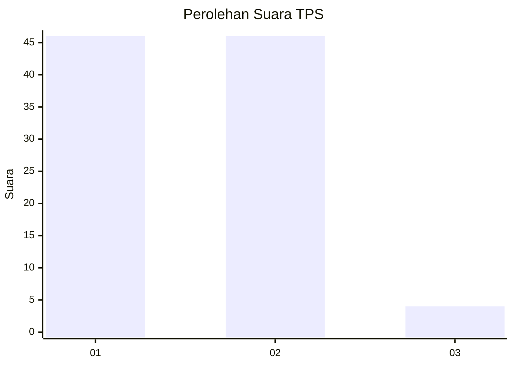
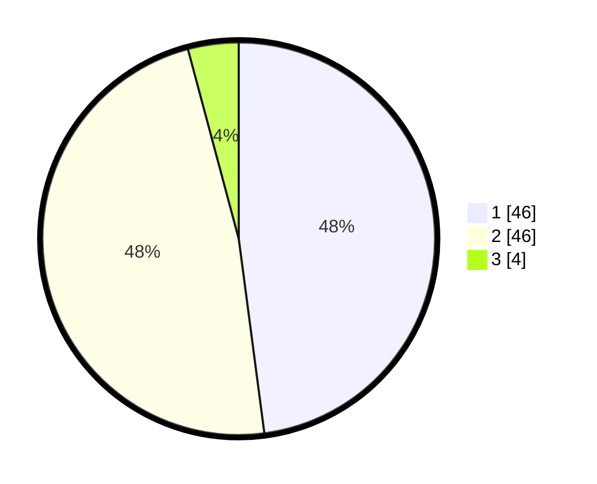

# Hasil

## Grafik

## Tabel

| No. | Nama Paslon    | Suara | Suara (raw) | Persentase |
|:--- |:-------------- | -----:| -----------:| ----------:|
| 1   | ANIES MUHAIMIN | 46    | [46][p-1]   | 47,92      |
| 2   | PRABOWO GIBRAN | 46    | [46][p-2]   | 47,92      |
| 3   | GANJAR MAHFUD  | 4     | [4][p-3]    | 4,17       |

[p-1]: https://github.com/gigit-pemilu/pemilu-2024/blob/main/pilpres/hitung-suara/sub/35-jawa-timur/sub/29-sumenep/sub/27-kangayan/sub/2002-kangayan/sub/029-tps/sub/paslon-1.txt
[p-2]: https://github.com/gigit-pemilu/pemilu-2024/blob/main/pilpres/hitung-suara/sub/35-jawa-timur/sub/29-sumenep/sub/27-kangayan/sub/2002-kangayan/sub/029-tps/sub/paslon-2.txt
[p-3]: https://github.com/gigit-pemilu/pemilu-2024/blob/main/pilpres/hitung-suara/sub/35-jawa-timur/sub/29-sumenep/sub/27-kangayan/sub/2002-kangayan/sub/029-tps/sub/paslon-3.txt

## Foto C Plano

https://sirekap-obj-formc.kpu.go.id/c34d/pemilu/ppwp/35/29/27/20/02/3529272002029-20240223-162822--090f95d1-e4ed-479e-bbad-d46e5479ec6f.jpg

https://sirekap-obj-formc.kpu.go.id/c34d/pemilu/ppwp/35/29/27/20/02/3529272002029-20240223-162902--ff32228b-ee66-4513-941a-7b7082a0976e.jpg

https://sirekap-obj-formc.kpu.go.id/c34d/pemilu/ppwp/35/29/27/20/02/3529272002029-20240223-163018--4fc752cb-72c1-4c73-abe9-5117707f49e1.jpg

## Metadata

| Key        | Value               |
| ---------- | ------------------- |
| Time Stamp | 2024-02-24 22:31:28 |

