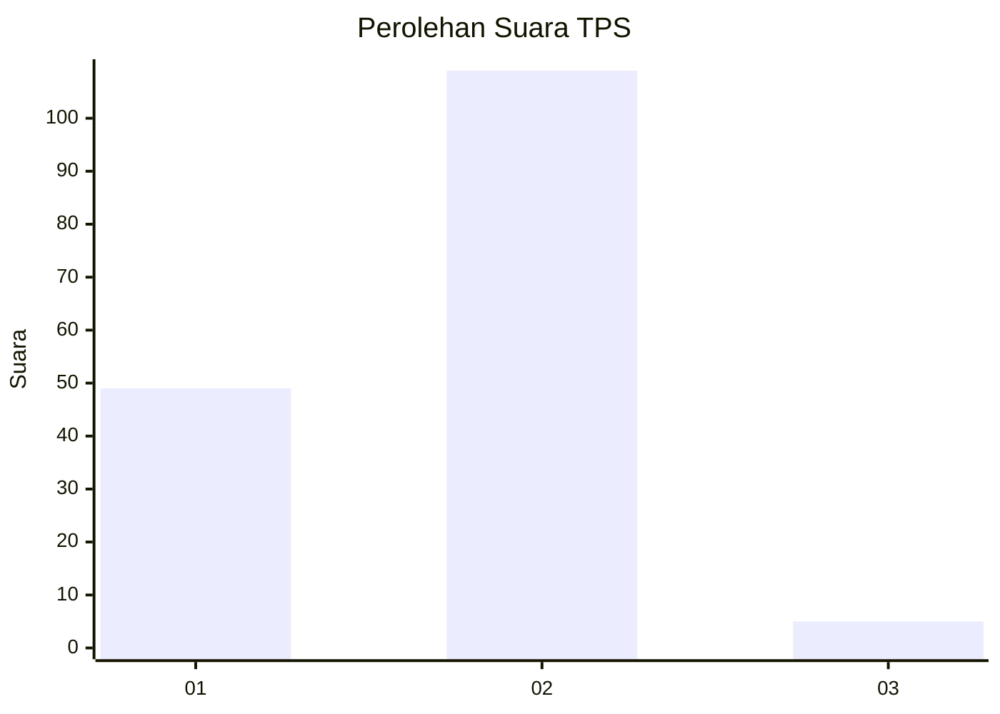
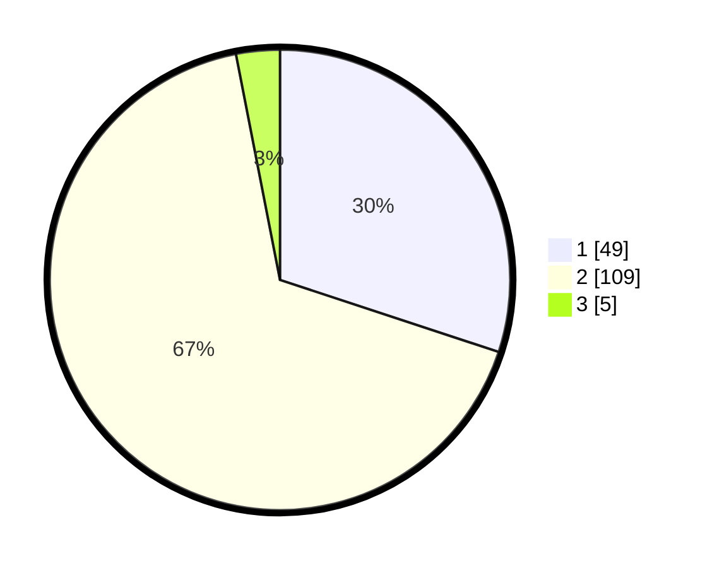

# Hasil

## Grafik

## Tabel

| No. | Nama Paslon    | Suara | Suara (raw) | Persentase |
|:--- |:-------------- | -----:| -----------:| ----------:|
| 1   | ANIES MUHAIMIN | 49    | [49][p-1]   | 30,06      |
| 2   | PRABOWO GIBRAN | 109   | [109][p-2]  | 66,87      |
| 3   | GANJAR MAHFUD  | 5     | [5][p-3]    | 3,07       |

[p-1]: https://github.com/gigit-pemilu/pemilu-2024-35-jawa-timur/blob/main/pilpres/hitung-suara/sub/35-jawa-timur/sub/29-sumenep/sub/27-kangayan/sub/2003-torjek/sub/004-tps/sub/paslon-1.txt
[p-2]: https://github.com/gigit-pemilu/pemilu-2024-35-jawa-timur/blob/main/pilpres/hitung-suara/sub/35-jawa-timur/sub/29-sumenep/sub/27-kangayan/sub/2003-torjek/sub/004-tps/sub/paslon-2.txt
[p-3]: https://github.com/gigit-pemilu/pemilu-2024-35-jawa-timur/blob/main/pilpres/hitung-suara/sub/35-jawa-timur/sub/29-sumenep/sub/27-kangayan/sub/2003-torjek/sub/004-tps/sub/paslon-3.txt

## Foto C Plano

https://sirekap-obj-formc.kpu.go.id/b567/pemilu/ppwp/35/29/27/20/03/3529272003004-20240225-085838--1b01da2b-f965-4612-96eb-d995ff7c92db.jpg

https://sirekap-obj-formc.kpu.go.id/b567/pemilu/ppwp/35/29/27/20/03/3529272003004-20240225-085911--a06980d0-6e38-40a4-bac6-e5764db32c7c.jpg

https://sirekap-obj-formc.kpu.go.id/b567/pemilu/ppwp/35/29/27/20/03/3529272003004-20240225-085946--cab34f85-460d-48dd-a37f-b135f5edf8c8.jpg

## Metadata

| Key        | Value               |
| ---------- | ------------------- |
| Time Stamp | 2024-02-28 19:00:00 |

