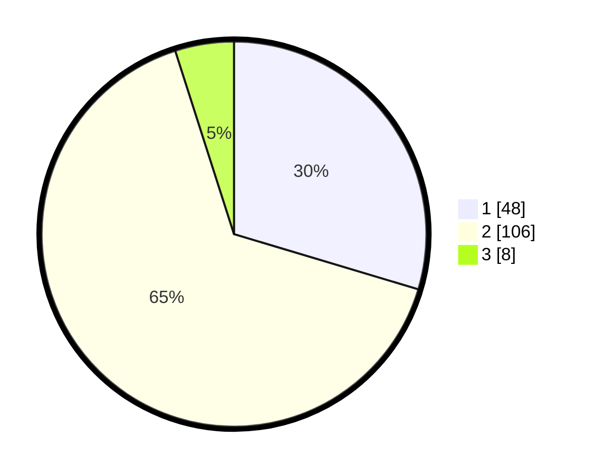

# Hasil

## Grafik

## Tabel

| No. | Nama Paslon    | Suara | Suara (raw) | Persentase |
|:--- |:-------------- | -----:| -----------:| ----------:|
| 1   | ANIES MUHAIMIN | 48    | [48][p-1]   | 29,63      |
| 2   | PRABOWO GIBRAN | 106   | [106][p-2]  | 65,43      |
| 3   | GANJAR MAHFUD  | 8     | [8][p-3]    | 4,94       |

[p-1]: https://github.com/gigit-pemilu/pemilu-2024-35-jawa-timur/blob/main/pilpres/hitung-suara/sub/35-jawa-timur/sub/29-sumenep/sub/27-kangayan/sub/2003-torjek/sub/005-tps/sub/paslon-1.txt
[p-2]: https://github.com/gigit-pemilu/pemilu-2024-35-jawa-timur/blob/main/pilpres/hitung-suara/sub/35-jawa-timur/sub/29-sumenep/sub/27-kangayan/sub/2003-torjek/sub/005-tps/sub/paslon-2.txt
[p-3]: https://github.com/gigit-pemilu/pemilu-2024-35-jawa-timur/blob/main/pilpres/hitung-suara/sub/35-jawa-timur/sub/29-sumenep/sub/27-kangayan/sub/2003-torjek/sub/005-tps/sub/paslon-3.txt

## Foto C Plano

https://sirekap-obj-formc.kpu.go.id/c1f2/pemilu/ppwp/35/29/27/20/03/3529272003005-20240225-090427--41957ad2-8487-4ebd-bba3-f024f2bee246.jpg

https://sirekap-obj-formc.kpu.go.id/c1f2/pemilu/ppwp/35/29/27/20/03/3529272003005-20240225-090513--fee20cb0-1628-401f-8208-3e55d9847a3e.jpg

https://sirekap-obj-formc.kpu.go.id/c1f2/pemilu/ppwp/35/29/27/20/03/3529272003005-20240225-090611--4b65943e-c342-43f7-bcfc-10f9320b6335.jpg

## Metadata

| Key        | Value               |
| ---------- | ------------------- |
| Time Stamp | 2024-02-28 19:00:00 |

