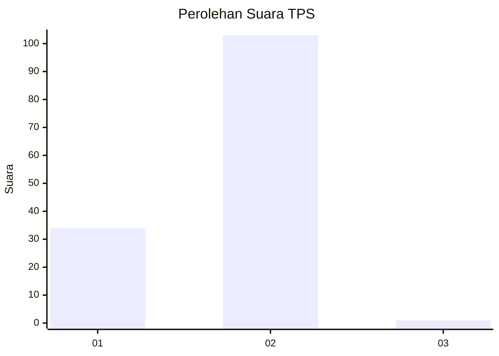
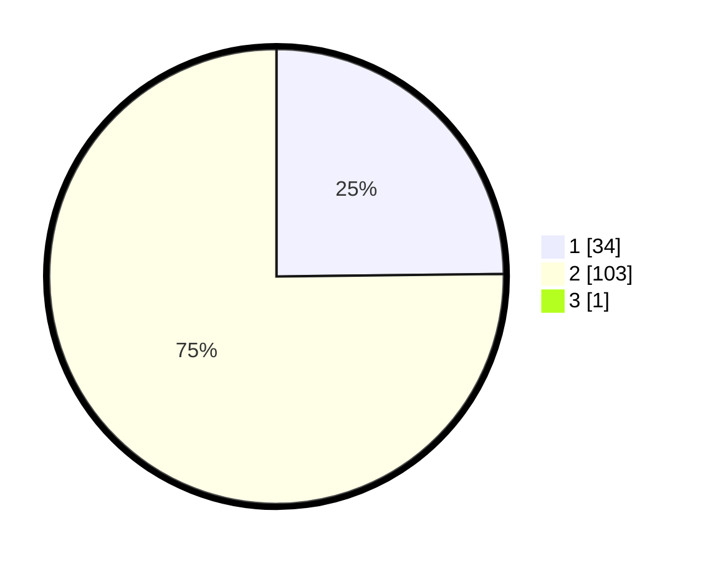

# Hasil

## Grafik

## Tabel

| No. | Nama Paslon    | Suara | Suara (raw) | Persentase |
|:--- |:-------------- | -----:| -----------:| ----------:|
| 1   | ANIES MUHAIMIN | 34    | [34][p-1]   | 24,64      |
| 2   | PRABOWO GIBRAN | 103   | [103][p-2]  | 74,64      |
| 3   | GANJAR MAHFUD  | 1     | [1][p-3]    | 0,72       |

[p-1]: https://github.com/gigit-pemilu/pemilu-2024/blob/main/pilpres/hitung-suara/sub/35-jawa-timur/sub/29-sumenep/sub/27-kangayan/sub/2003-torjek/sub/006-tps/sub/paslon-1.txt
[p-2]: https://github.com/gigit-pemilu/pemilu-2024/blob/main/pilpres/hitung-suara/sub/35-jawa-timur/sub/29-sumenep/sub/27-kangayan/sub/2003-torjek/sub/006-tps/sub/paslon-2.txt
[p-3]: https://github.com/gigit-pemilu/pemilu-2024/blob/main/pilpres/hitung-suara/sub/35-jawa-timur/sub/29-sumenep/sub/27-kangayan/sub/2003-torjek/sub/006-tps/sub/paslon-3.txt

## Foto C Plano

https://sirekap-obj-formc.kpu.go.id/5d81/pemilu/ppwp/35/29/27/20/03/3529272003006-20240225-090811--987f1df4-e762-4c0b-bde4-aa5258525818.jpg

https://sirekap-obj-formc.kpu.go.id/5d81/pemilu/ppwp/35/29/27/20/03/3529272003006-20240225-090855--5565c100-972c-459b-b450-f892dff1c13d.jpg

https://sirekap-obj-formc.kpu.go.id/5d81/pemilu/ppwp/35/29/27/20/03/3529272003006-20240225-090929--f08ac78c-467e-4255-91cb-982e9618e9ce.jpg

## Metadata

| Key        | Value               |
| ---------- | ------------------- |
| Time Stamp | 2024-02-28 20:00:00 |

