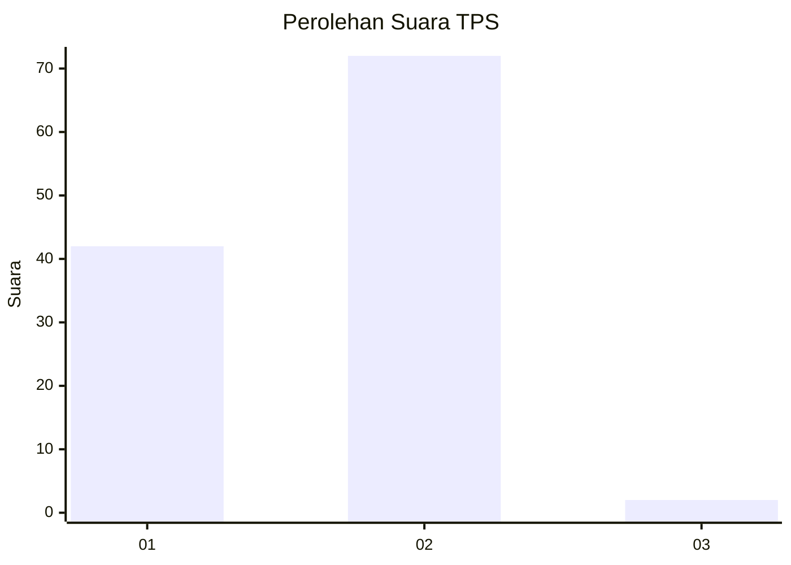
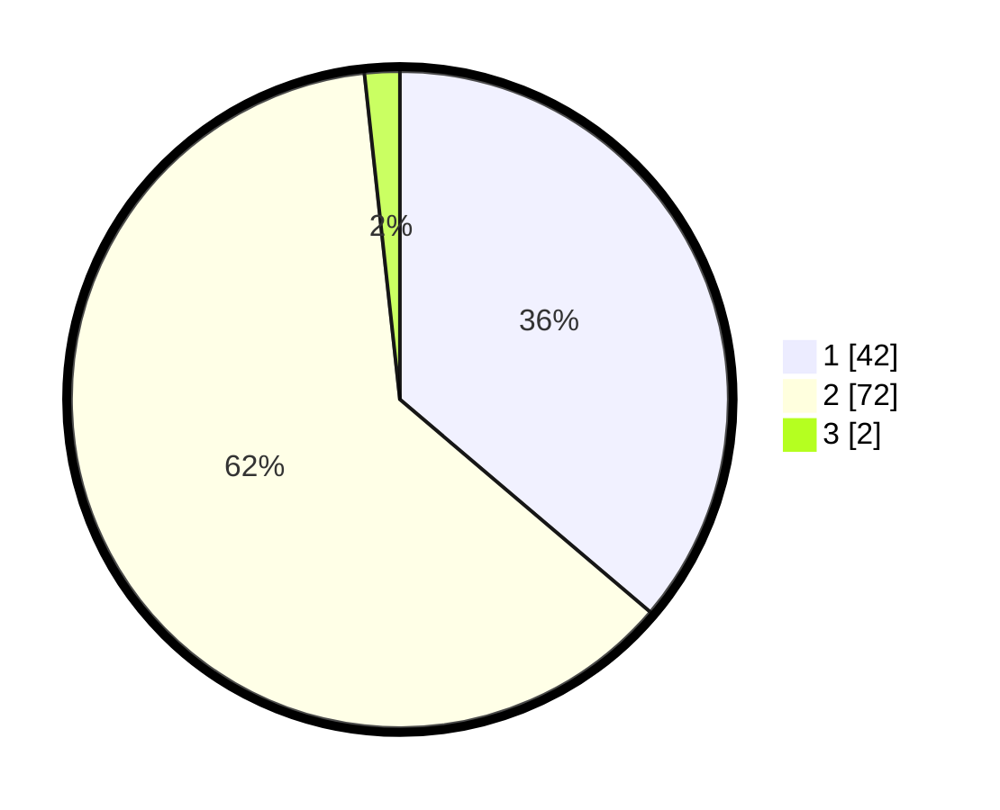

# Hasil

## Grafik

## Tabel

| No. | Nama Paslon    | Suara | Suara (raw) | Persentase |
|:--- |:-------------- | -----:| -----------:| ----------:|
| 1   | ANIES MUHAIMIN | 42    | [42][p-1]   | 36,21      |
| 2   | PRABOWO GIBRAN | 72    | [72][p-2]   | 62,07      |
| 3   | GANJAR MAHFUD  | 2     | [2][p-3]    | 1,72       |

[p-1]: https://github.com/gigit-pemilu/pemilu-2024/blob/main/pilpres/hitung-suara/sub/35-jawa-timur/sub/29-sumenep/sub/27-kangayan/sub/2003-torjek/sub/007-tps/sub/paslon-1.txt
[p-2]: https://github.com/gigit-pemilu/pemilu-2024/blob/main/pilpres/hitung-suara/sub/35-jawa-timur/sub/29-sumenep/sub/27-kangayan/sub/2003-torjek/sub/007-tps/sub/paslon-2.txt
[p-3]: https://github.com/gigit-pemilu/pemilu-2024/blob/main/pilpres/hitung-suara/sub/35-jawa-timur/sub/29-sumenep/sub/27-kangayan/sub/2003-torjek/sub/007-tps/sub/paslon-3.txt

## Foto C Plano

https://sirekap-obj-formc.kpu.go.id/1ade/pemilu/ppwp/35/29/27/20/03/3529272003007-20240225-091035--93641a73-f151-4e95-93cd-87d1a9cb98aa.jpg

https://sirekap-obj-formc.kpu.go.id/1ade/pemilu/ppwp/35/29/27/20/03/3529272003007-20240225-091109--a52b08ba-7ca3-4c19-ac41-3b42fed1eb0f.jpg

https://sirekap-obj-formc.kpu.go.id/1ade/pemilu/ppwp/35/29/27/20/03/3529272003007-20240225-091223--7e736250-bb9e-47be-99d7-dfa9956b206d.jpg

## Metadata

| Key        | Value               |
| ---------- | ------------------- |
| Time Stamp | 2024-02-28 20:00:00 |

