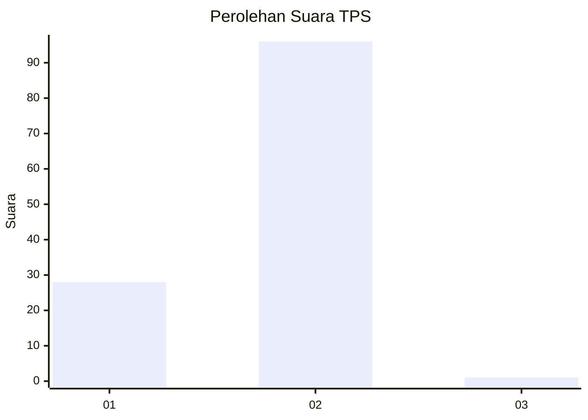
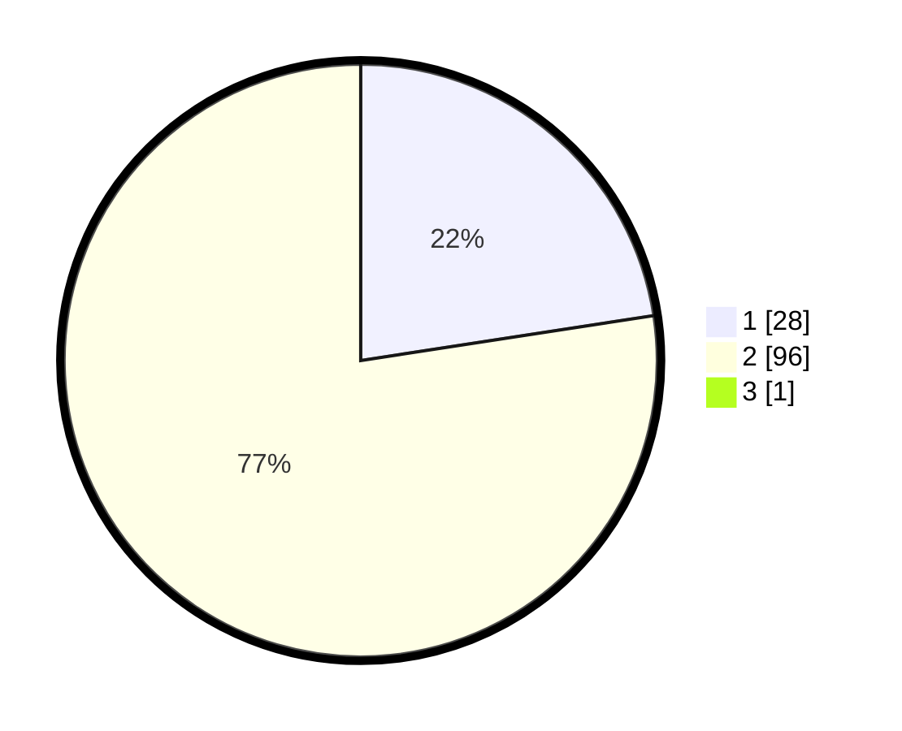

# Hasil

## Grafik

## Tabel

| No. | Nama Paslon    | Suara | Suara (raw) | Persentase |
|:--- |:-------------- | -----:| -----------:| ----------:|
| 1   | ANIES MUHAIMIN | 28    | [28][p-1]   | 22,40      |
| 2   | PRABOWO GIBRAN | 96    | [96][p-2]   | 76,80      |
| 3   | GANJAR MAHFUD  | 1     | [1][p-3]    | 0,80       |

[p-1]: https://github.com/gigit-pemilu/pemilu-2024-35-jawa-timur/blob/main/pilpres/hitung-suara/sub/35-jawa-timur/sub/29-sumenep/sub/27-kangayan/sub/2003-torjek/sub/010-tps/sub/paslon-1.txt
[p-2]: https://github.com/gigit-pemilu/pemilu-2024-35-jawa-timur/blob/main/pilpres/hitung-suara/sub/35-jawa-timur/sub/29-sumenep/sub/27-kangayan/sub/2003-torjek/sub/010-tps/sub/paslon-2.txt
[p-3]: https://github.com/gigit-pemilu/pemilu-2024-35-jawa-timur/blob/main/pilpres/hitung-suara/sub/35-jawa-timur/sub/29-sumenep/sub/27-kangayan/sub/2003-torjek/sub/010-tps/sub/paslon-3.txt

## Foto C Plano

https://sirekap-obj-formc.kpu.go.id/fa57/pemilu/ppwp/35/29/27/20/03/3529272003010-20240225-092045--d82c633f-ae06-48b6-8ba5-1c510819d919.jpg

https://sirekap-obj-formc.kpu.go.id/fa57/pemilu/ppwp/35/29/27/20/03/3529272003010-20240225-092139--d9218990-f640-4908-9e38-f1b4f7ed958b.jpg

https://sirekap-obj-formc.kpu.go.id/fa57/pemilu/ppwp/35/29/27/20/03/3529272003010-20240225-092306--6ce0da8e-2999-4eb2-bc5c-87d8a34b00a3.jpg

## Metadata

| Key        | Value               |
| ---------- | ------------------- |
| Time Stamp | 2024-02-28 19:00:00 |

