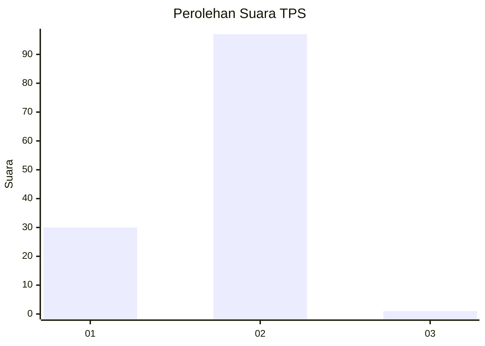
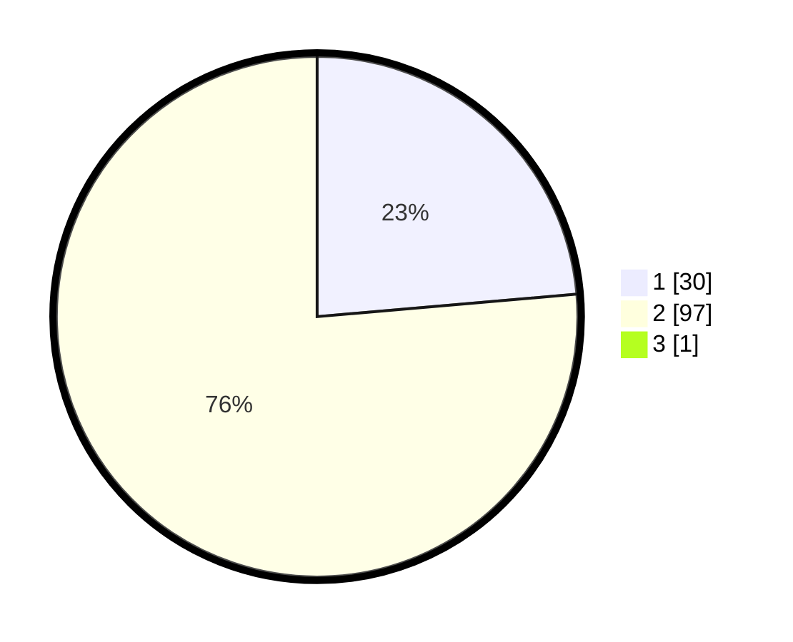

# Hasil

## Grafik

## Tabel

| No. | Nama Paslon    | Suara | Suara (raw) | Persentase |
|:--- |:-------------- | -----:| -----------:| ----------:|
| 1   | ANIES MUHAIMIN | 30    | [30][p-1]   | 23,44      |
| 2   | PRABOWO GIBRAN | 97    | [97][p-2]   | 75,78      |
| 3   | GANJAR MAHFUD  | 1     | [1][p-3]    | 0,78       |

[p-1]: https://github.com/gigit-pemilu/pemilu-2024/blob/main/pilpres/hitung-suara/sub/35-jawa-timur/sub/29-sumenep/sub/27-kangayan/sub/2003-torjek/sub/011-tps/sub/paslon-1.txt
[p-2]: https://github.com/gigit-pemilu/pemilu-2024/blob/main/pilpres/hitung-suara/sub/35-jawa-timur/sub/29-sumenep/sub/27-kangayan/sub/2003-torjek/sub/011-tps/sub/paslon-2.txt
[p-3]: https://github.com/gigit-pemilu/pemilu-2024/blob/main/pilpres/hitung-suara/sub/35-jawa-timur/sub/29-sumenep/sub/27-kangayan/sub/2003-torjek/sub/011-tps/sub/paslon-3.txt

## Foto C Plano

https://sirekap-obj-formc.kpu.go.id/e84d/pemilu/ppwp/35/29/27/20/03/3529272003011-20240225-092358--2d30c264-d6c4-4e35-9548-93989270f60b.jpg

https://sirekap-obj-formc.kpu.go.id/e84d/pemilu/ppwp/35/29/27/20/03/3529272003011-20240225-092501--b2da1545-0dc2-459f-bb37-fa452551353c.jpg

https://sirekap-obj-formc.kpu.go.id/e84d/pemilu/ppwp/35/29/27/20/03/3529272003011-20240225-092550--04fe9844-c109-48f3-acbf-367cc5552ee6.jpg

## Metadata

| Key        | Value               |
| ---------- | ------------------- |
| Time Stamp | 2024-02-28 19:00:00 |

