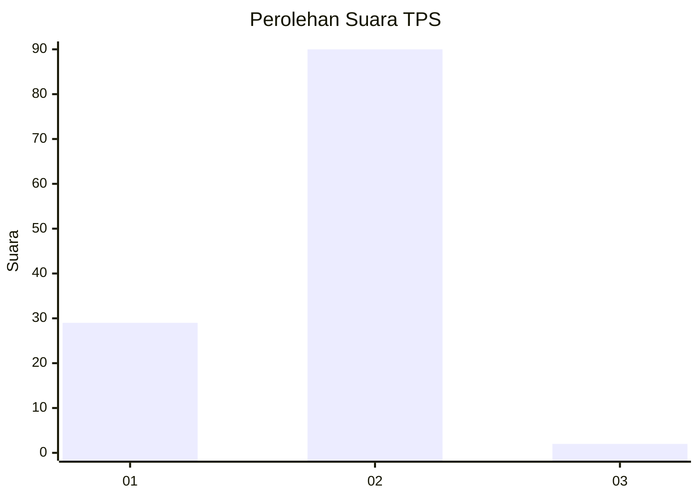
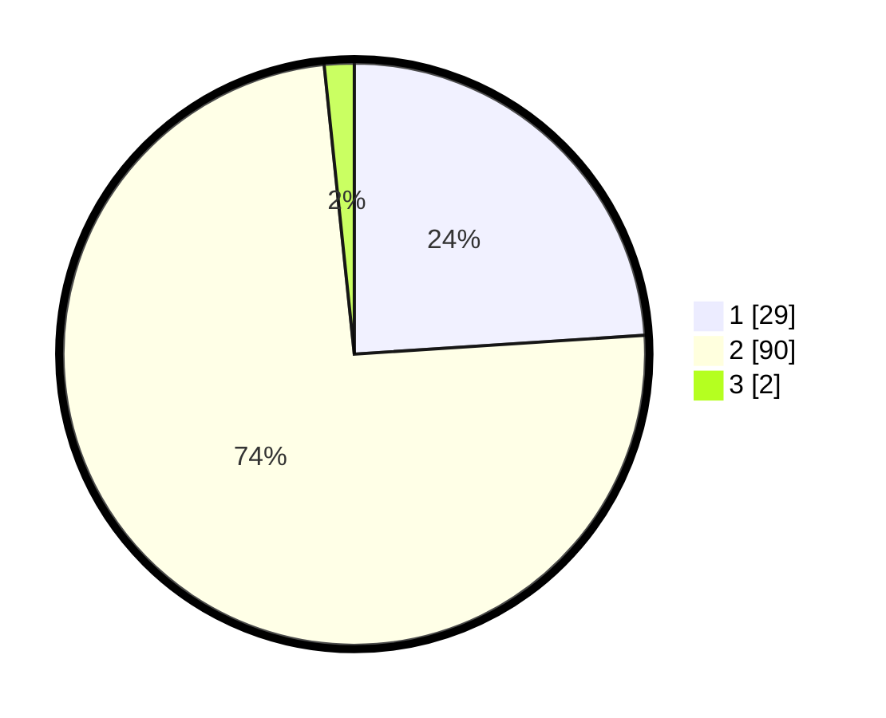

# Hasil

## Grafik

## Tabel

| No. | Nama Paslon    | Suara | Suara (raw) | Persentase |
|:--- |:-------------- | -----:| -----------:| ----------:|
| 1   | ANIES MUHAIMIN | 29    | [29][p-1]   | 23,97      |
| 2   | PRABOWO GIBRAN | 90    | [90][p-2]   | 74,38      |
| 3   | GANJAR MAHFUD  | 2     | [2][p-3]    | 1,65       |

[p-1]: https://github.com/gigit-pemilu/pemilu-2024-35-jawa-timur/blob/main/pilpres/hitung-suara/sub/35-jawa-timur/sub/29-sumenep/sub/27-kangayan/sub/2003-torjek/sub/012-tps/sub/paslon-1.txt
[p-2]: https://github.com/gigit-pemilu/pemilu-2024-35-jawa-timur/blob/main/pilpres/hitung-suara/sub/35-jawa-timur/sub/29-sumenep/sub/27-kangayan/sub/2003-torjek/sub/012-tps/sub/paslon-2.txt
[p-3]: https://github.com/gigit-pemilu/pemilu-2024-35-jawa-timur/blob/main/pilpres/hitung-suara/sub/35-jawa-timur/sub/29-sumenep/sub/27-kangayan/sub/2003-torjek/sub/012-tps/sub/paslon-3.txt

## Foto C Plano

https://sirekap-obj-formc.kpu.go.id/46f6/pemilu/ppwp/35/29/27/20/03/3529272003012-20240225-093153--00f693c6-91e1-4b18-bc59-e1d890fd828e.jpg

https://sirekap-obj-formc.kpu.go.id/46f6/pemilu/ppwp/35/29/27/20/03/3529272003012-20240225-093428--9aa37d07-b36d-455c-9f4c-24c8a52bafda.jpg

https://sirekap-obj-formc.kpu.go.id/46f6/pemilu/ppwp/35/29/27/20/03/3529272003012-20240225-093258--3d5be784-2729-4b02-9bed-def0b75d701a.jpg

## Metadata

| Key        | Value               |
| ---------- | ------------------- |
| Time Stamp | 2024-02-28 19:00:00 |

