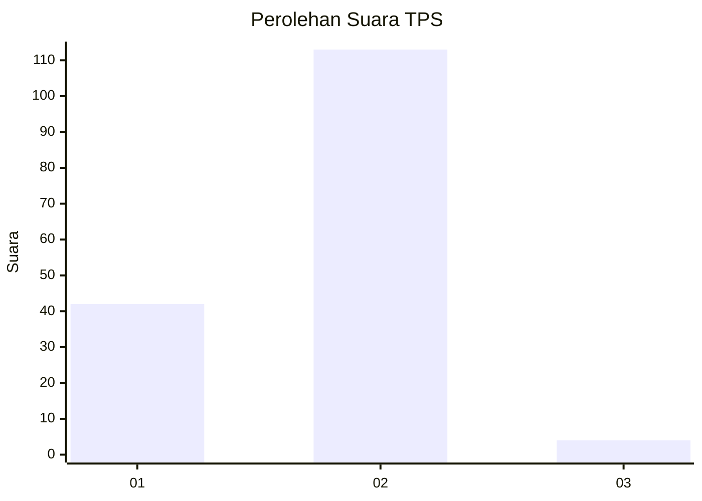
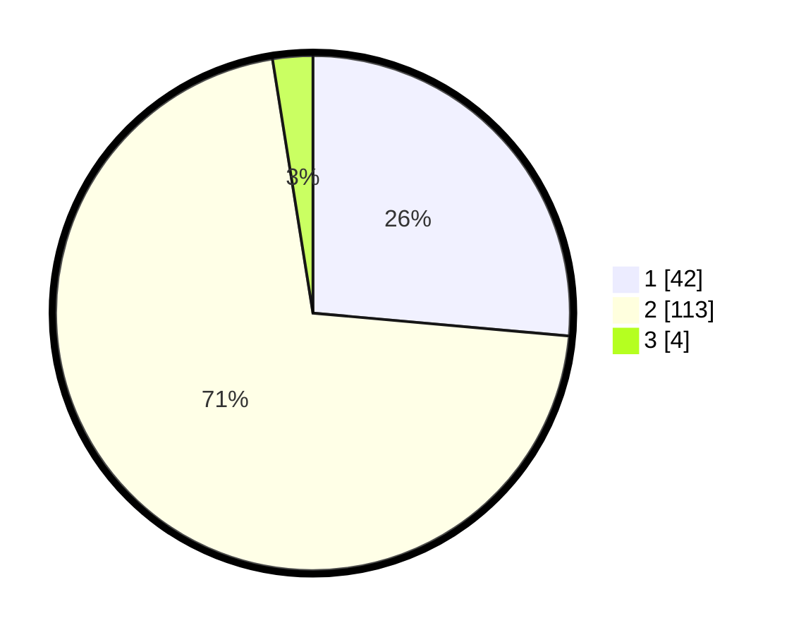

# Hasil

## Grafik

## Tabel

| No. | Nama Paslon    | Suara | Suara (raw) | Persentase |
|:--- |:-------------- | -----:| -----------:| ----------:|
| 1   | ANIES MUHAIMIN | 42    | [42][p-1]   | 26,42      |
| 2   | PRABOWO GIBRAN | 113   | [113][p-2]  | 71,07      |
| 3   | GANJAR MAHFUD  | 4     | [4][p-3]    | 2,52       |

[p-1]: https://github.com/gigit-pemilu/pemilu-2024/blob/main/pilpres/hitung-suara/sub/35-jawa-timur/sub/29-sumenep/sub/27-kangayan/sub/2003-torjek/sub/013-tps/sub/paslon-1.txt
[p-2]: https://github.com/gigit-pemilu/pemilu-2024/blob/main/pilpres/hitung-suara/sub/35-jawa-timur/sub/29-sumenep/sub/27-kangayan/sub/2003-torjek/sub/013-tps/sub/paslon-2.txt
[p-3]: https://github.com/gigit-pemilu/pemilu-2024/blob/main/pilpres/hitung-suara/sub/35-jawa-timur/sub/29-sumenep/sub/27-kangayan/sub/2003-torjek/sub/013-tps/sub/paslon-3.txt

## Foto C Plano

https://sirekap-obj-formc.kpu.go.id/b024/pemilu/ppwp/35/29/27/20/03/3529272003013-20240225-093754--ee717ca6-2d81-4196-9e2d-a92a1d2f081f.jpg

https://sirekap-obj-formc.kpu.go.id/b024/pemilu/ppwp/35/29/27/20/03/3529272003013-20240225-093850--05aa29ee-5386-4047-aba0-1a56765d951f.jpg

https://sirekap-obj-formc.kpu.go.id/b024/pemilu/ppwp/35/29/27/20/03/3529272003013-20240225-094004--b5c62e49-1e46-4a6e-bb36-0a49756c7005.jpg

## Metadata

| Key        | Value               |
| ---------- | ------------------- |
| Time Stamp | 2024-02-28 19:00:00 |

