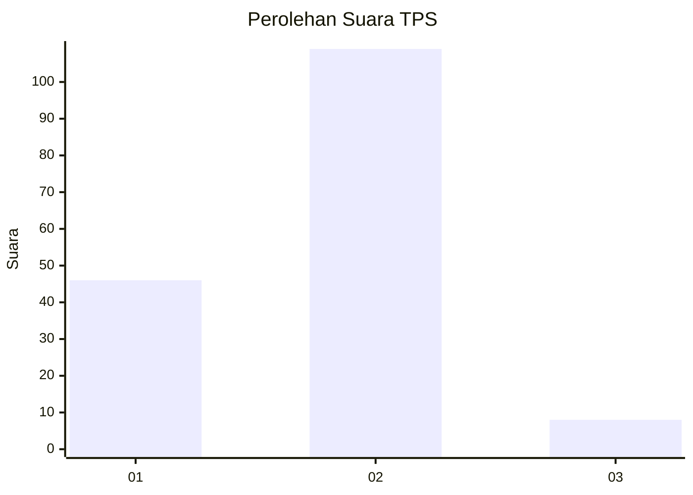
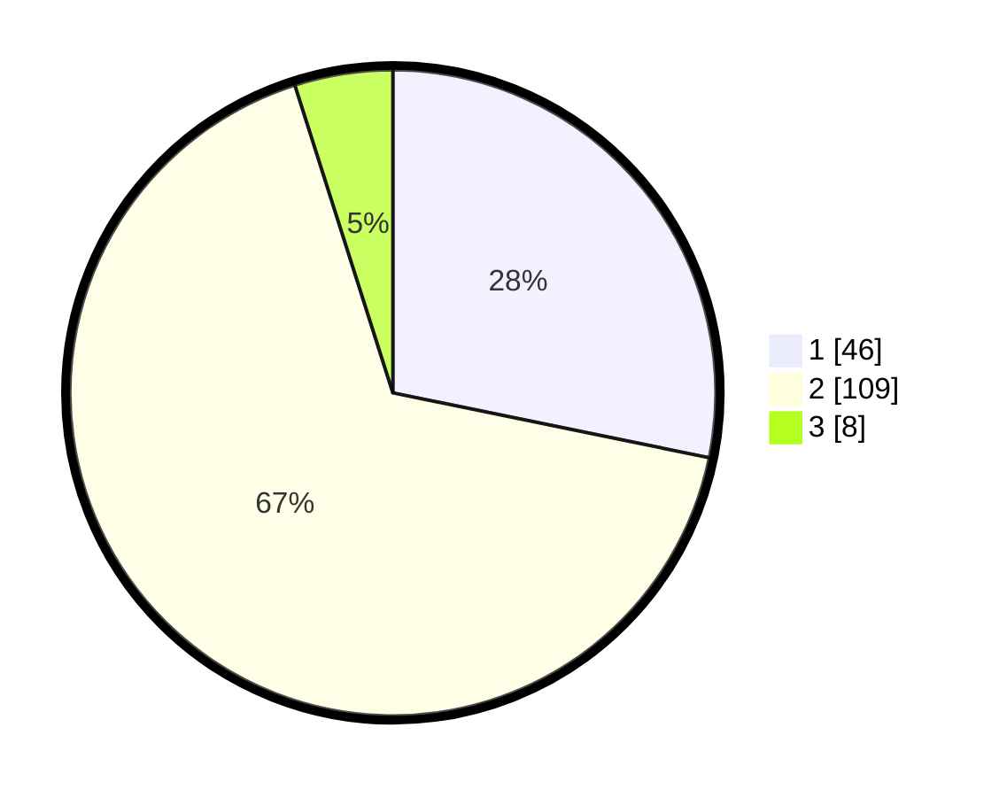

# Hasil

## Grafik

## Tabel

| No. | Nama Paslon    | Suara | Suara (raw) | Persentase |
|:--- |:-------------- | -----:| -----------:| ----------:|
| 1   | ANIES MUHAIMIN | 46    | [46][p-1]   | 28,22      |
| 2   | PRABOWO GIBRAN | 109   | [109][p-2]  | 66,87      |
| 3   | GANJAR MAHFUD  | 8     | [8][p-3]    | 4,91       |

[p-1]: https://github.com/gigit-pemilu/pemilu-2024-35-jawa-timur/blob/main/pilpres/hitung-suara/sub/35-jawa-timur/sub/29-sumenep/sub/27-kangayan/sub/2003-torjek/sub/014-tps/sub/paslon-1.txt
[p-2]: https://github.com/gigit-pemilu/pemilu-2024-35-jawa-timur/blob/main/pilpres/hitung-suara/sub/35-jawa-timur/sub/29-sumenep/sub/27-kangayan/sub/2003-torjek/sub/014-tps/sub/paslon-2.txt
[p-3]: https://github.com/gigit-pemilu/pemilu-2024-35-jawa-timur/blob/main/pilpres/hitung-suara/sub/35-jawa-timur/sub/29-sumenep/sub/27-kangayan/sub/2003-torjek/sub/014-tps/sub/paslon-3.txt

## Foto C Plano

https://sirekap-obj-formc.kpu.go.id/35eb/pemilu/ppwp/35/29/27/20/03/3529272003014-20240225-094046--f8025f4e-01d7-4423-a37c-98b290c2c1db.jpg

https://sirekap-obj-formc.kpu.go.id/35eb/pemilu/ppwp/35/29/27/20/03/3529272003014-20240225-094213--ebf9243a-c625-4f0f-aeee-dfc5bdf1a969.jpg

https://sirekap-obj-formc.kpu.go.id/35eb/pemilu/ppwp/35/29/27/20/03/3529272003014-20240225-094122--e94f07dd-36a9-40f8-b7ea-cfe1991acbc1.jpg

## Metadata

| Key        | Value               |
| ---------- | ------------------- |
| Time Stamp | 2024-02-28 19:00:00 |

