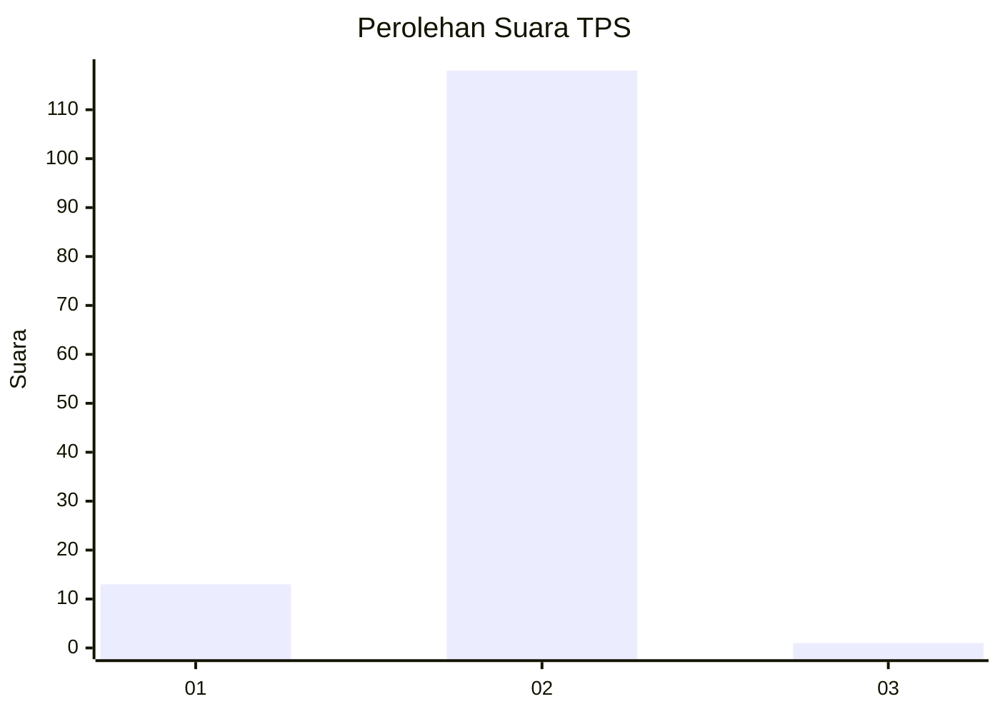
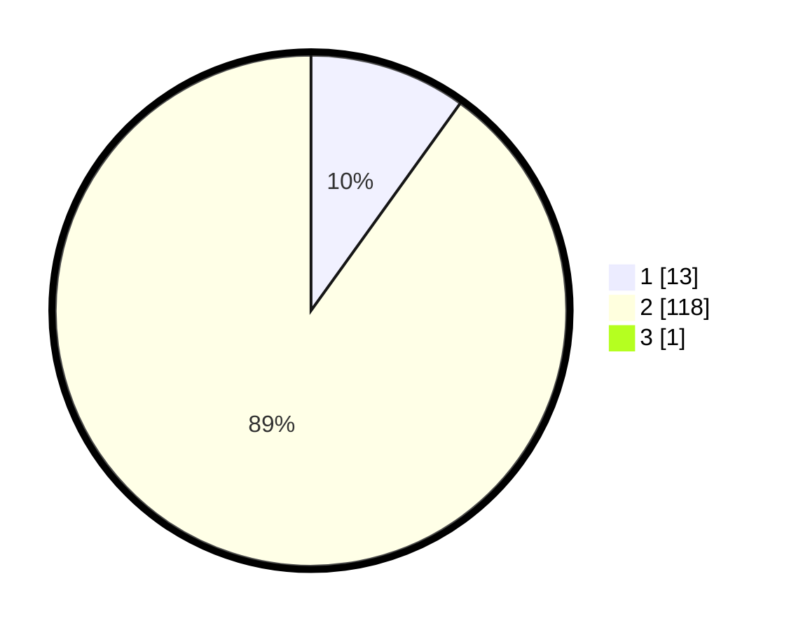

# Hasil

## Grafik

## Tabel

| No. | Nama Paslon    | Suara | Suara (raw) | Persentase |
|:--- |:-------------- | -----:| -----------:| ----------:|
| 1   | ANIES MUHAIMIN | 13    | [13][p-1]   | 9,85       |
| 2   | PRABOWO GIBRAN | 118   | [118][p-2]  | 89,39      |
| 3   | GANJAR MAHFUD  | 1     | [1][p-3]    | 0,76       |

[p-1]: https://github.com/gigit-pemilu/pemilu-2024/blob/main/pilpres/hitung-suara/sub/35-jawa-timur/sub/29-sumenep/sub/27-kangayan/sub/2003-torjek/sub/016-tps/sub/paslon-1.txt
[p-2]: https://github.com/gigit-pemilu/pemilu-2024/blob/main/pilpres/hitung-suara/sub/35-jawa-timur/sub/29-sumenep/sub/27-kangayan/sub/2003-torjek/sub/016-tps/sub/paslon-2.txt
[p-3]: https://github.com/gigit-pemilu/pemilu-2024/blob/main/pilpres/hitung-suara/sub/35-jawa-timur/sub/29-sumenep/sub/27-kangayan/sub/2003-torjek/sub/016-tps/sub/paslon-3.txt

## Foto C Plano

https://sirekap-obj-formc.kpu.go.id/a70b/pemilu/ppwp/35/29/27/20/03/3529272003016-20240225-094655--bc00c53f-c0e6-4bc6-bf83-9f0107789161.jpg

https://sirekap-obj-formc.kpu.go.id/a70b/pemilu/ppwp/35/29/27/20/03/3529272003016-20240225-094737--ac28cdc7-3ac3-4bd2-89f8-c514d53ba9e2.jpg

https://sirekap-obj-formc.kpu.go.id/a70b/pemilu/ppwp/35/29/27/20/03/3529272003016-20240225-094828--eb668fe1-544b-4196-84f5-9d2e3dba3a4e.jpg

## Metadata

| Key        | Value               |
| ---------- | ------------------- |
| Time Stamp | 2024-02-29 10:00:00 |

