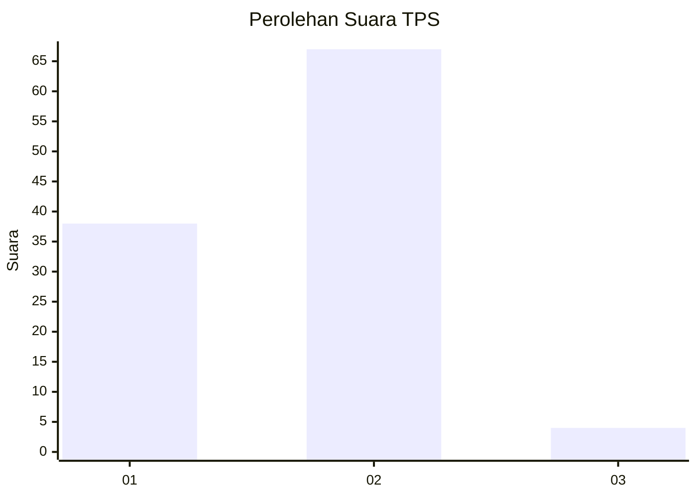
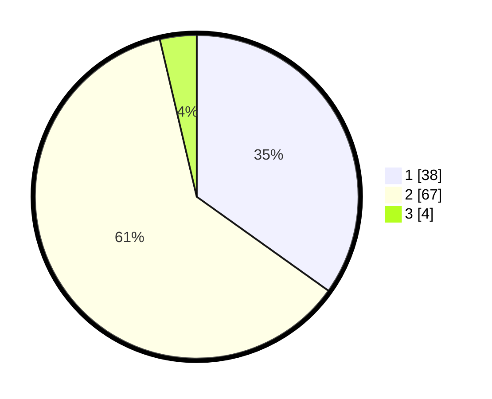

# Hasil

## Grafik

## Tabel

| No. | Nama Paslon    | Suara | Suara (raw) | Persentase |
|:--- |:-------------- | -----:| -----------:| ----------:|
| 1   | ANIES MUHAIMIN | 38    | [38][p-1]   | 34,86      |
| 2   | PRABOWO GIBRAN | 67    | [67][p-2]   | 61,47      |
| 3   | GANJAR MAHFUD  | 4     | [4][p-3]    | 3,67       |

[p-1]: https://github.com/gigit-pemilu/pemilu-2024/blob/main/pilpres/hitung-suara/sub/35-jawa-timur/sub/29-sumenep/sub/27-kangayan/sub/2003-torjek/sub/018-tps/sub/paslon-1.txt
[p-2]: https://github.com/gigit-pemilu/pemilu-2024/blob/main/pilpres/hitung-suara/sub/35-jawa-timur/sub/29-sumenep/sub/27-kangayan/sub/2003-torjek/sub/018-tps/sub/paslon-2.txt
[p-3]: https://github.com/gigit-pemilu/pemilu-2024/blob/main/pilpres/hitung-suara/sub/35-jawa-timur/sub/29-sumenep/sub/27-kangayan/sub/2003-torjek/sub/018-tps/sub/paslon-3.txt

## Foto C Plano

https://sirekap-obj-formc.kpu.go.id/618c/pemilu/ppwp/35/29/27/20/03/3529272003018-20240225-095306--b3b75cb4-f839-4a48-8427-e2a5f590031b.jpg

https://sirekap-obj-formc.kpu.go.id/618c/pemilu/ppwp/35/29/27/20/03/3529272003018-20240225-095339--074063ce-11b7-4574-a91d-f20660f44b6c.jpg

https://sirekap-obj-formc.kpu.go.id/618c/pemilu/ppwp/35/29/27/20/03/3529272003018-20240225-095432--71ab6d75-80e2-45e3-a476-1cbcc72fc1ec.jpg

## Metadata

| Key        | Value               |
| ---------- | ------------------- |
| Time Stamp | 2024-03-01 22:00:00 |

