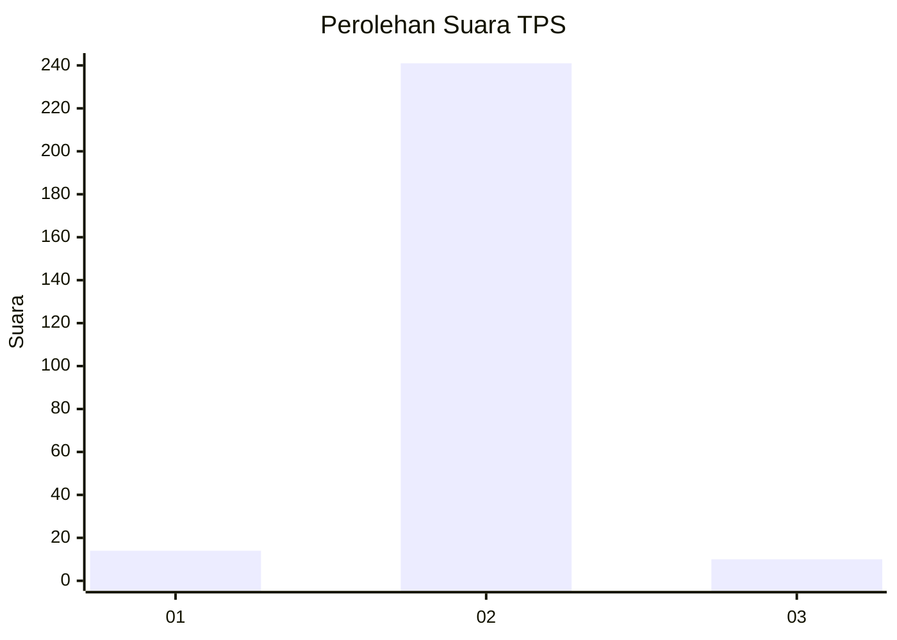
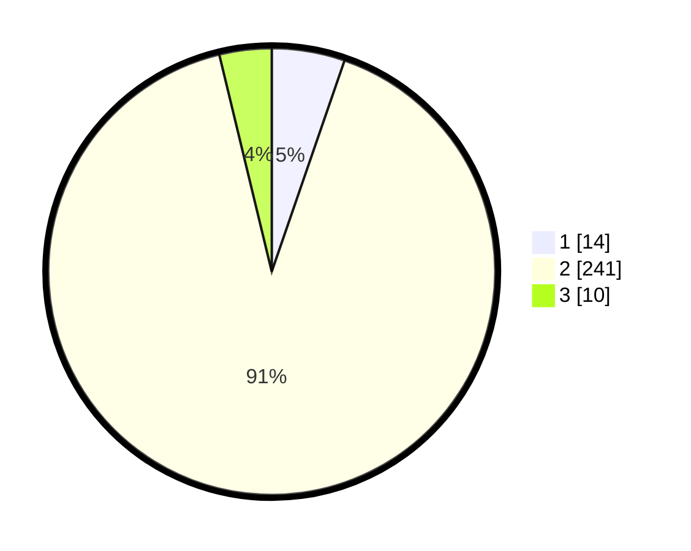

# Hasil

## Grafik

## Tabel

| No. | Nama Paslon    | Suara | Suara (raw) | Persentase |
|:--- |:-------------- | -----:| -----------:| ----------:|
| 1   | ANIES MUHAIMIN | 14    | [14][p-1]   | 5,28       |
| 2   | PRABOWO GIBRAN | 241   | [241][p-2]  | 90,94      |
| 3   | GANJAR MAHFUD  | 10    | [10][p-3]   | 3,77       |

[p-1]: https://github.com/gigit-pemilu/pemilu-2024-35-jawa-timur/blob/main/pilpres/hitung-suara/sub/35-jawa-timur/sub/29-sumenep/sub/27-kangayan/sub/2004-cangkramaan/sub/001-tps/sub/paslon-1.txt
[p-2]: https://github.com/gigit-pemilu/pemilu-2024-35-jawa-timur/blob/main/pilpres/hitung-suara/sub/35-jawa-timur/sub/29-sumenep/sub/27-kangayan/sub/2004-cangkramaan/sub/001-tps/sub/paslon-2.txt
[p-3]: https://github.com/gigit-pemilu/pemilu-2024-35-jawa-timur/blob/main/pilpres/hitung-suara/sub/35-jawa-timur/sub/29-sumenep/sub/27-kangayan/sub/2004-cangkramaan/sub/001-tps/sub/paslon-3.txt

## Foto C Plano

https://sirekap-obj-formc.kpu.go.id/920e/pemilu/ppwp/35/29/27/20/04/3529272004001-20240226-145948--7e46994e-07c3-4fb5-bee7-05ed3bb8f9c7.jpg

https://sirekap-obj-formc.kpu.go.id/920e/pemilu/ppwp/35/29/27/20/04/3529272004001-20240226-145750--aaf54c9c-946d-41c2-8804-e295afdb7848.jpg

https://sirekap-obj-formc.kpu.go.id/920e/pemilu/ppwp/35/29/27/20/04/3529272004001-20240226-145711--8acf9a0e-8d83-4624-a935-3e45c48e513f.jpg

## Metadata

| Key        | Value               |
| ---------- | ------------------- |
| Time Stamp | 2024-02-29 12:00:00 |

