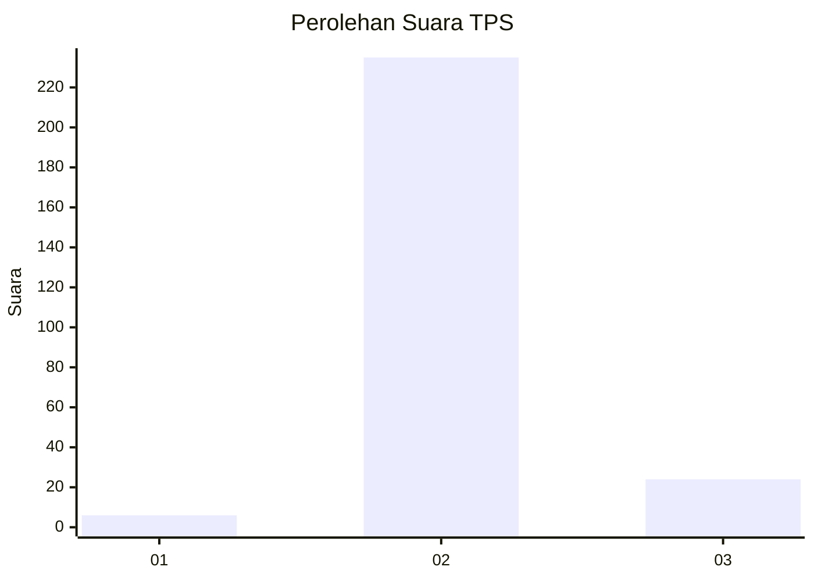
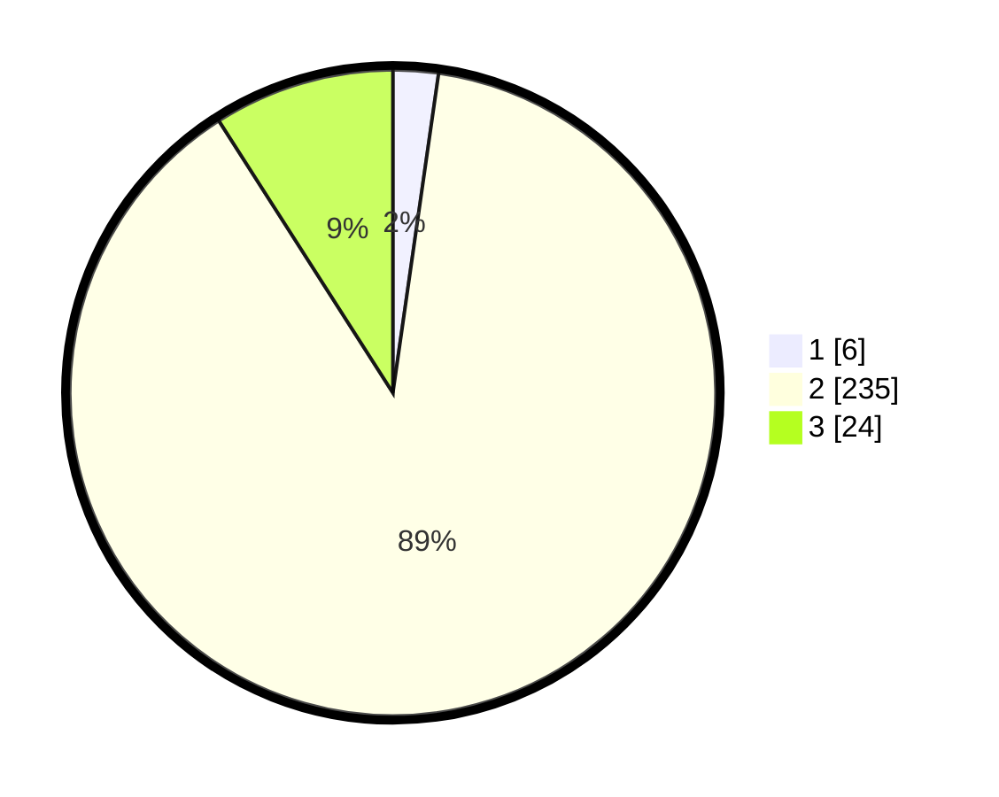

# Hasil

## Grafik

## Tabel

| No. | Nama Paslon    | Suara | Suara (raw) | Persentase |
|:--- |:-------------- | -----:| -----------:| ----------:|
| 1   | ANIES MUHAIMIN | 6     | [6][p-1]    | 2,26       |
| 2   | PRABOWO GIBRAN | 235   | [235][p-2]  | 88,68      |
| 3   | GANJAR MAHFUD  | 24    | [24][p-3]   | 9,06       |

[p-1]: https://github.com/gigit-pemilu/pemilu-2024/blob/main/pilpres/hitung-suara/sub/35-jawa-timur/sub/29-sumenep/sub/27-kangayan/sub/2004-cangkramaan/sub/002-tps/sub/paslon-1.txt
[p-2]: https://github.com/gigit-pemilu/pemilu-2024/blob/main/pilpres/hitung-suara/sub/35-jawa-timur/sub/29-sumenep/sub/27-kangayan/sub/2004-cangkramaan/sub/002-tps/sub/paslon-2.txt
[p-3]: https://github.com/gigit-pemilu/pemilu-2024/blob/main/pilpres/hitung-suara/sub/35-jawa-timur/sub/29-sumenep/sub/27-kangayan/sub/2004-cangkramaan/sub/002-tps/sub/paslon-3.txt

## Foto C Plano

https://sirekap-obj-formc.kpu.go.id/b159/pemilu/ppwp/35/29/27/20/04/3529272004002-20240226-150702--77e90bfd-c9c7-4b97-bd79-85dea5b76789.jpg

https://sirekap-obj-formc.kpu.go.id/b159/pemilu/ppwp/35/29/27/20/04/3529272004002-20240226-150422--306e20da-933d-4765-a804-e4ef85efd6f8.jpg

https://sirekap-obj-formc.kpu.go.id/b159/pemilu/ppwp/35/29/27/20/04/3529272004002-20240226-150358--f2a3ddbb-5906-4368-b86a-55d222bc3296.jpg

## Metadata

| Key        | Value               |
| ---------- | ------------------- |
| Time Stamp | 2024-02-28 20:00:00 |

