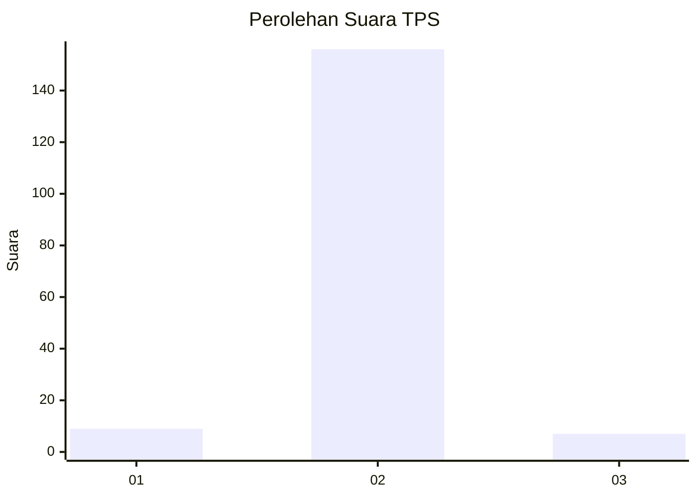
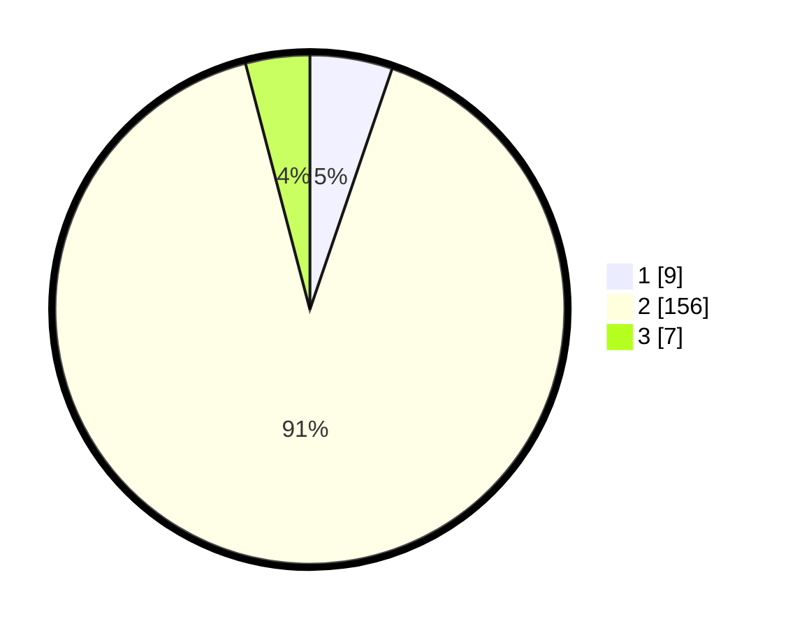

# Hasil

## Grafik

## Tabel

| No. | Nama Paslon    | Suara | Suara (raw) | Persentase |
|:--- |:-------------- | -----:| -----------:| ----------:|
| 1   | ANIES MUHAIMIN | 9     | [9][p-1]    | 5,23       |
| 2   | PRABOWO GIBRAN | 156   | [156][p-2]  | 90,70      |
| 3   | GANJAR MAHFUD  | 7     | [7][p-3]    | 4,07       |

[p-1]: https://github.com/gigit-pemilu/pemilu-2024-35-jawa-timur/blob/main/pilpres/hitung-suara/sub/35-jawa-timur/sub/29-sumenep/sub/27-kangayan/sub/2004-cangkramaan/sub/003-tps/sub/paslon-1.txt
[p-2]: https://github.com/gigit-pemilu/pemilu-2024-35-jawa-timur/blob/main/pilpres/hitung-suara/sub/35-jawa-timur/sub/29-sumenep/sub/27-kangayan/sub/2004-cangkramaan/sub/003-tps/sub/paslon-2.txt
[p-3]: https://github.com/gigit-pemilu/pemilu-2024-35-jawa-timur/blob/main/pilpres/hitung-suara/sub/35-jawa-timur/sub/29-sumenep/sub/27-kangayan/sub/2004-cangkramaan/sub/003-tps/sub/paslon-3.txt

## Foto C Plano

https://sirekap-obj-formc.kpu.go.id/d1ac/pemilu/ppwp/35/29/27/20/04/3529272004003-20240226-151113--d1401aa5-c834-4eb8-945a-7e63a1cbdab0.jpg

https://sirekap-obj-formc.kpu.go.id/d1ac/pemilu/ppwp/35/29/27/20/04/3529272004003-20240226-151004--59672aa6-cf6b-4615-95f4-bdd1c8de3d38.jpg

https://sirekap-obj-formc.kpu.go.id/d1ac/pemilu/ppwp/35/29/27/20/04/3529272004003-20240226-150936--56759c51-24aa-4450-bbc0-0183cceed03d.jpg

## Metadata

| Key        | Value               |
| ---------- | ------------------- |
| Time Stamp | 2024-03-01 00:00:00 |

