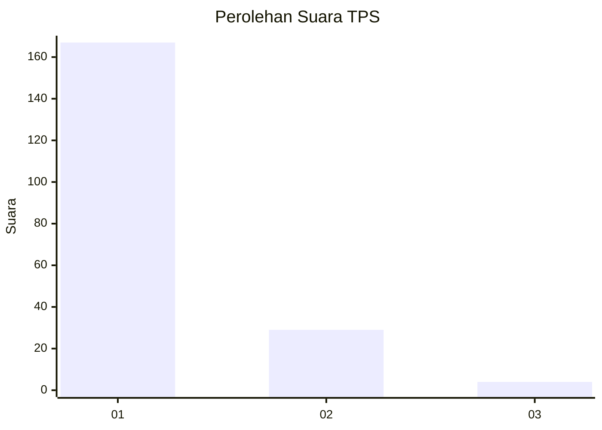
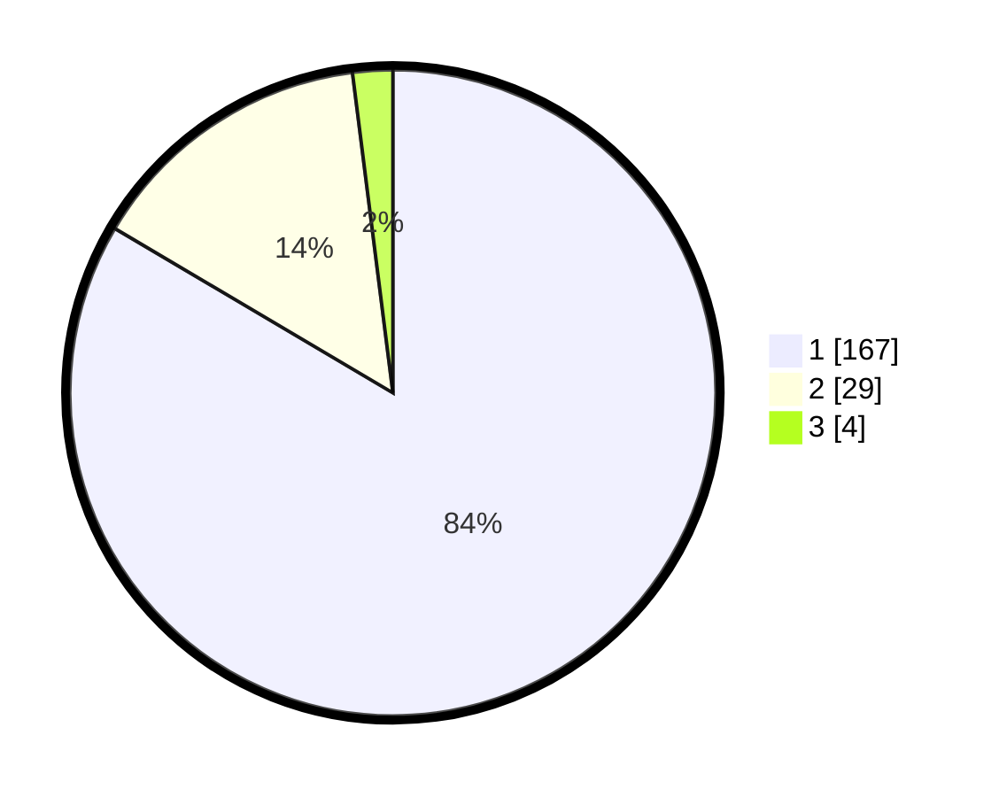

# Hasil

## Grafik

## Tabel

| No. | Nama Paslon    | Suara | Suara (raw) | Persentase |
|:--- |:-------------- | -----:| -----------:| ----------:|
| 1   | ANIES MUHAIMIN | 167   | [167][p-1]  | 83,50      |
| 2   | PRABOWO GIBRAN | 29    | [29][p-2]   | 14,50      |
| 3   | GANJAR MAHFUD  | 4     | [4][p-3]    | 2,00       |

[p-1]: https://github.com/gigit-pemilu/pemilu-2024/blob/main/pilpres/hitung-suara/sub/35-jawa-timur/sub/29-sumenep/sub/27-kangayan/sub/2005-tembayangan/sub/001-tps/sub/paslon-1.txt
[p-2]: https://github.com/gigit-pemilu/pemilu-2024/blob/main/pilpres/hitung-suara/sub/35-jawa-timur/sub/29-sumenep/sub/27-kangayan/sub/2005-tembayangan/sub/001-tps/sub/paslon-2.txt
[p-3]: https://github.com/gigit-pemilu/pemilu-2024/blob/main/pilpres/hitung-suara/sub/35-jawa-timur/sub/29-sumenep/sub/27-kangayan/sub/2005-tembayangan/sub/001-tps/sub/paslon-3.txt

## Foto C Plano

https://sirekap-obj-formc.kpu.go.id/33bb/pemilu/ppwp/35/29/27/20/05/3529272005001-20240227-091059--815e702e-c330-467c-8ae8-94c4f4fe16d5.jpg

https://sirekap-obj-formc.kpu.go.id/33bb/pemilu/ppwp/35/29/27/20/05/3529272005001-20240227-091133--6b267704-9473-4f37-9d46-629978eec3f7.jpg

https://sirekap-obj-formc.kpu.go.id/33bb/pemilu/ppwp/35/29/27/20/05/3529272005001-20240227-091229--a5e5bd75-97b2-490e-b7c5-b1c54861aa0d.jpg

## Metadata

| Key        | Value               |
| ---------- | ------------------- |
| Time Stamp | 2024-02-28 22:00:00 |

