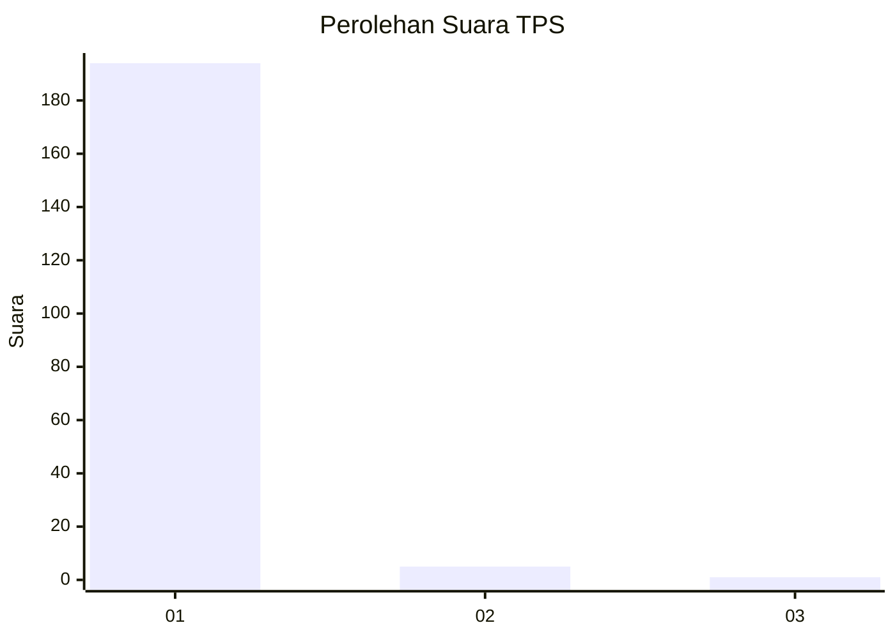
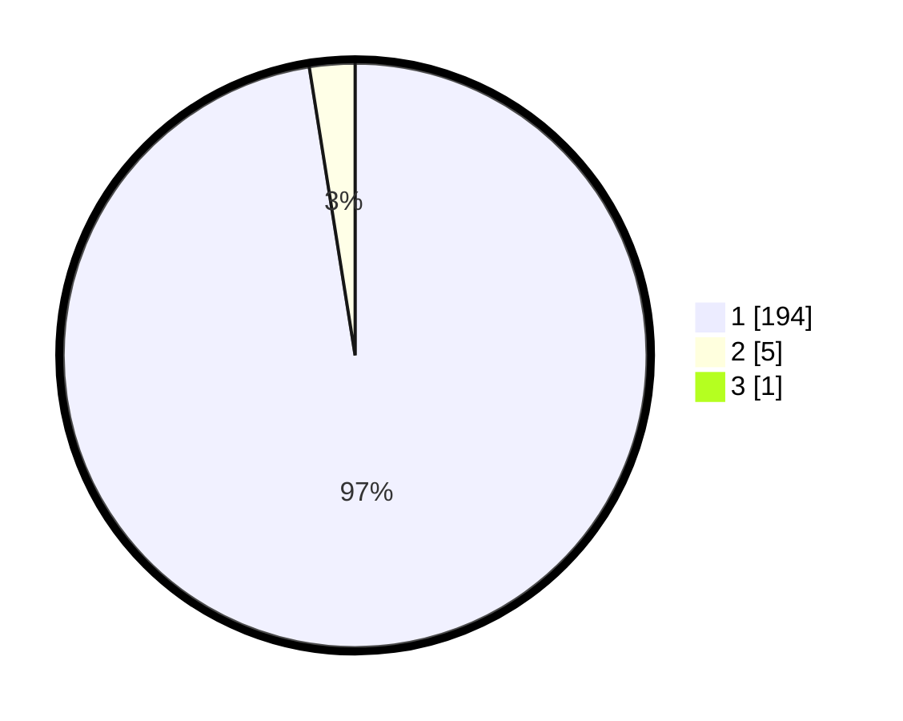

# Hasil

## Grafik

## Tabel

| No. | Nama Paslon    | Suara | Suara (raw) | Persentase |
|:--- |:-------------- | -----:| -----------:| ----------:|
| 1   | ANIES MUHAIMIN | 194   | [194][p-1]  | 97,00      |
| 2   | PRABOWO GIBRAN | 5     | [5][p-2]    | 2,50       |
| 3   | GANJAR MAHFUD  | 1     | [1][p-3]    | 0,50       |

[p-1]: https://github.com/gigit-pemilu/pemilu-2024-35-jawa-timur/blob/main/pilpres/hitung-suara/sub/35-jawa-timur/sub/29-sumenep/sub/27-kangayan/sub/2005-tembayangan/sub/002-tps/sub/paslon-1.txt
[p-2]: https://github.com/gigit-pemilu/pemilu-2024-35-jawa-timur/blob/main/pilpres/hitung-suara/sub/35-jawa-timur/sub/29-sumenep/sub/27-kangayan/sub/2005-tembayangan/sub/002-tps/sub/paslon-2.txt
[p-3]: https://github.com/gigit-pemilu/pemilu-2024-35-jawa-timur/blob/main/pilpres/hitung-suara/sub/35-jawa-timur/sub/29-sumenep/sub/27-kangayan/sub/2005-tembayangan/sub/002-tps/sub/paslon-3.txt

## Foto C Plano

https://sirekap-obj-formc.kpu.go.id/63f7/pemilu/ppwp/35/29/27/20/05/3529272005002-20240227-091339--5522c7a8-7504-47ff-947b-dc2c3e7751fe.jpg

https://sirekap-obj-formc.kpu.go.id/63f7/pemilu/ppwp/35/29/27/20/05/3529272005002-20240227-091412--f0ba72b0-67bb-4c5d-992d-c0cbbc9e5a77.jpg

https://sirekap-obj-formc.kpu.go.id/63f7/pemilu/ppwp/35/29/27/20/05/3529272005002-20240227-091452--161e5914-0ed2-4244-a838-b3d18d829c98.jpg

## Metadata

| Key        | Value               |
| ---------- | ------------------- |
| Time Stamp | 2024-02-28 20:00:00 |

