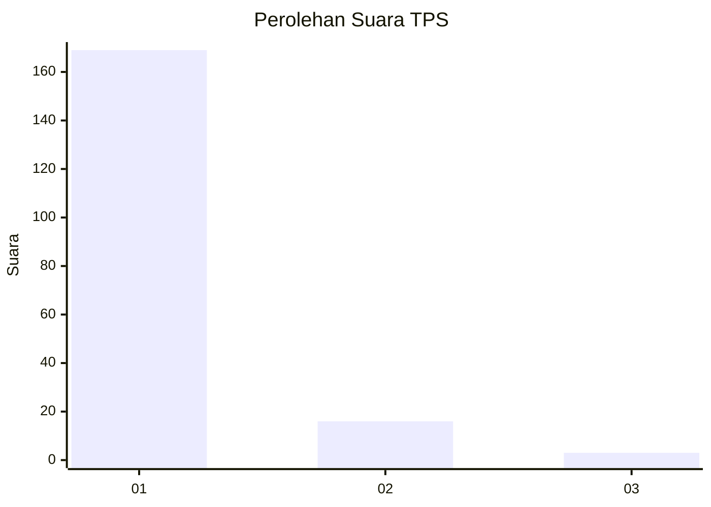
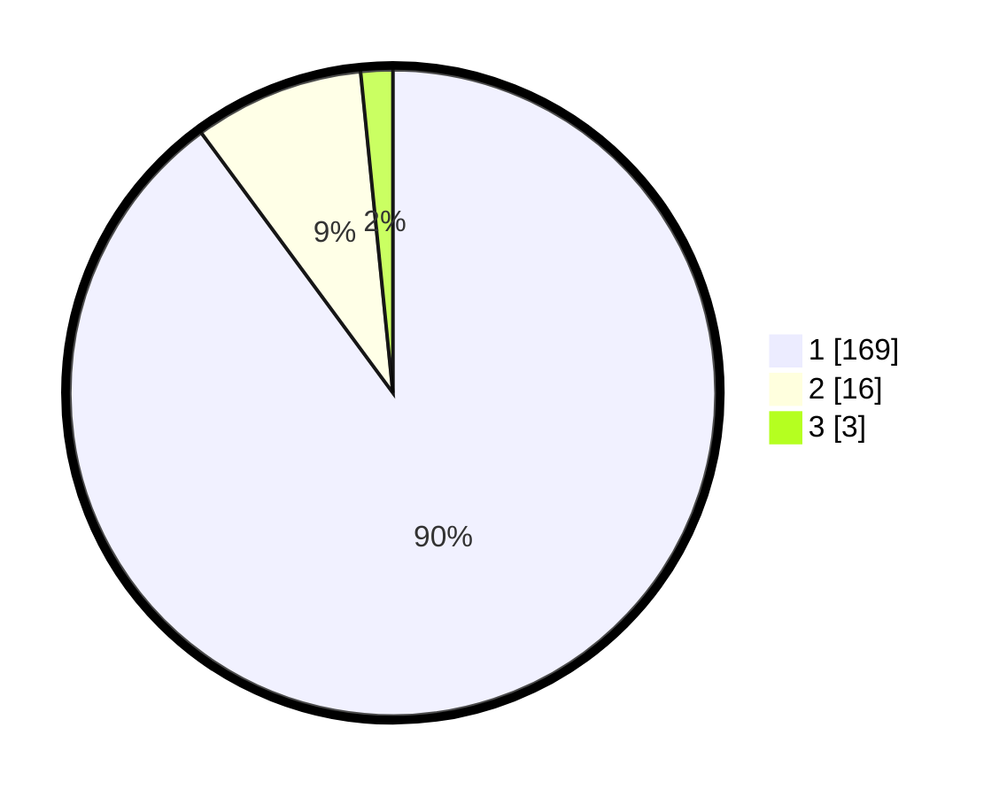

# Hasil

## Grafik

## Tabel

| No. | Nama Paslon    | Suara | Suara (raw) | Persentase |
|:--- |:-------------- | -----:| -----------:| ----------:|
| 1   | ANIES MUHAIMIN | 169   | [169][p-1]  | 89,89      |
| 2   | PRABOWO GIBRAN | 16    | [16][p-2]   | 8,51       |
| 3   | GANJAR MAHFUD  | 3     | [3][p-3]    | 1,60       |

[p-1]: https://github.com/gigit-pemilu/pemilu-2024-35-jawa-timur/blob/main/pilpres/hitung-suara/sub/35-jawa-timur/sub/29-sumenep/sub/27-kangayan/sub/2005-tembayangan/sub/003-tps/sub/paslon-1.txt
[p-2]: https://github.com/gigit-pemilu/pemilu-2024-35-jawa-timur/blob/main/pilpres/hitung-suara/sub/35-jawa-timur/sub/29-sumenep/sub/27-kangayan/sub/2005-tembayangan/sub/003-tps/sub/paslon-2.txt
[p-3]: https://github.com/gigit-pemilu/pemilu-2024-35-jawa-timur/blob/main/pilpres/hitung-suara/sub/35-jawa-timur/sub/29-sumenep/sub/27-kangayan/sub/2005-tembayangan/sub/003-tps/sub/paslon-3.txt

## Foto C Plano

https://sirekap-obj-formc.kpu.go.id/a1b8/pemilu/ppwp/35/29/27/20/05/3529272005003-20240227-091730--61e59d12-f784-481f-a2a9-b14e2d02f22a.jpg

https://sirekap-obj-formc.kpu.go.id/a1b8/pemilu/ppwp/35/29/27/20/05/3529272005003-20240227-091617--324bee79-517c-4910-bcb9-50c6bd4bb5bb.jpg

https://sirekap-obj-formc.kpu.go.id/a1b8/pemilu/ppwp/35/29/27/20/05/3529272005003-20240227-091651--d1fe9d6b-851a-46c6-8533-8421a2ff3852.jpg

## Metadata

| Key        | Value               |
| ---------- | ------------------- |
| Time Stamp | 2024-02-28 19:00:00 |

