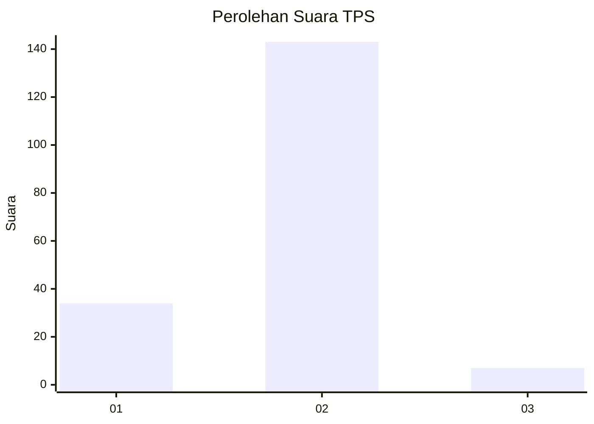
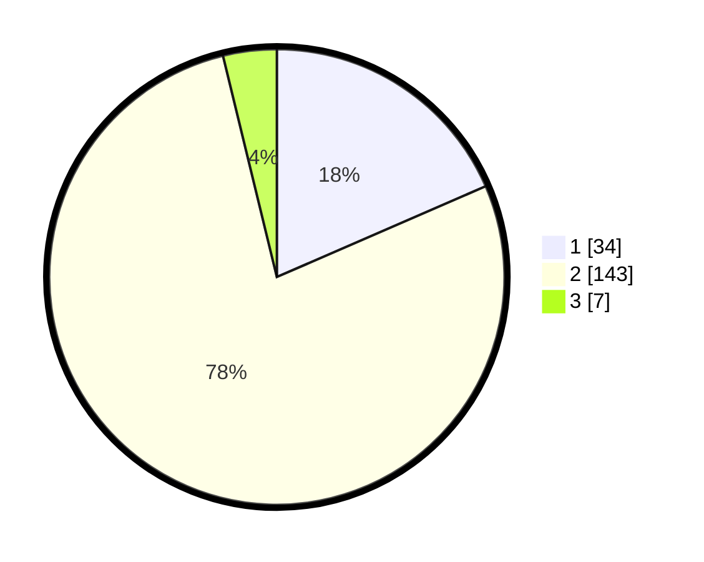

# Hasil

## Grafik

## Tabel

| No. | Nama Paslon    | Suara | Suara (raw) | Persentase |
|:--- |:-------------- | -----:| -----------:| ----------:|
| 1   | ANIES MUHAIMIN | 34    | [34][p-1]   | 18,48      |
| 2   | PRABOWO GIBRAN | 143   | [143][p-2]  | 77,72      |
| 3   | GANJAR MAHFUD  | 7     | [7][p-3]    | 3,80       |

[p-1]: https://github.com/gigit-pemilu/pemilu-2024-35-jawa-timur/blob/main/pilpres/hitung-suara/sub/35-jawa-timur/sub/29-sumenep/sub/27-kangayan/sub/2006-batuputih/sub/002-tps/sub/paslon-1.txt
[p-2]: https://github.com/gigit-pemilu/pemilu-2024-35-jawa-timur/blob/main/pilpres/hitung-suara/sub/35-jawa-timur/sub/29-sumenep/sub/27-kangayan/sub/2006-batuputih/sub/002-tps/sub/paslon-2.txt
[p-3]: https://github.com/gigit-pemilu/pemilu-2024-35-jawa-timur/blob/main/pilpres/hitung-suara/sub/35-jawa-timur/sub/29-sumenep/sub/27-kangayan/sub/2006-batuputih/sub/002-tps/sub/paslon-3.txt

## Foto C Plano

https://sirekap-obj-formc.kpu.go.id/f903/pemilu/ppwp/35/29/27/20/06/3529272006002-20240224-211347--c832b655-65de-4b85-a47c-d6bc52f6291e.jpg

https://sirekap-obj-formc.kpu.go.id/f903/pemilu/ppwp/35/29/27/20/06/3529272006002-20240224-211427--515b4fd6-e748-446e-aee9-d8e3f99b0f2f.jpg

https://sirekap-obj-formc.kpu.go.id/f903/pemilu/ppwp/35/29/27/20/06/3529272006002-20240224-211514--356e1412-54d0-4efd-94ed-e8201b99de69.jpg

## Metadata

| Key        | Value               |
| ---------- | ------------------- |
| Time Stamp | 2024-02-28 19:00:00 |

