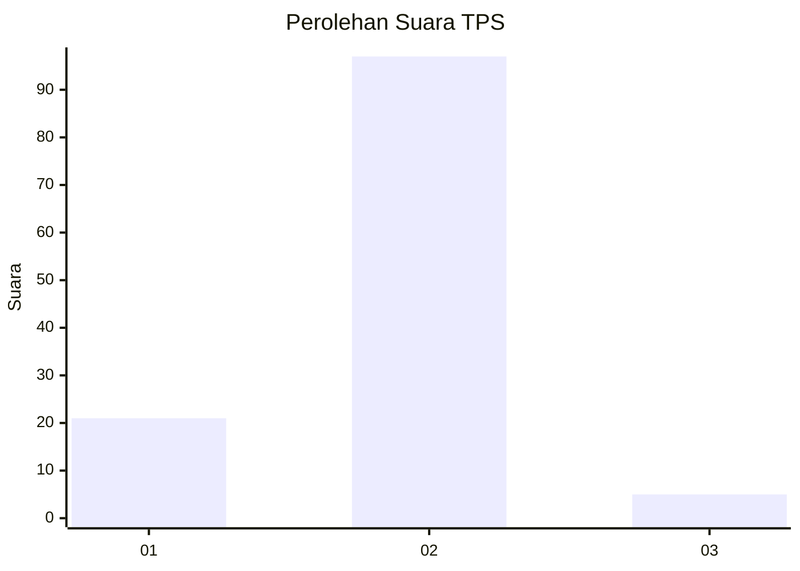
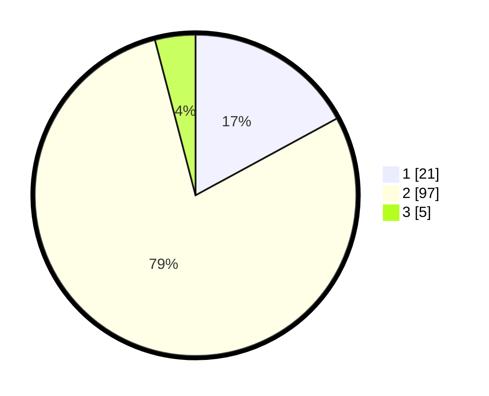

# Hasil

## Grafik

## Tabel

| No. | Nama Paslon    | Suara | Suara (raw) | Persentase |
|:--- |:-------------- | -----:| -----------:| ----------:|
| 1   | ANIES MUHAIMIN | 21    | [21][p-1]   | 17,07      |
| 2   | PRABOWO GIBRAN | 97    | [97][p-2]   | 78,86      |
| 3   | GANJAR MAHFUD  | 5     | [5][p-3]    | 4,07       |

[p-1]: https://github.com/gigit-pemilu/pemilu-2024-35-jawa-timur/blob/main/pilpres/hitung-suara/sub/35-jawa-timur/sub/29-sumenep/sub/27-kangayan/sub/2008-timur-jang-jang/sub/001-tps/sub/paslon-1.txt
[p-2]: https://github.com/gigit-pemilu/pemilu-2024-35-jawa-timur/blob/main/pilpres/hitung-suara/sub/35-jawa-timur/sub/29-sumenep/sub/27-kangayan/sub/2008-timur-jang-jang/sub/001-tps/sub/paslon-2.txt
[p-3]: https://github.com/gigit-pemilu/pemilu-2024-35-jawa-timur/blob/main/pilpres/hitung-suara/sub/35-jawa-timur/sub/29-sumenep/sub/27-kangayan/sub/2008-timur-jang-jang/sub/001-tps/sub/paslon-3.txt

## Foto C Plano

https://sirekap-obj-formc.kpu.go.id/70ff/pemilu/ppwp/35/29/27/20/08/3529272008001-20240227-105646--26081261-c919-4ed1-bf1a-0ea8b0cf5f03.jpg

https://sirekap-obj-formc.kpu.go.id/70ff/pemilu/ppwp/35/29/27/20/08/3529272008001-20240227-105734--4c10d447-6d87-4bdc-b852-28ed7b567b61.jpg

https://sirekap-obj-formc.kpu.go.id/70ff/pemilu/ppwp/35/29/27/20/08/3529272008001-20240227-105829--6af15f54-936d-40f2-8652-f83ed65e3fe8.jpg

## Metadata

| Key        | Value               |
| ---------- | ------------------- |
| Time Stamp | 2024-02-28 19:00:00 |

