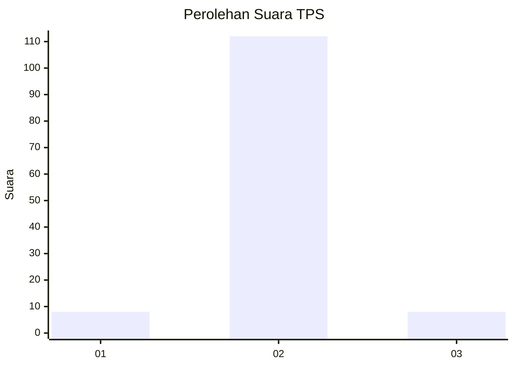
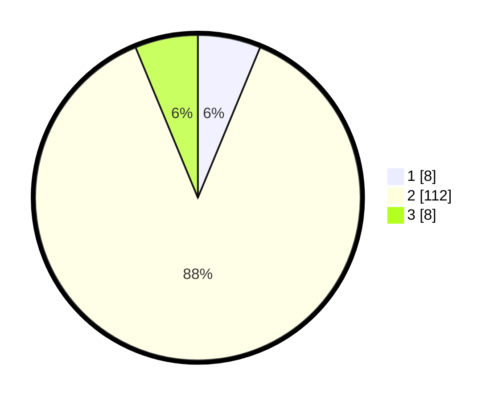

# Hasil

## Grafik

## Tabel

| No. | Nama Paslon    | Suara | Suara (raw) | Persentase |
|:--- |:-------------- | -----:| -----------:| ----------:|
| 1   | ANIES MUHAIMIN | 8     | [8][p-1]    | 6,25       |
| 2   | PRABOWO GIBRAN | 112   | [112][p-2]  | 87,50      |
| 3   | GANJAR MAHFUD  | 8     | [8][p-3]    | 6,25       |

[p-1]: https://github.com/gigit-pemilu/pemilu-2024-35-jawa-timur/blob/main/pilpres/hitung-suara/sub/35-jawa-timur/sub/29-sumenep/sub/27-kangayan/sub/2008-timur-jang-jang/sub/002-tps/sub/paslon-1.txt
[p-2]: https://github.com/gigit-pemilu/pemilu-2024-35-jawa-timur/blob/main/pilpres/hitung-suara/sub/35-jawa-timur/sub/29-sumenep/sub/27-kangayan/sub/2008-timur-jang-jang/sub/002-tps/sub/paslon-2.txt
[p-3]: https://github.com/gigit-pemilu/pemilu-2024-35-jawa-timur/blob/main/pilpres/hitung-suara/sub/35-jawa-timur/sub/29-sumenep/sub/27-kangayan/sub/2008-timur-jang-jang/sub/002-tps/sub/paslon-3.txt

## Foto C Plano

https://sirekap-obj-formc.kpu.go.id/5e82/pemilu/ppwp/35/29/27/20/08/3529272008002-20240227-110957--b389b509-5e69-48d5-a8ad-adab7136541d.jpg

https://sirekap-obj-formc.kpu.go.id/5e82/pemilu/ppwp/35/29/27/20/08/3529272008002-20240227-110812--8d3942d8-f9ef-45c3-8f6f-258bc9be7060.jpg

https://sirekap-obj-formc.kpu.go.id/5e82/pemilu/ppwp/35/29/27/20/08/3529272008002-20240227-110905--345f93be-7d7a-4e29-9e01-337e786126da.jpg

## Metadata

| Key        | Value               |
| ---------- | ------------------- |
| Time Stamp | 2024-03-01 23:00:00 |

