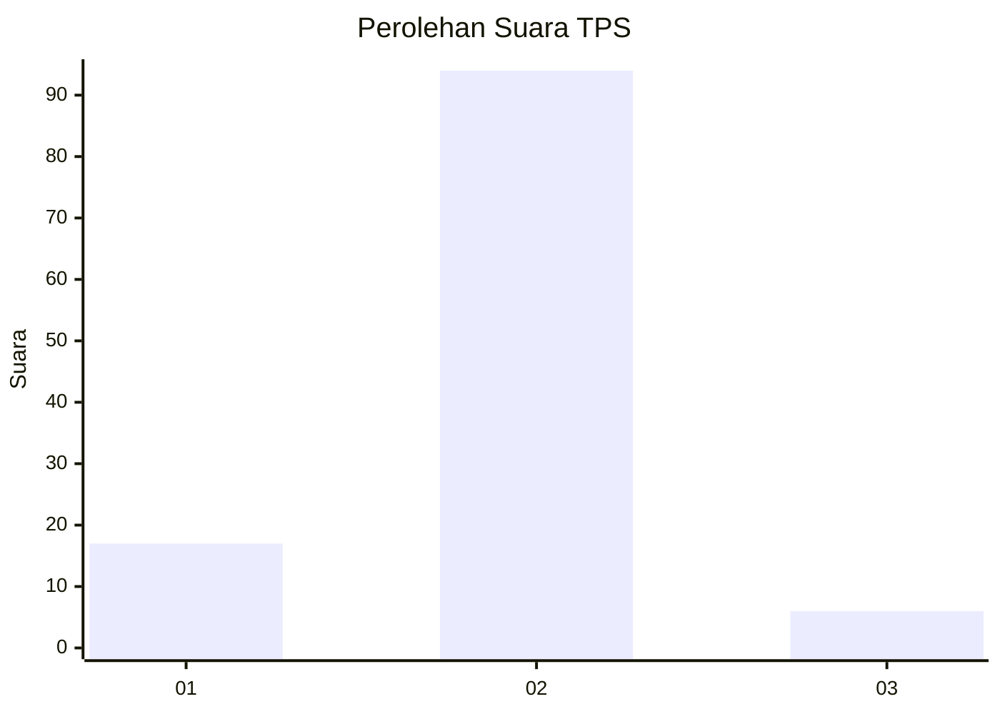
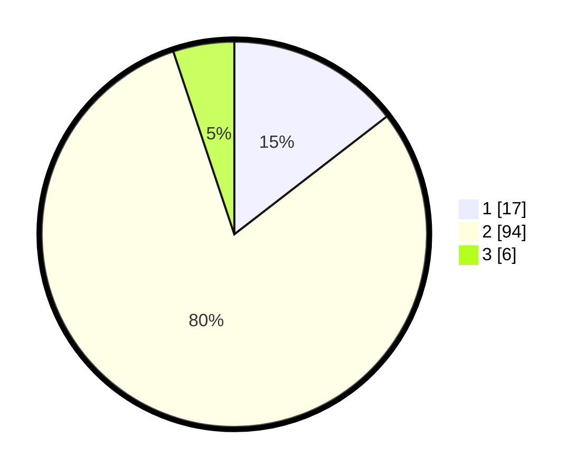

# Hasil

## Grafik

## Tabel

| No. | Nama Paslon    | Suara | Suara (raw) | Persentase |
|:--- |:-------------- | -----:| -----------:| ----------:|
| 1   | ANIES MUHAIMIN | 17    | [17][p-1]   | 14,53      |
| 2   | PRABOWO GIBRAN | 94    | [94][p-2]   | 80,34      |
| 3   | GANJAR MAHFUD  | 6     | [6][p-3]    | 5,13       |

[p-1]: https://github.com/gigit-pemilu/pemilu-2024/blob/main/pilpres/hitung-suara/sub/35-jawa-timur/sub/29-sumenep/sub/27-kangayan/sub/2008-timur-jang-jang/sub/004-tps/sub/paslon-1.txt
[p-2]: https://github.com/gigit-pemilu/pemilu-2024/blob/main/pilpres/hitung-suara/sub/35-jawa-timur/sub/29-sumenep/sub/27-kangayan/sub/2008-timur-jang-jang/sub/004-tps/sub/paslon-2.txt
[p-3]: https://github.com/gigit-pemilu/pemilu-2024/blob/main/pilpres/hitung-suara/sub/35-jawa-timur/sub/29-sumenep/sub/27-kangayan/sub/2008-timur-jang-jang/sub/004-tps/sub/paslon-3.txt

## Foto C Plano

https://sirekap-obj-formc.kpu.go.id/85a3/pemilu/ppwp/35/29/27/20/08/3529272008004-20240227-111706--1ea2876f-0ff5-470a-9982-7bd1441ca9df.jpg

https://sirekap-obj-formc.kpu.go.id/85a3/pemilu/ppwp/35/29/27/20/08/3529272008004-20240227-111458--7846b6ae-86fc-4c20-b9a2-034555bae604.jpg

https://sirekap-obj-formc.kpu.go.id/85a3/pemilu/ppwp/35/29/27/20/08/3529272008004-20240227-111424--fad3fd63-c94b-4f36-88f0-5a6291dc4bca.jpg

## Metadata

| Key        | Value               |
| ---------- | ------------------- |
| Time Stamp | 2024-02-28 23:00:00 |

