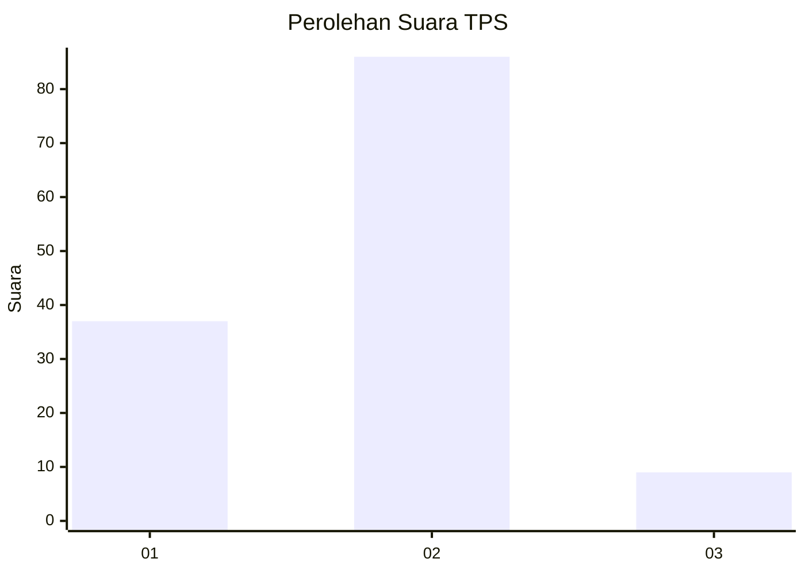
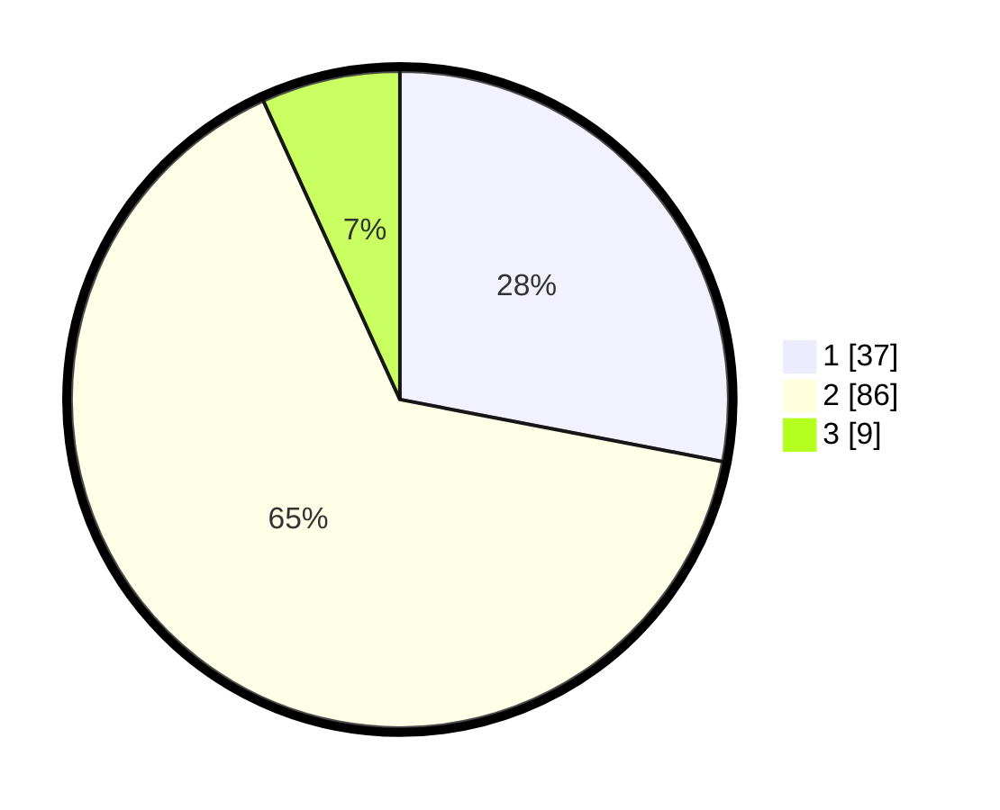

# Hasil

## Grafik

## Tabel

| No. | Nama Paslon    | Suara | Suara (raw) | Persentase |
|:--- |:-------------- | -----:| -----------:| ----------:|
| 1   | ANIES MUHAIMIN | 37    | [37][p-1]   | 28,03      |
| 2   | PRABOWO GIBRAN | 86    | [86][p-2]   | 65,15      |
| 3   | GANJAR MAHFUD  | 9     | [9][p-3]    | 6,82       |

[p-1]: https://github.com/gigit-pemilu/pemilu-2024-35-jawa-timur/blob/main/pilpres/hitung-suara/sub/35-jawa-timur/sub/29-sumenep/sub/27-kangayan/sub/2008-timur-jang-jang/sub/005-tps/sub/paslon-1.txt
[p-2]: https://github.com/gigit-pemilu/pemilu-2024-35-jawa-timur/blob/main/pilpres/hitung-suara/sub/35-jawa-timur/sub/29-sumenep/sub/27-kangayan/sub/2008-timur-jang-jang/sub/005-tps/sub/paslon-2.txt
[p-3]: https://github.com/gigit-pemilu/pemilu-2024-35-jawa-timur/blob/main/pilpres/hitung-suara/sub/35-jawa-timur/sub/29-sumenep/sub/27-kangayan/sub/2008-timur-jang-jang/sub/005-tps/sub/paslon-3.txt

## Foto C Plano

https://sirekap-obj-formc.kpu.go.id/a532/pemilu/ppwp/35/29/27/20/08/3529272008005-20240227-112741--604bac88-4e12-4d25-840a-f1e534318dca.jpg

https://sirekap-obj-formc.kpu.go.id/a532/pemilu/ppwp/35/29/27/20/08/3529272008005-20240227-112639--9ef237f0-583b-4a39-9899-230fa3328515.jpg

https://sirekap-obj-formc.kpu.go.id/a532/pemilu/ppwp/35/29/27/20/08/3529272008005-20240227-112547--66c622dc-404d-4845-a478-500f236e04db.jpg

## Metadata

| Key        | Value               |
| ---------- | ------------------- |
| Time Stamp | 2024-02-29 20:00:00 |

