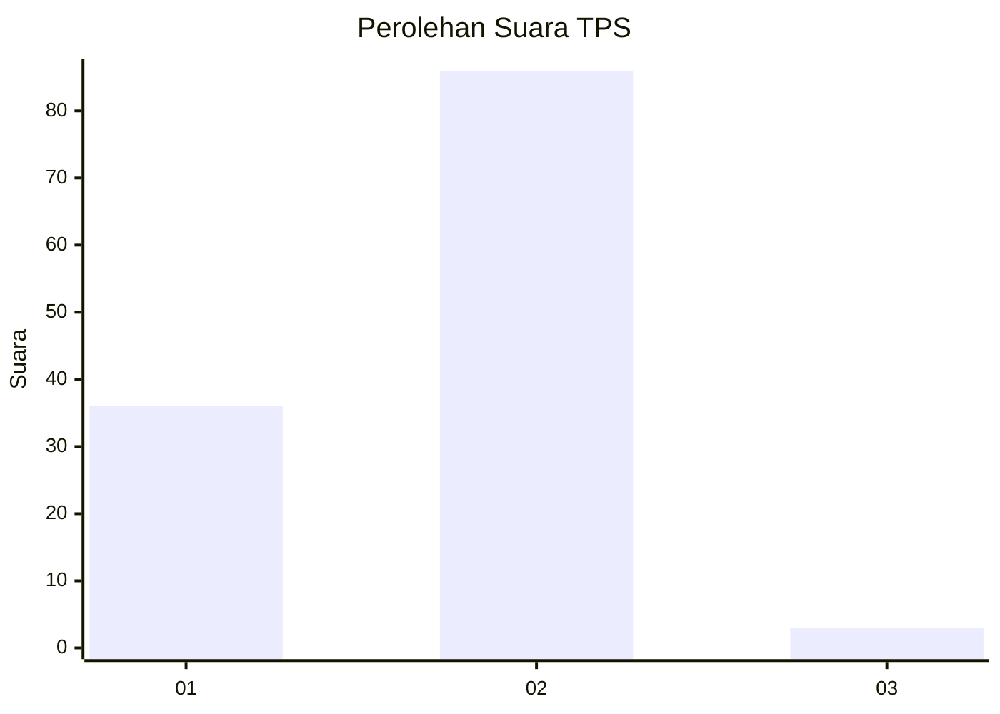
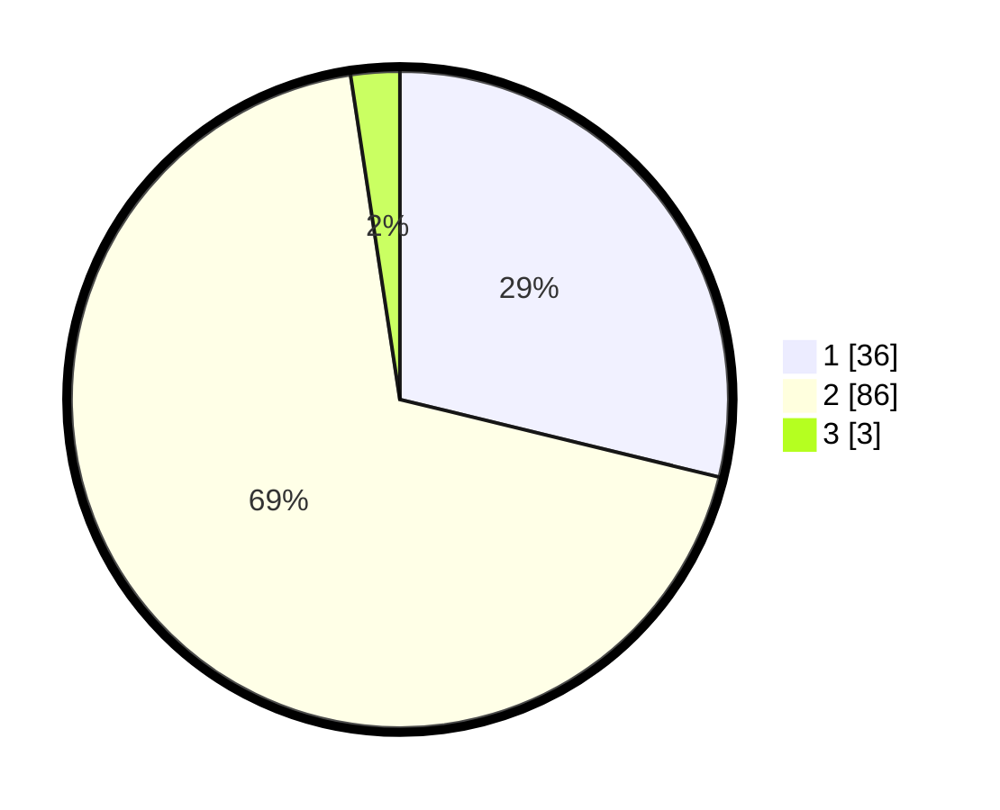

# Hasil

## Grafik

## Tabel

| No. | Nama Paslon    | Suara | Suara (raw) | Persentase |
|:--- |:-------------- | -----:| -----------:| ----------:|
| 1   | ANIES MUHAIMIN | 36    | [36][p-1]   | 28,80      |
| 2   | PRABOWO GIBRAN | 86    | [86][p-2]   | 68,80      |
| 3   | GANJAR MAHFUD  | 3     | [3][p-3]    | 2,40       |

[p-1]: https://github.com/gigit-pemilu/pemilu-2024/blob/main/pilpres/hitung-suara/sub/35-jawa-timur/sub/29-sumenep/sub/27-kangayan/sub/2008-timur-jang-jang/sub/006-tps/sub/paslon-1.txt
[p-2]: https://github.com/gigit-pemilu/pemilu-2024/blob/main/pilpres/hitung-suara/sub/35-jawa-timur/sub/29-sumenep/sub/27-kangayan/sub/2008-timur-jang-jang/sub/006-tps/sub/paslon-2.txt
[p-3]: https://github.com/gigit-pemilu/pemilu-2024/blob/main/pilpres/hitung-suara/sub/35-jawa-timur/sub/29-sumenep/sub/27-kangayan/sub/2008-timur-jang-jang/sub/006-tps/sub/paslon-3.txt

## Foto C Plano

https://sirekap-obj-formc.kpu.go.id/ea95/pemilu/ppwp/35/29/27/20/08/3529272008006-20240227-113125--1c722b3c-9e63-4cc9-95d9-453e7bca36d3.jpg

https://sirekap-obj-formc.kpu.go.id/ea95/pemilu/ppwp/35/29/27/20/08/3529272008006-20240227-113047--d8dcc3aa-fcfe-4864-a0d0-b678d3901855.jpg

https://sirekap-obj-formc.kpu.go.id/ea95/pemilu/ppwp/35/29/27/20/08/3529272008006-20240227-113010--bbdec014-85be-44cb-8199-6e5f3e5a2a65.jpg

## Metadata

| Key        | Value               |
| ---------- | ------------------- |
| Time Stamp | 2024-02-28 22:00:00 |

