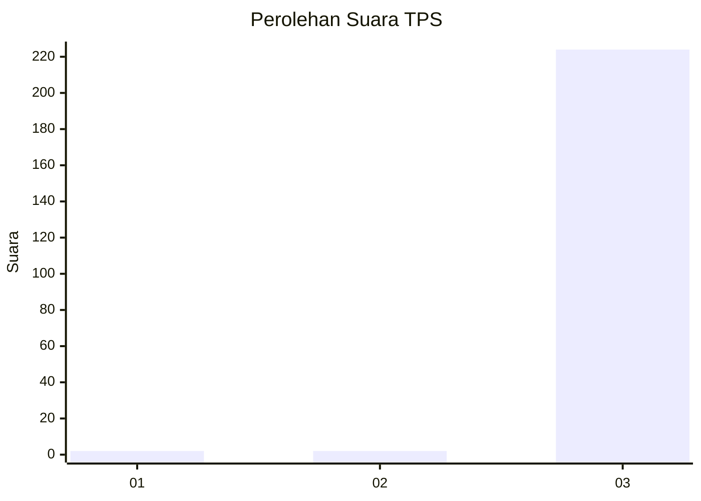
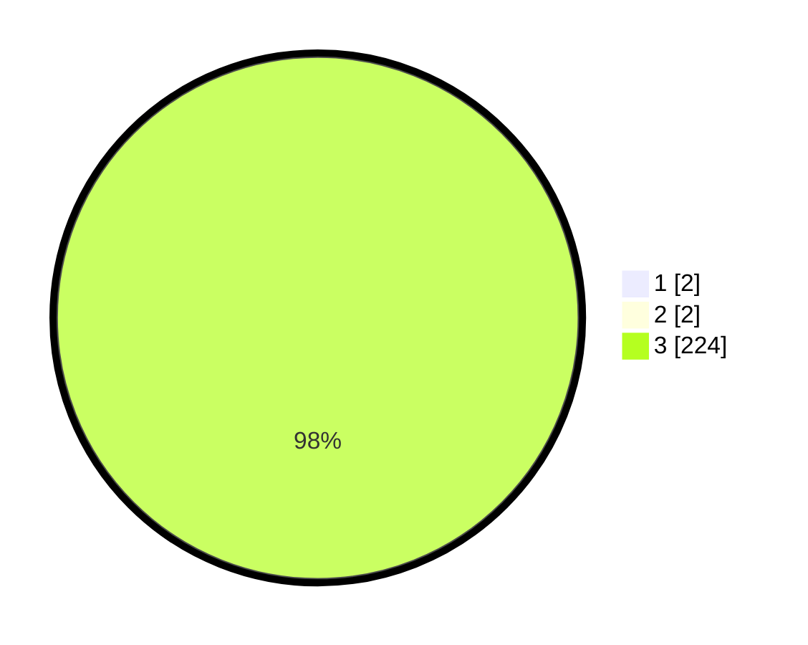

# Hasil

## Grafik

## Tabel

| No. | Nama Paslon    | Suara | Suara (raw) | Persentase |
|:--- |:-------------- | -----:| -----------:| ----------:|
| 1   | ANIES MUHAIMIN | 2     | [2][p-1]    | 0,88       |
| 2   | PRABOWO GIBRAN | 2     | [2][p-2]    | 0,88       |
| 3   | GANJAR MAHFUD  | 224   | [224][p-3]  | 98,25      |

[p-1]: https://github.com/gigit-pemilu/pemilu-2024-35-jawa-timur/blob/main/pilpres/hitung-suara/sub/35-jawa-timur/sub/29-sumenep/sub/27-kangayan/sub/2008-timur-jang-jang/sub/007-tps/sub/paslon-1.txt
[p-2]: https://github.com/gigit-pemilu/pemilu-2024-35-jawa-timur/blob/main/pilpres/hitung-suara/sub/35-jawa-timur/sub/29-sumenep/sub/27-kangayan/sub/2008-timur-jang-jang/sub/007-tps/sub/paslon-2.txt
[p-3]: https://github.com/gigit-pemilu/pemilu-2024-35-jawa-timur/blob/main/pilpres/hitung-suara/sub/35-jawa-timur/sub/29-sumenep/sub/27-kangayan/sub/2008-timur-jang-jang/sub/007-tps/sub/paslon-3.txt

## Foto C Plano

https://sirekap-obj-formc.kpu.go.id/3e1d/pemilu/ppwp/35/29/27/20/08/3529272008007-20240227-113412--b2bee92d-bcf8-4d1a-af51-c4a99627b6ec.jpg

https://sirekap-obj-formc.kpu.go.id/3e1d/pemilu/ppwp/35/29/27/20/08/3529272008007-20240227-113331--ba6f1521-1898-47ad-984e-537f73eed727.jpg

https://sirekap-obj-formc.kpu.go.id/3e1d/pemilu/ppwp/35/29/27/20/08/3529272008007-20240227-113246--51ca7f57-14a8-464c-b2af-283896a6b907.jpg

## Metadata

| Key        | Value               |
| ---------- | ------------------- |
| Time Stamp | 2024-03-01 15:00:00 |

