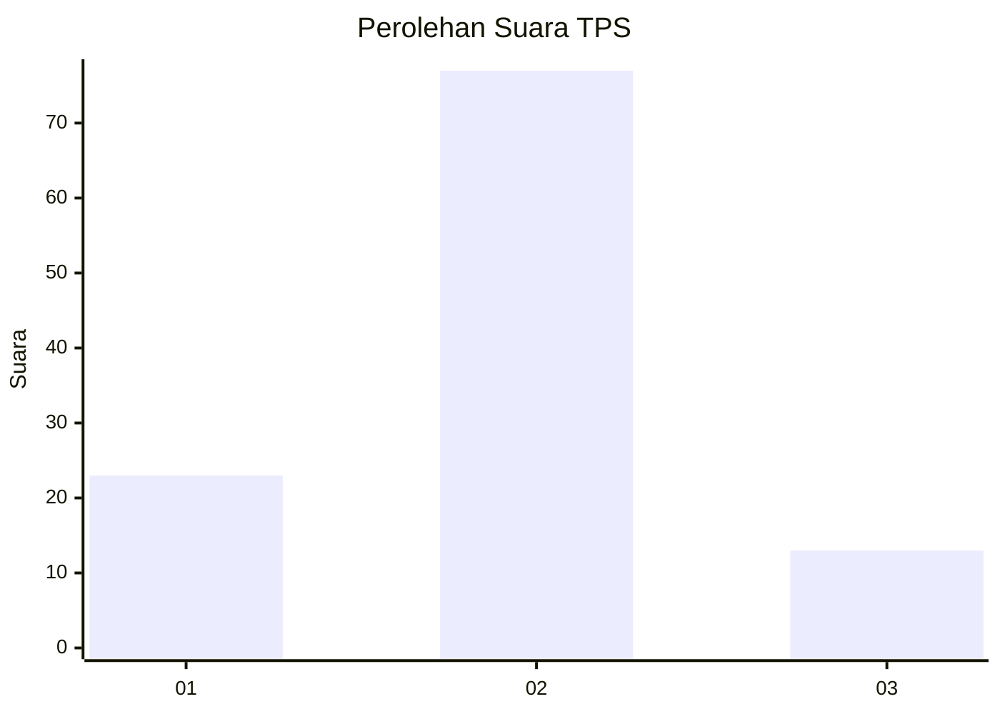
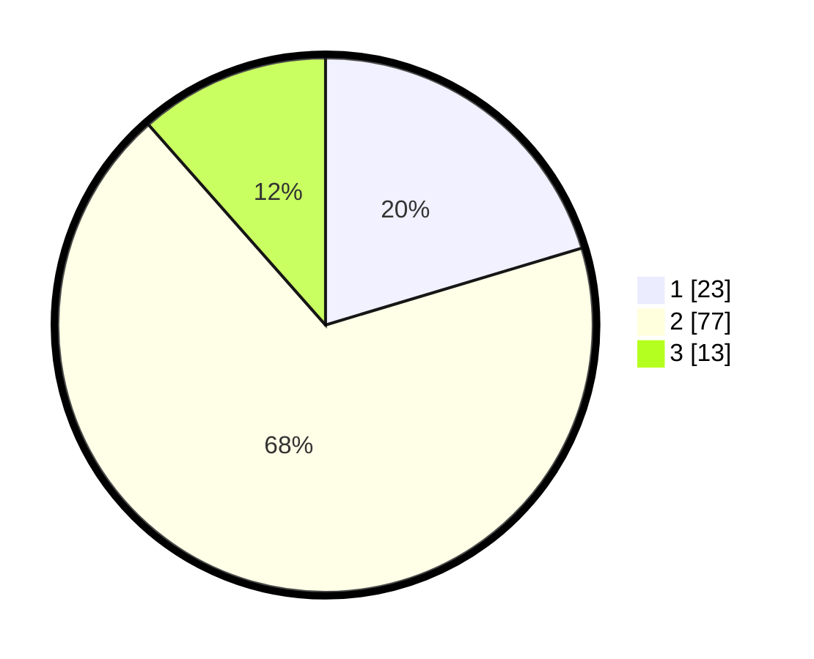

# Hasil

## Grafik

## Tabel

| No. | Nama Paslon    | Suara | Suara (raw) | Persentase |
|:--- |:-------------- | -----:| -----------:| ----------:|
| 1   | ANIES MUHAIMIN | 23    | [23][p-1]   | 20,35      |
| 2   | PRABOWO GIBRAN | 77    | [77][p-2]   | 68,14      |
| 3   | GANJAR MAHFUD  | 13    | [13][p-3]   | 11,50      |

[p-1]: https://github.com/gigit-pemilu/pemilu-2024-35-jawa-timur/blob/main/pilpres/hitung-suara/sub/35-jawa-timur/sub/29-sumenep/sub/27-kangayan/sub/2008-timur-jang-jang/sub/012-tps/sub/paslon-1.txt
[p-2]: https://github.com/gigit-pemilu/pemilu-2024-35-jawa-timur/blob/main/pilpres/hitung-suara/sub/35-jawa-timur/sub/29-sumenep/sub/27-kangayan/sub/2008-timur-jang-jang/sub/012-tps/sub/paslon-2.txt
[p-3]: https://github.com/gigit-pemilu/pemilu-2024-35-jawa-timur/blob/main/pilpres/hitung-suara/sub/35-jawa-timur/sub/29-sumenep/sub/27-kangayan/sub/2008-timur-jang-jang/sub/012-tps/sub/paslon-3.txt

## Foto C Plano

https://sirekap-obj-formc.kpu.go.id/cf90/pemilu/ppwp/35/29/27/20/08/3529272008012-20240227-114858--ba4b6744-63d1-49d6-82bf-5e9d025676f7.jpg

https://sirekap-obj-formc.kpu.go.id/cf90/pemilu/ppwp/35/29/27/20/08/3529272008012-20240227-114744--e6a33f1a-0c7c-4c53-987e-710db9427032.jpg

https://sirekap-obj-formc.kpu.go.id/cf90/pemilu/ppwp/35/29/27/20/08/3529272008012-20240227-114715--87cf14c9-7c60-4447-ad5e-4a85bf71828f.jpg

## Metadata

| Key        | Value               |
| ---------- | ------------------- |
| Time Stamp | 2024-02-28 19:00:00 |

