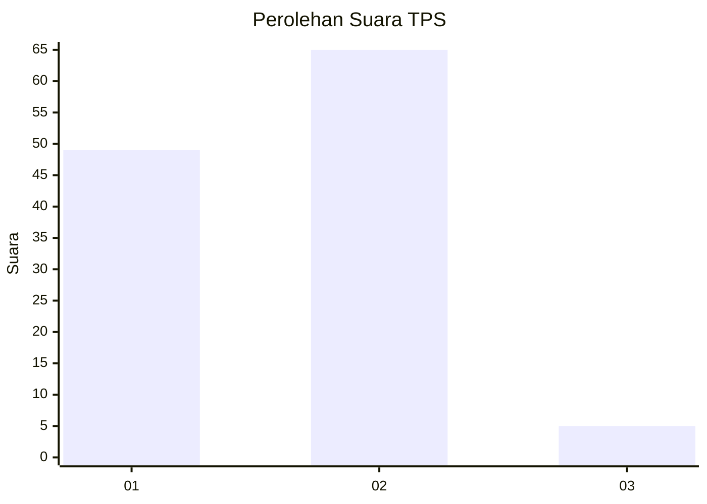
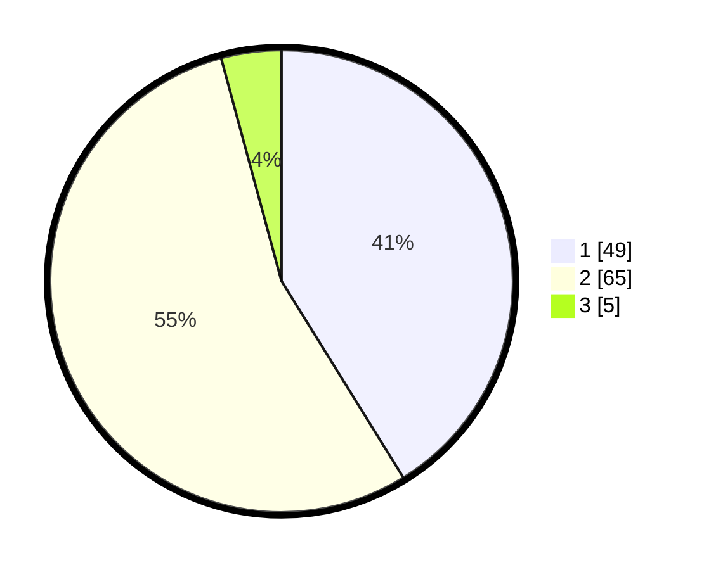

# Hasil

## Grafik

## Tabel

| No. | Nama Paslon    | Suara | Suara (raw) | Persentase |
|:--- |:-------------- | -----:| -----------:| ----------:|
| 1   | ANIES MUHAIMIN | 49    | [49][p-1]   | 41,18      |
| 2   | PRABOWO GIBRAN | 65    | [65][p-2]   | 54,62      |
| 3   | GANJAR MAHFUD  | 5     | [5][p-3]    | 4,20       |

[p-1]: https://github.com/gigit-pemilu/pemilu-2024-35-jawa-timur/blob/main/pilpres/hitung-suara/sub/35-jawa-timur/sub/29-sumenep/sub/27-kangayan/sub/2008-timur-jang-jang/sub/013-tps/sub/paslon-1.txt
[p-2]: https://github.com/gigit-pemilu/pemilu-2024-35-jawa-timur/blob/main/pilpres/hitung-suara/sub/35-jawa-timur/sub/29-sumenep/sub/27-kangayan/sub/2008-timur-jang-jang/sub/013-tps/sub/paslon-2.txt
[p-3]: https://github.com/gigit-pemilu/pemilu-2024-35-jawa-timur/blob/main/pilpres/hitung-suara/sub/35-jawa-timur/sub/29-sumenep/sub/27-kangayan/sub/2008-timur-jang-jang/sub/013-tps/sub/paslon-3.txt

## Foto C Plano

https://sirekap-obj-formc.kpu.go.id/cae8/pemilu/ppwp/35/29/27/20/08/3529272008013-20240227-114941--420bceb5-be06-4d35-a3ad-7929e8ab1d8c.jpg

https://sirekap-obj-formc.kpu.go.id/cae8/pemilu/ppwp/35/29/27/20/08/3529272008013-20240227-115128--42b662d9-a84a-425a-a959-f04224308bbb.jpg

https://sirekap-obj-formc.kpu.go.id/cae8/pemilu/ppwp/35/29/27/20/08/3529272008013-20240227-115015--d5e8dd79-8462-4978-88d6-9b17d3c4aa09.jpg

## Metadata

| Key        | Value               |
| ---------- | ------------------- |
| Time Stamp | 2024-02-28 19:00:00 |

