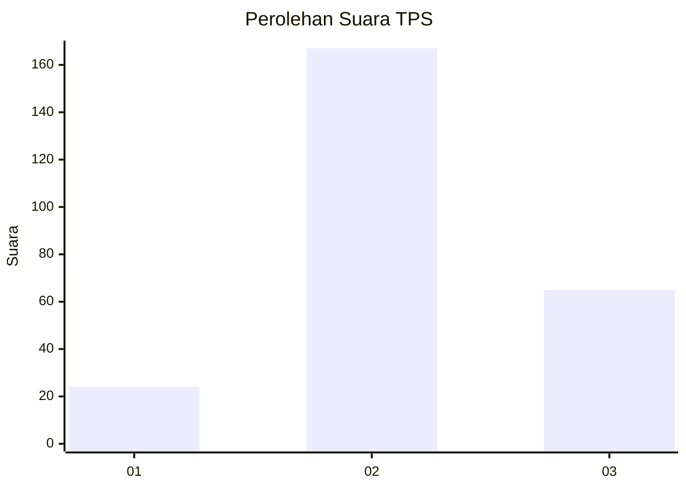
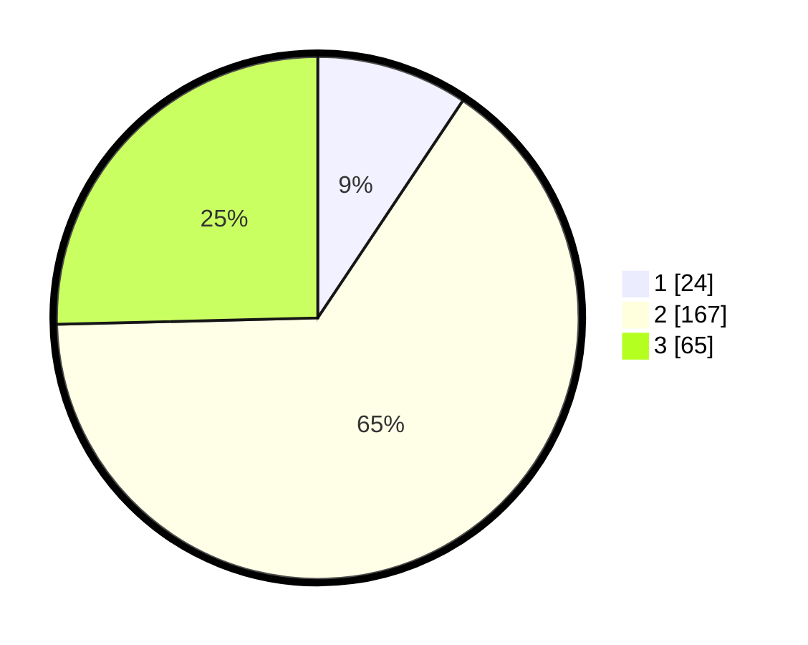

# Hasil

## Grafik

## Tabel

| No. | Nama Paslon    | Suara | Suara (raw) | Persentase |
|:--- |:-------------- | -----:| -----------:| ----------:|
| 1   | ANIES MUHAIMIN | 24    | [24][p-1]   | 9,38       |
| 2   | PRABOWO GIBRAN | 167   | [167][p-2]  | 65,23      |
| 3   | GANJAR MAHFUD  | 65    | [65][p-3]   | 25,39      |

[p-1]: https://github.com/gigit-pemilu/pemilu-2024-35-jawa-timur/blob/main/pilpres/hitung-suara/sub/35-jawa-timur/sub/71-kota-kediri/sub/01-mojoroto/sub/1001-bandar-lor/sub/001-tps/sub/paslon-1.txt
[p-2]: https://github.com/gigit-pemilu/pemilu-2024-35-jawa-timur/blob/main/pilpres/hitung-suara/sub/35-jawa-timur/sub/71-kota-kediri/sub/01-mojoroto/sub/1001-bandar-lor/sub/001-tps/sub/paslon-2.txt
[p-3]: https://github.com/gigit-pemilu/pemilu-2024-35-jawa-timur/blob/main/pilpres/hitung-suara/sub/35-jawa-timur/sub/71-kota-kediri/sub/01-mojoroto/sub/1001-bandar-lor/sub/001-tps/sub/paslon-3.txt

## Foto C Plano

https://sirekap-obj-formc.kpu.go.id/c530/pemilu/ppwp/35/71/01/10/01/3571011001001-20240216-210710--0a369a4f-e947-4aed-8a5e-43053c0c5f97.jpg

https://sirekap-obj-formc.kpu.go.id/c530/pemilu/ppwp/35/71/01/10/01/3571011001001-20240216-210711--356a2eb2-9813-4855-800d-dd7aa0894168.jpg

https://sirekap-obj-formc.kpu.go.id/c530/pemilu/ppwp/35/71/01/10/01/3571011001001-20240216-210711--f8d49d62-94e2-47f7-82b5-e5c3ca177efa.jpg

## Metadata

| Key        | Value               |
| ---------- | ------------------- |
| Time Stamp | 2024-02-17 10:30:03 |

## DATA PEMILIH TETAP

Jumlah pemilih dalam DPT: **283**.
 * L: **140**.
 * P: **143**.

## DATA PENGGUNA HAK PILIH

Jumlah pengguna hak pilih dalam DPT: **234**.
 * L: **111**.
 * P: **123**.

Jumlah pengguna hak pilih dalam DPTb: **17**.
 * L: **17**.
 * P: **0**.

Jumlah pengguna hak pilih dalam DPK: **9**.
 * L: **2**.
 * P: **7**.

Jumlah pengguna hak pilih: **260**.
 * L: **130**.
 * P: **130**.

## JUMLAH SUARA SAH DAN TIDAK SAH

JUMLAH SELURUH SUARA SAH: **256**.

JUMLAH SUARA TIDAK SAH: **4**.

JUMLAH SELURUH SUARA SAH DAN SUARA TIDAK SAH: **260**.

