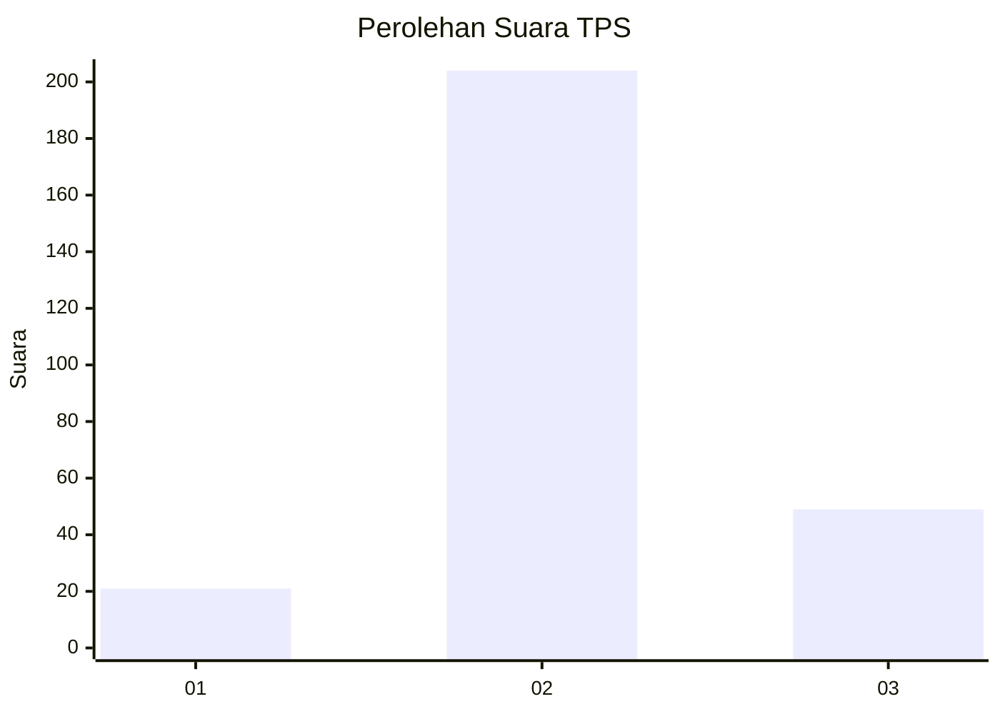

# Hasil

## Grafik

## Tabel

| No. | Nama Paslon    | Suara | Suara (raw) | Persentase |
|:--- |:-------------- | -----:| -----------:| ----------:|
| 1   | ANIES MUHAIMIN | 21    | [21][p-1]   | 7,66       |
| 2   | PRABOWO GIBRAN | 204   | [204][p-2]  | 74,45      |
| 3   | GANJAR MAHFUD  | 49    | [49][p-3]   | 17,88      |

[p-1]: https://github.com/gigit-pemilu/pemilu-2024-35-jawa-timur/blob/main/pilpres/hitung-suara/sub/35-jawa-timur/sub/71-kota-kediri/sub/01-mojoroto/sub/1001-bandar-lor/sub/004-tps/sub/paslon-1.txt
[p-2]: https://github.com/gigit-pemilu/pemilu-2024-35-jawa-timur/blob/main/pilpres/hitung-suara/sub/35-jawa-timur/sub/71-kota-kediri/sub/01-mojoroto/sub/1001-bandar-lor/sub/004-tps/sub/paslon-2.txt
[p-3]: https://github.com/gigit-pemilu/pemilu-2024-35-jawa-timur/blob/main/pilpres/hitung-suara/sub/35-jawa-timur/sub/71-kota-kediri/sub/01-mojoroto/sub/1001-bandar-lor/sub/004-tps/sub/paslon-3.txt

## Foto C Plano

https://sirekap-obj-formc.kpu.go.id/94fe/pemilu/ppwp/35/71/01/10/01/3571011001004-20240216-163641--76db2501-8424-45d0-a2f4-3737232f6223.jpg

https://sirekap-obj-formc.kpu.go.id/94fe/pemilu/ppwp/35/71/01/10/01/3571011001004-20240216-163643--acd9fd44-89c0-4514-abc6-6fdf73baa1a9.jpg

https://sirekap-obj-formc.kpu.go.id/94fe/pemilu/ppwp/35/71/01/10/01/3571011001004-20240216-163642--1ce549c1-1f48-49e0-b1c2-a54e34d221bf.jpg

## Metadata

| Key        | Value               |
| ---------- | ------------------- |
| Time Stamp | 2024-02-17 12:00:00 |

## DATA PEMILIH TETAP

Jumlah pemilih dalam DPT: **300**.
 * L: **146**.
 * P: **154**.

## DATA PENGGUNA HAK PILIH

Jumlah pengguna hak pilih dalam DPT: **258**.
 * L: **117**.
 * P: **141**.

Jumlah pengguna hak pilih dalam DPTb: **16**.
 * L: **8**.
 * P: **8**.

Jumlah pengguna hak pilih dalam DPK: **6**.
 * L: **3**.
 * P: **3**.

Jumlah pengguna hak pilih: **280**.
 * L: **128**.
 * P: **152**.

## JUMLAH SUARA SAH DAN TIDAK SAH

JUMLAH SELURUH SUARA SAH: **274**.

JUMLAH SUARA TIDAK SAH: **6**.

JUMLAH SELURUH SUARA SAH DAN SUARA TIDAK SAH: **280**.

