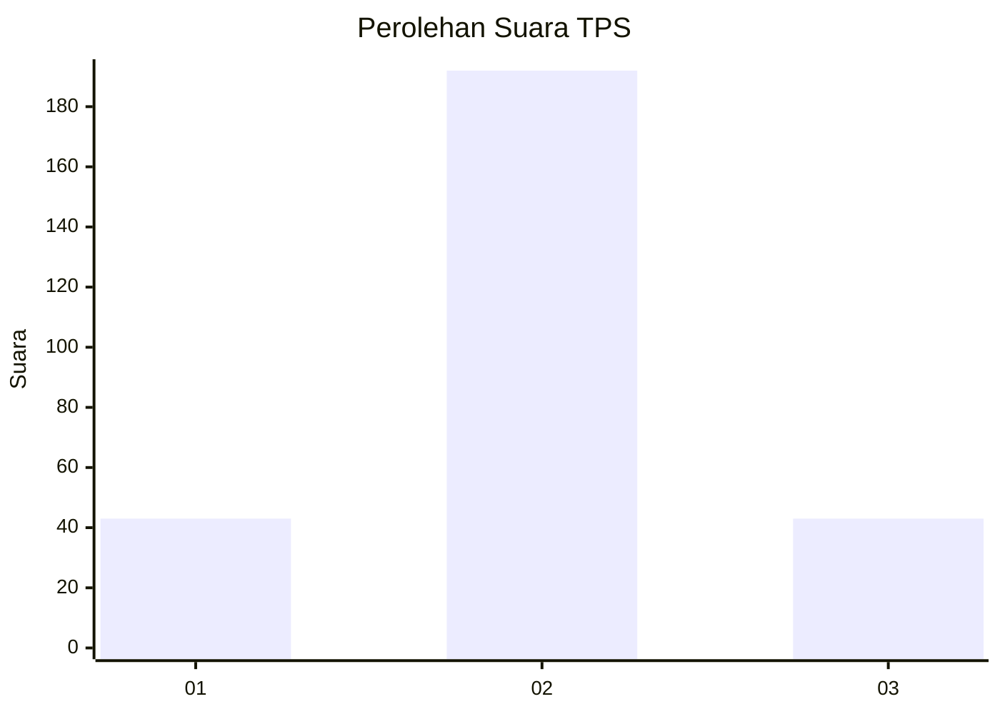

# Hasil

## Grafik

## Tabel

| No. | Nama Paslon    | Suara | Suara (raw) | Persentase |
|:--- |:-------------- | -----:| -----------:| ----------:|
| 1   | ANIES MUHAIMIN | 43    | [43][p-1]   | 15,47      |
| 2   | PRABOWO GIBRAN | 192   | [192][p-2]  | 69,06      |
| 3   | GANJAR MAHFUD  | 43    | [43][p-3]   | 15,47      |

[p-1]: https://github.com/gigit-pemilu/pemilu-2024/blob/main/pilpres/hitung-suara/sub/35-jawa-timur/sub/71-kota-kediri/sub/01-mojoroto/sub/1001-bandar-lor/sub/006-tps/sub/paslon-1.txt
[p-2]: https://github.com/gigit-pemilu/pemilu-2024/blob/main/pilpres/hitung-suara/sub/35-jawa-timur/sub/71-kota-kediri/sub/01-mojoroto/sub/1001-bandar-lor/sub/006-tps/sub/paslon-2.txt
[p-3]: https://github.com/gigit-pemilu/pemilu-2024/blob/main/pilpres/hitung-suara/sub/35-jawa-timur/sub/71-kota-kediri/sub/01-mojoroto/sub/1001-bandar-lor/sub/006-tps/sub/paslon-3.txt

## Foto C Plano

https://sirekap-obj-formc.kpu.go.id/e50f/pemilu/ppwp/35/71/01/10/01/3571011001006-20240214-185921--10050abd-c9cb-4d53-9525-048360717c3b.jpg

https://sirekap-obj-formc.kpu.go.id/e50f/pemilu/ppwp/35/71/01/10/01/3571011001006-20240214-190854--2a24a49b-790d-4682-a9ed-928726d23f84.jpg

https://sirekap-obj-formc.kpu.go.id/e50f/pemilu/ppwp/35/71/01/10/01/3571011001006-20240214-190236--e9297b1a-f050-452c-97f0-2861aea83d25.jpg

## Metadata

| Key        | Value               |
| ---------- | ------------------- |
| Time Stamp | 2024-02-14 21:46:01 |

## DATA PEMILIH TETAP

Jumlah pemilih dalam DPT: **300**.
 * L: **131**.
 * P: **169**.

## DATA PENGGUNA HAK PILIH

Jumlah pengguna hak pilih dalam DPT: **265**.
 * L: **113**.
 * P: **152**.

Jumlah pengguna hak pilih dalam DPTb: **16**.
 * L: **7**.
 * P: **9**.

Jumlah pengguna hak pilih dalam DPK: **4**.
 * L: **1**.
 * P: **3**.

Jumlah pengguna hak pilih: **285**.
 * L: **121**.
 * P: **164**.

## JUMLAH SUARA SAH DAN TIDAK SAH

JUMLAH SELURUH SUARA SAH: **278**.

JUMLAH SUARA TIDAK SAH: **7**.

JUMLAH SELURUH SUARA SAH DAN SUARA TIDAK SAH: **285**.

